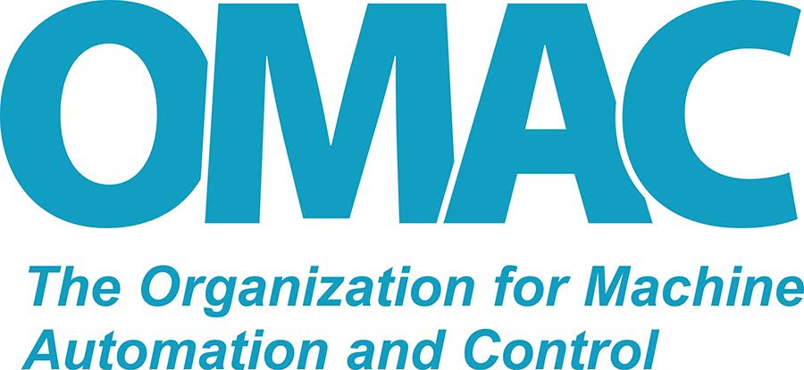
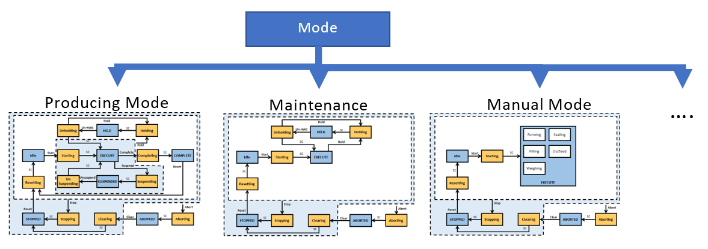

---
format:
  docx:
    output-file: "OPC 30050 - UA Companion Specification for PackML 2.00-alpha_autogenerated"
    reference-doc: reference.docx
---

+---------------------------------+-------------------------------------------------------+-------------------------+
| >          | {width="2.340977690288714in" | OPC UA                  |
|                                 | height="1.0967574365704287in"}                        | Companion-Specification |
+---------------------------------+-------------------------------------------------------+                         |
| > OPC 30050                                                                             |                         |
+-----------------------------------------------------------------------------------------+                         |
| > OPC UA for PackML                                                                     |                         |
| >                                                                                       |                         |
| > Release 1.01                                                                          |                         |
| >                                                                                       |                         |
| > 2020-11-11                                                                            |                         |
+=================================+=======================================================+=========================+

+----------+:----------------+:----------+-------+--------------+:-----------------------+
| Standard | OPC UA Information Model    | Comments:            |                        |
| Type:    | For PackML                  |                      |                        |
+----------+-----------------------------+----------------------+------------------------+
|          |                             |                      |                        |
+----------+-----------------------------+----------------------+------------------------+
| Title:   | OPC UA for PackML           | Date:                |                        |
+----------+-----------------------------+----------------------+------------------------+
|          |                             |                      |                        |
+----------+-----------------------------+----------------------+------------------------+
| Version: | 1.01                        | Software:            | MS-Word                |
+----------+-----------------------------+----------------------+------------------------+
| Editors: | Brandl, Dennis              | Source:              | OPC 30050 - UA         |
|          |                             |                      | Companion              |
|          | Hunkar, Paul                |                      | Specification for      |
|          |                             |                      | Packml 1.01.docx       |
|          | Apolito, Frank              |                      |                        |
|          |                             |                      |                        |
|          | Soehner, Heiko              |                      |                        |
+----------+-----------------------------+----------------------+------------------------+
|          |                             |                      |                        |
+----------+-----------------------------+----------------------+------------------------+
| Owner:   | OPC UA PackML WG            | Status:              | Release                |
+----------+-----------------+-----------+-------+--------------+------------------------+
|          |                 |                   |                                       |
+----------+-----------------+-------------------+---------------------------------------+

**Document History**

  ---------------------------------------------------------------------------------------------------
  **Version**   **Date**     **Reason**      **COMMENTS**         **Clause/\    **Proposed change**
                                                                  Subclause**   
  ------------- ------------ --------------- -------------------- ------------- ---------------------
  1.00.00       04/14/2018   Initial         Initial Release                    

  1.00.01       11/15/2018   Format fixes    Minor formatting                   
                                             fixes                              

  1.01.00       10/08/2020   Fixes &         Several fixes in                   
                             modifications   wording and types,                 
                                             harmonization with                 
                                             TR88                               
  ---------------------------------------------------------------------------------------------------

**CONTENTS**

Page

1 Scope [9](#scope)

2 Normative References [9](#normative-references)

3 Terms, definitions and conventions
[10](#terms-definitions-and-conventions)

**3.1** Overview [10](#overview)

**3.2** OPC 10000-1 terms [10](#opc-10000-1-terms)

**3.3** OPC 10000-3 terms [10](#opc-10000-3-terms)

**3.4** OPC 10000-8 [11](#opc-10000-8)

**3.5** OPC 10000-9 [11](#opc-10000-9)

**3.6** OPC UA PackML Terms [11](#opc-ua-packml-terms)

**3.6.1** PackML\<Term\> [11](#packmlterm)

3.6.1.1 General [11](#general)

3.6.1.2 PackMLUnit [11](#packmlunit)

3.6.1.3 PackMLTag [11](#packmltag)

3.6.1.4 PackMLStateModel [11](#packmlstatemodel)

3.6.1.5 PackMLMode [11](#packmlmode)

**3.7** Abbreviations and symbols [11](#abbreviations-and-symbols)

**3.8** OPC UA Notation [12](#opc-ua-notation)

4 Concept [13](#concept)

**4.1** Overview [13](#overview-1)

**4.2** PackML Overview [14](#packml-overview)

**4.2.1** Introduction [14](#introduction)

**4.2.2** Why PackML? [14](#why-packml)

**4.2.3** PackML Elements [15](#packml-elements)

**4.2.4** Standard Modes [15](#standard-modes)

**4.2.5** Standard States [16](#standard-states)

**4.2.6** Standard Tag Names [16](#standard-tag-names)

**4.2.7** PackML Object Model [16](#packml-object-model)

4.2.7.1 Overview [16](#overview-2)

4.2.7.2 Command Tags [16](#command-tags)

4.2.7.3 Status Tags [16](#status-tags)

4.2.7.4 Admin Tags [16](#admin-tags)

**4.2.8** Standard Tag Values [16](#standard-tag-values)

4.2.8.1 Overview [16](#overview-3)

4.2.8.2 Machine Speed [16](#machine-speed)

4.2.8.3 Material Interlock [17](#material-interlock)

4.2.8.4 Remote Interface Structure [17](#remote-interface-structure)

**4.3** OPC UA Overview [17](#opc-ua-overview)

**4.3.1** Introduction [17](#introduction-1)

**4.3.2** What is OPC UA? [17](#what-is-opc-ua)

**4.3.3** Basics of OPC UA [18](#basics-of-opc-ua)

**4.3.4** Information Modelling in OPC UA
[18](#information-modelling-in-opc-ua)

4.3.4.1 Concepts [18](#concepts)

4.3.4.2 Namespaces [22](#namespaces)

4.3.4.3 Companion Specifications [22](#companion-specifications)

5 Modelling Approach of PackML [24](#modelling-approach-of-packml)

6 PackML Data Representation Model
[25](#packml-data-representation-model)

**6.1** General [25](#general-1)

**6.2** Instance AddressSpace [26](#instance-addressspace)

**6.3** Objects and ObjectTypes [27](#objects-and-objecttypes)

**6.3.1** Overview [27](#overview-4)

**6.3.2** PackMLBaseObjectType [27](#packmlbaseobjecttype)

**6.3.3** PackMLStatusObjectType [28](#packmlstatusobjecttype)

**6.3.4** PackMLAdminObjectType [30](#packmladminobjecttype)

**6.3.5** StateMachines Overview [33](#statemachines-overview)

**6.3.6** PackMLBaseStateMachineType [35](#packmlbasestatemachinetype)

**6.3.7** PackMLMachineStateMachineType
[37](#packmlmachinestatemachinetype)

**6.3.8** PackMLExecuteStateMachineType
[40](#packmlexecutestatemachinetype)

**6.4** Variables and VariableTypes [43](#variables-and-variabletypes)

**6.5** DataTypes [44](#datatypes)

**6.5.1** Overview [44](#overview-5)

**6.5.2** ProductionMaintenanceModeEnum
[44](#productionmaintenancemodeenum)

**6.5.3** PackMLCountDataType [44](#packmlcountdatatype)

**6.5.4** PackMLDescriptorDataType [44](#packmldescriptordatatype)

**6.5.5** PackMLIngredientsDataType [45](#packmlingredientsdatatype)

**6.5.6** PackMLProductDataType [45](#packmlproductdatatype)

**6.5.7** PackMLRemoteInterfaceDataType
[45](#packmlremoteinterfacedatatype)

**6.6** ReferenceTypes [46](#referencetypes)

**6.6.1** HasInterlock [46](#hasinterlock)

**6.6.2** HasAlarm [46](#hasalarm)

**6.6.3** HasAlarmHistory [47](#hasalarmhistory)

**6.6.4** HasWarning [47](#haswarning)

**6.6.5** HasStopReason [47](#hasstopreason)

**6.7** Methods [47](#methods)

**6.7.1** Overview [47](#overview-6)

**6.7.2** SetUnitMode Method [48](#setunitmode-method)

**6.7.3** SetMachSpeed Method [48](#setmachspeed-method)

**6.7.4** SetProduct Method [49](#setproduct-method)

**6.7.5** Abort Method [50](#abort-method)

**6.7.6** Clear Method [50](#clear-method)

**6.7.7** Stop Method [51](#stop-method)

**6.7.8** Reset Method [52](#reset-method)

**6.7.9** Complete Method [52](#complete-method)

**6.7.10** Start Method [53](#start-method)

**6.7.11** Unhold Method [53](#unhold-method)

**6.7.12** Suspend Method [54](#suspend-method)

**6.7.13** Unsuspend Method [55](#unsuspend-method)

**6.7.14** Hold Method [55](#hold-method)

**6.7.15** RemoteCommand Method [56](#remotecommand-method)

**6.7.16** SetInterlock Method [58](#setinterlock-method)

**6.7.17** SetParameter Method [59](#setparameter-method)

**6.8** Alarms [59](#alarms)

**6.8.1** Overview [59](#overview-7)

**6.8.2** Alarm Tags [60](#alarm-tags)

6.8.2.1 Overview [60](#overview-8)

6.8.2.2 PackMLAlarmDataType [60](#packmlalarmdatatype)

**6.8.3** Alarm Events [60](#alarm-events)

7 Profile [61](#profile)

**7.1** Conformance Unit [61](#conformance-unit)

**7.1.1** Overview [61](#overview-9)

**7.1.2** Server [61](#server)

**7.1.3** Client [62](#client)

**7.2** Facet [63](#facet)

**7.2.1** Overview [63](#overview-10)

**7.2.2** Server [64](#server-1)

7.2.2.1 PackML Base Functionality Server Facet
[64](#packml-base-functionality-server-facet)

**7.2.3** Client [65](#client-1)

7.2.3.1 PackML Base Client Facet [65](#packml-base-client-facet)

8 Namespaces [66](#namespaces-1)

**8.1** Namespace Metadata [66](#namespace-metadata)

**8.2** Handling of OPC UA namespaces
[66](#handling-of-opc-ua-namespaces)

Annex A (normative): PackML Namespace and Mappings [68](#_Toc206519805)

A.1 Namespace and identifiers for PackML Information Model
[68](#namespace-and-identifiers-for-packml-information-model)

Annex B (informative): Recommended localized names [69](#_Toc364814137)

B.1 Recommended state names for *StateMachine* *Variables*
[69](#recommended-state-names-for-statemachine-variables)

B.1.1 LocaleId "en" [69](#localeid-en)

B.1.2 LocaleId "de" [69](#localeid-de)

B.1.3 LocaleId "fr" [69](#localeid-fr)

Annex C : DataType (Non-Normative) [71](#_Ref234035279)

C.1 Mapping of elementary data types
[71](#mapping-of-elementary-data-types)

C.2 Mapping of generic data types [71](#mapping-of-generic-data-types)

C.3 Mapping of derived data types [72](#mapping-of-derived-data-types)

C.3.1 Mapping of enumerated data types
[72](#mapping-of-enumerated-data-types)

C.3.2 Mapping of array data types [72](#mapping-of-array-data-types)

Annex D : Revision / Change Log [74](#_Toc55996691)

D.1 Main changes from V1.00 to V1.01
[74](#main-changes-from-v1.00-to-v1.01)

Figures

Figure 1 -- Automated Machines using the ISA 88 Models
[14](#_Ref457805689)

Figure 2 -- Mode Management of States [16](#_Ref457833134)

Figure 3 -- The Scope of OPC UA within an Enterprise
[18](#_Ref294331370)

Figure 4 -- A Basic Object in an OPC UA Address Space
[19](#_Ref285633454)

Figure 5 -- The Relationship between Type Definitions and Instances
[20](#_Ref285633471)

Figure 6 -- Examples of References between Objects [21](#_Ref285633484)

Figure 7 -- The OPC UA Information Model Notation [21](#_Ref285633513)

Figure 8 -- A Visual Representation of the Sample ObjectType
[23](#_Ref285635800)

Figure 9 - System Overview [25](#_Ref500371052)

Figure 10 - PackML Object Instance Overview [26](#_Ref485617565)

Figure 11 - PackMLBaseObjectType Overview [27](#_Toc55996703)

Figure 12 - PackMLStatusObjectType Overview [29](#_Ref491851671)

Figure 13 - PackMLAdminObjectType Overview [31](#_Ref497950807)

Figure 14 - PackML StateMachines Overview [34](#_Ref477922657)

Figure 15 - PackML States [35](#_Ref41494237)

Figure 16 - PackMLBaseStateMachineType illustration [36](#_Ref485392787)

Figure 17 - PackMLMachineStateMachineType illustration
[38](#_Ref498930554)

Figure 18 -- PackMLExecuteStateMachineType illustration
[40](#_Ref485790867)

Figure 19 - Remote Command and Internal systems [56](#_Ref498493919)

Figure 20 - Remote Command -- Line and Upstream/Downstream systems
[57](#_Ref498493938)

Tables

[Table 1 -- Example *ObjectType* Definition
[22](#_Ref130213312)](#_Ref130213312)

[Table 2 -- PackMLObjects definition
[27](#_Ref330292856)](#_Ref330292856)

[Table 3 -- PackMLBaseObjectType Definition
[27](#_Ref477921664)](#_Ref477921664)

[Table 4 -- PackMLStatusObjectType Definition
[29](#_Ref497899362)](#_Ref497899362)

[Table 5 -- PackMLAdminObjectType Definition
[31](#_Ref497950773)](#_Ref497950773)

[Table 6 -- PackMLBaseStateMachineType Definition
[36](#_Ref474306872)](#_Ref474306872)

[Table 7 -- PackMLBaseStateMachineType Additional References
[37](#_Ref475541859)](#_Ref475541859)

[Table 8 -- PackMLMachineStateMachineType Definition
[38](#_Ref475562311)](#_Ref475562311)

[Table 9 -- PackMLMachineStateMachineType Additional References
[39](#_Ref475540746)](#_Ref475540746)

[Table 10 -- PackMLExecuteStateMachineType Definition
[41](#_Ref478713960)](#_Ref478713960)

[Table 11 -- PackMLExecuteStateMachineType Additional References
[43](#_Ref151451913)](#_Ref151451913)

[Table 12 -- ProductionMaintenanceModeEnum values
[44](#_Ref323831181)](#_Ref323831181)

[Table 13 -- PackMLCountDataType Structure
[44](#_Ref497916124)](#_Ref497916124)

[Table 14 -- PackMLDescriptorDataType Structure
[45](#_Ref497952289)](#_Ref497952289)

[Table 15 -- PackMLIngredientsDataType Structure
[45](#_Ref497952290)](#_Ref497952290)

[Table 16 -- PackMLProductDataType Structure
[45](#_Ref497952291)](#_Ref497952291)

[Table 17 -- PackMLRemoteInterfaceDataType Structure
[46](#_Ref497952292)](#_Ref497952292)

[Table 18 -- HasInterlock reference type
[46](#_Ref228719486)](#_Ref228719486)

[Table 19 -- HasAlarm reference type
[47](#_Ref508785960)](#_Ref508785960)

[Table 20 -- HasAlarmHistory reference type
[47](#_Ref509225980)](#_Ref509225980)

[Table 21 -- HasWarning reference type
[47](#_Toc55996733)](#_Toc55996733)

[Table 22 -- HasStopReason reference type
[47](#_Toc55996734)](#_Toc55996734)

[Table 23 - SetUnitMode Method Parameters
[48](#_Ref497900777)](#_Ref497900777)

[Table 24 - SetUnitMode Method Result Codes
[48](#_Ref497900778)](#_Ref497900778)

[Table 25 - SetUnitMode Method AddressSpace Definition
[48](#_Ref498388056)](#_Ref498388056)

[Table 26 - SetMachSpeed Method Parameters
[48](#_Ref498388135)](#_Ref498388135)

[Table 27 - SetMachSpeed Method ResultCodes
[49](#_Ref498388162)](#_Ref498388162)

[Table 28 -- SetMachSpeed Method AddressSpace Definition
[49](#_Ref498388091)](#_Ref498388091)

[Table 29 - SetProduct Method Parameters
[49](#_Ref498986932)](#_Ref498986932)

[Table 30 - SetProduct Method Result Codes
[49](#_Ref498493420)](#_Ref498493420)

[Table 31 -- SetProduct Method AddressSpace Definition
[50](#_Ref498493431)](#_Ref498493431)

[Table 32 - Abort Method result codes
[50](#_Ref498493462)](#_Ref498493462)

[Table 33 -- Abort Method AddressSpace Definition
[50](#_Ref498493479)](#_Ref498493479)

[Table 34 - Clear method result codes
[51](#_Ref498493497)](#_Ref498493497)

[Table 35 -- Clear Method AddressSpace Definition
[51](#_Ref498493519)](#_Ref498493519)

[Table 36 - Stop Method result codes
[51](#_Ref498493538)](#_Ref498493538)

[Table 37 -- Stop Method AddressSpace Definition
[51](#_Ref498493549)](#_Ref498493549)

[Table 38 - Reset Method result codes
[52](#_Ref498493566)](#_Ref498493566)

[Table 39 -- Reset Method AddressSpace Definition
[52](#_Ref498493579)](#_Ref498493579)

[Table 40 - Complete Method result codes
[52](#_Ref498493604)](#_Ref498493604)

[Table 41 -- Complete Method AddressSpace Definition
[53](#_Ref498493618)](#_Ref498493618)

[Table 42 - Start Method Parameters
[53](#_Ref498493632)](#_Ref498493632)

[Table 43 - Start Method result codes
[53](#_Ref498493649)](#_Ref498493649)

[Table 44 -- Start Method AddressSpace Definition
[53](#_Ref498493674)](#_Ref498493674)

[Table 45 - Unhold Method result codes
[54](#_Ref498493686)](#_Ref498493686)

[Table 46 -- Unhold Method AddressSpace Definition
[54](#_Ref498493720)](#_Ref498493720)

[Table 47 - Suspend Method result codes
[54](#_Ref498493853)](#_Ref498493853)

[Table 48 -- Suspend Method AddressSpace Definition
[54](#_Ref498493863)](#_Ref498493863)

[Table 49 - Unsuspend Method result codes
[55](#_Ref498702833)](#_Ref498702833)

[Table 50 -- Unsuspend Method AddressSpace Definition
[55](#_Ref498702834)](#_Ref498702834)

[Table 51 - Hold Method result codes
[55](#_Ref498493879)](#_Ref498493879)

[Table 52 -- Hold Method AddressSpace Definition
[56](#_Ref498493886)](#_Ref498493886)

[Table 53 - RemoteCommand Method Parameters
[57](#_Ref498494086)](#_Ref498494086)

[Table 54 - RemoteCommand Method result codes
[57](#_Ref498494172)](#_Ref498494172)

[Table 55 -- RemoteCommand Method AddressSpace Definition
[58](#_Ref497952294)](#_Ref497952294)

[Table 56 - SetInterlock Method Parameters
[58](#_Ref498494245)](#_Ref498494245)

[Table 57 - SetInterlock Method result codes
[58](#_Ref498494288)](#_Ref498494288)

[Table 58 -- SetInterlock Method AddressSpace Definition
[59](#_Ref498494298)](#_Ref498494298)

[Table 59 - SetParameter Method Parameters
[59](#_Ref498987247)](#_Ref498987247)

[Table 60 - SetParameter Method result codes
[59](#_Ref498494331)](#_Ref498494331)

[Table 61 -- SetParameter Method AddressSpace Definition
[59](#_Ref498494342)](#_Ref498494342)

[Table 62 -- PackMLAlarmDataType Structure
[60](#_Ref498494780)](#_Ref498494780)

[Table 63 -- PackML Server Information Model
[61](#_Ref136918394)](#_Ref136918394)

[Table 64 -- PackML Client Information Model
[62](#_Ref332709096)](#_Ref332709096)

[Table 65 - PackML Profiles [63](#_Toc349863536)](#_Toc349863536)

[Table 66 - PackML Base Functionality Server Facet
[64](#_Ref313575252)](#_Ref313575252)

[Table 67 - PackML Base Client Facet
[65](#_Ref442394485)](#_Ref442394485)

[Table 68 -- NamespaceMetadata Object for this Specification
[66](#_Ref447784419)](#_Ref447784419)

[Table 69 -- Namespaces used in a PackML Server
[66](#_Ref252866620)](#_Ref252866620)

[Table 70 -- Namespaces used in this specification
[67](#_Ref369000025)](#_Ref369000025)

[Table 71 -- Mapping IEC 61131-3 elementary data types to OPC UA built
in data types [71](#_Ref234123391)](#_Ref234123391)

[Table 72 -- Mapping IEC 61131-3 generic data types to OPC UA data types
[72](#_Ref234148049)](#_Ref234148049)

OPC Foundation

\_\_\_\_\_\_\_\_\_\_\_\_

UNIFIED ARCHITECTURE --

FOREWORD

This specification is the specification for developers of OPC UA
applications. The specification is a result of an analysis and design
process to develop a standard interface to facilitate the development of
applications by multiple vendors that shall inter-operate seamlessly
together.

Copyright © 2006-2026, OPC Foundation, Inc.

[AGREEMENT OF USE]{.underline}

COPYRIGHT RESTRICTIONS

Any unauthorized use of this specification may violate copyright laws,
trademark laws, and communications regulations and statutes. This
document contains information which is protected by copyright. All
Rights Reserved. No part of this work covered by copyright herein may be
reproduced or used in any form or by any means\--graphic, electronic, or
mechanical, including photocopying, recording, taping, or information
storage and retrieval systems\--without permission of the copyright
owner.

OPC Foundation members and non-members are prohibited from copying and
redistributing this specification. All copies must be obtained on an
individual basis, directly from the OPC Foundation website
<https://opcfoundation.org/> or from the OMAC website <http://omac.org>.

PATENTS

The attention of adopters is directed to the possibility that compliance
with or adoption of OPC specifications may require use of an invention
covered by patent rights. OPC shall not be responsible for identifying
patents for which a license may be required by any OPC specification, or
for conducting legal inquiries into the legal validity or scope of those
patents that are brought to its attention. OPC specifications are
prospective and advisory only. Prospective users are responsible for
protecting themselves against liability for infringement of patents.

WARRANTY AND LIABILITY DISCLAIMERS

WHILE THIS PUBLICATION IS BELIEVED TO BE ACCURATE, IT IS PROVIDED \"AS
IS\" AND MAY CONTAIN ERRORS OR MISPRINTS. THE OPC FOUDATION AND OMAC
MAKES NO WARRANTY OF ANY KIND, EXPRESSED OR IMPLIED, WITH REGARD TO THIS
PUBLICATION, INCLUDING BUT NOT LIMITED TO ANY WARRANTY OF TITLE OR
OWNERSHIP, IMPLIED WARRANTY OF MERCHANTABILITY OR WARRANTY OF FITNESS
FOR A PARTICULAR PURPOSE OR USE. IN NO EVENT SHALL THE OPC FOUNDATION OR
OMAC BE LIABLE FOR ERRORS CONTAINED HEREIN OR FOR DIRECT, INDIRECT,
INCIDENTAL, SPECIAL, CONSEQUENTIAL, RELIANCE OR COVER DAMAGES, INCLUDING
LOSS OF PROFITS, REVENUE, DATA OR USE, INCURRED BY ANY USER OR ANY THIRD
PARTY IN CONNECTION WITH THE FURNISHING, PERFORMANCE, OR USE OF THIS
MATERIAL, EVEN IF ADVISED OF THE POSSIBILITY OF SUCH DAMAGES.

The entire risk as to the quality and performance of software developed
using this specification is borne by you.

RESTRICTED RIGHTS LEGEND

This Specification is provided with Restricted Rights. Use, duplication
or disclosure by the U.S. government is subject to restrictions as set
forth in (a) this Agreement pursuant to DFARs 227.7202-3(a); (b)
subparagraph (c)(1)(i) of the Rights in Technical Data and Computer
Software clause at DFARs 252.227-7013; or (c) the Commercial Computer
Software Restricted Rights clause at FAR 52.227-19 subdivision (c)(1)
and (2), as applicable. Contractor / manufacturer are the OPC
Foundation,. 16101 N. 82nd Street, Suite 3B, Scottsdale, AZ, 85260-1830
and OMAC 11911 Freedom Drive, Suite 600, Reston, VA 20190

COMPLIANCE

The OPC Foundation shall at all times be the sole entity that may
authorize developers, suppliers and sellers of hardware and software to
use certification marks, trademarks or other special designations to
indicate compliance with these materials. Products developed using this
specification may claim compliance or conformance with this
specification if and only if the software satisfactorily meets the
certification requirements set by the OPC Foundation. Products that do
not meet these requirements may claim only that the product was based on
this specification and must not claim compliance or conformance with
this specification.

Trademarks

Most computer and software brand names have trademarks or registered
trademarks. The individual trademarks have not been listed here.

GENERAL PROVISIONS

Should any provision of this Agreement be held to be void, invalid,
unenforceable or illegal by a court, the validity and enforceability of
the other provisions shall not be affected thereby.

This Agreement shall be governed by and construed under the laws of the
State of Minnesota, excluding its choice or law rules.

This Agreement embodies the entire understanding between the parties
with respect to, and supersedes any prior understanding or agreement
(oral or written) relating to, this specification.

ISSUE REPORTING

The OPC Foundation strives to maintain the highest quality standards for
its published specifications, hence they undergo constant review and
refinement. Readers are encouraged to report any issues in the OPC
Foundation Mantis system and view any existing errata here:
H[TUhttp://www.opcfoundation.org/errataUT](http://www.opcfoundation.org/errata)H

Revision 1.01 Highlights

The focus of V1.01 was on cleaning up data types, simplifying,
correcting spelling mistakes and harmonizing with OMAC PackML TR88 -
version 2015. The consideration of corrections etc. instead of
compatibility was more in focus, because version 1.0 is currently not in
use in productive environment.

Extended explanation and list of revisions listed in
[Annex D](#_Ref44593047)

# Scope

This standard is an extension of the overall OPC Unified Architecture
standards and defines an information model that conforms to the PackML
object model defined in ISA-TR88.00.02-2015 Machine and Unit States: An
Implementation Example of ISA-88, and in the OMAC (Organization for
Machine and Automation Control) PackML Unit/Machine Implementation
Guide, referred to collectively as PackML. The PackML object model
describes a standard way to monitor and control a wide variety of
production equipment, following the models defined in the ANSI/ISA 88
standard. ISA-TR88.00.02 has been implemented by manufacturers and
machine builders worldwide on various control platforms to increase
speed to production, ease line integration and improve reliability.
PackML defines standard state models for external control of a piece of
equipment, a standard mode model for determining which state model to
follow, standard tag names and tag values to command the equipment,
determine the status of the equipment, and perform administration of the
equipment. The PackML goal is to provide an easy to use and easy to test
method of integration of equipment control, into a production line.

The modelling targets of this standard shall exist in an OPC UA
*AddressSpace*. This standard does not consider the modelling targets
that are identified in other standards or vendor specifications.

# Normative References

The following referenced documents are indispensable for the application
of this standard. For dated references, only the edition cited applies.
For undated references, the latest edition of the referenced document
(including any amendments) applies.

[]{#UAPart1 .anchor}OPC 10000-1, *OPC Unified Architecture - Part 2:
Overview and Concepts*

> <http://www.opcfoundation.org/UA/Part1/>

[]{#UAPart2 .anchor}OPC 10000-2, *OPC Unified Architecture - Part 2:
Security Model*

> <http://www.opcfoundation.org/UA/Part2/>

[]{#UAPart3 .anchor}OPC 10000-3, *OPC Unified Architecture - Part 3:
Address Space Model*

> <http://www.opcfoundation.org/UA/Part3/>

[]{#UAPart4 .anchor}OPC 10000-4, *OPC Unified Architecture - Part 4:
Services*

> <http://www.opcfoundation.org/UA/Part4/>

[]{#UAPart5 .anchor}OPC 10000-5, *OPC Unified Architecture - Part 5:
Information Model*

> <http://www.opcfoundation.org/UA/Part5/>

[]{#UAPart6 .anchor}OPC 10000-6, *OPC Unified Architecture - Part 6:
Mappings*

> <http://www.opcfoundation.org/UA/Part6/>

[]{#UAPart7 .anchor}OPC 10000-7, *OPC Unified Architecture - Part 7:
Profiles*

> <http://www.opcfoundation.org/UA/Part7/>

[]{#UAPart8 .anchor}OPC 10000-8, *OPC Unified Architecture - Part 8:
Data Access*

> <http://www.opcfoundation.org/UA/Part8/>

[]{#UAPart9 .anchor}OPC 10000-9, *OPC UA Specification: Part 9 -- Alarms
& Conditions*

> [http://www.opcfoundation.org/UA/Part9/](http://www.opcfoundation.org/UA/Part8/)

[]{#UAPart10 .anchor}OPC 10000-10, *OPC UA Specification: Part 10 -
Programs*

> [http://www.opcfoundation.org/UA/Part10/](http://www.opcfoundation.org/UA/Part8/)

[]{#UAPart11 .anchor}OPC 10000-11, *OPC Unified Architecture - Part 11:
Historical Access*

> <http://www.opcfoundation.org/UA/Part11/>

OPC 10000-13, *OPC Unified Architecture - Part 13: Aggregates*

> <http://www.opcfoundation.org/UA/Part13/>

[]{#ISAPart2 .anchor}ISA-TR88.00.02-2015: Machine and Unit States: An
implementation example of ANSI/ISA-88.00.01

> <https://www.isa.org/store/ansi/isa-tr880002-2015,-machine-and-unit-states-an-implementation-example-of-ansi/isa-880001-/43761120>

[]{#ISAPart1 .anchor}ANSI/ISA--88.01--1995: Batch Control Part 1: Models
and Terminology

> <https://www.isa.org/store/products/product-detail/?productId=116649>

OPC 30000, UA companion specification for IEC61131-3

> <https://opcfoundation.org/developer-tools/specifications-unified-architecture/opc-unified-architecture-plcopen-information-model/>

# Terms, definitions and conventions

## Overview

It is assumed that basic concepts of OPC UA information modelling are
understood in this specification. This specification will use these
concepts to describe the PackML object models. The concepts and terms
used to describe the OPC UA information models are defined in other
parts and listed in the following sections. Note that OPC UA terms and
terms defined in this standard are *italicized* in the specification.

## OPC 10000-1 terms

The following terms defined in [OPC 10000-1](#UAPart1) apply.

- AddressSpace

- Attribute

- Client

- Message

- Node

- NodeClass

- Object

- ObjectType

- Profile

- Reference

- ReferenceType

- Server

- Variable

- View

## OPC 10000-3 terms

The following terms defined in [OPC 10000-3](#UAPart3) apply.

- Hierarchical Reference

- InstanceDeclaration

- ModellingRule

- OptionalPlaceholder

- MandatoryPlaceholder

- DataVariable

- Property

- SourceNode

- TargetNode

- TypeDefinitionNode

- VariableType

## OPC 10000-8

The following terms defined in [OPC 10000-8](#UAPart8) apply.

- AnalogItem

- EngineeringUnits

## OPC 10000-9

The following term defined in [OPC 10000-9](#UAPart9) apply.

- Operator

## OPC UA PackML Terms

### PackML\<Term\>

#### General

This standard adopts adding a PackML prefix to all PackML defined terms
that are used in this standard that are also defined by OPC. The
\<Term\> is the terminology defined by PackML. This allows the
terminology used in PackML to be easily distinguished from terminology
defined in OPC UA.

#### PackMLUnit

a concept that defines a collection of associated modules that can carry
out one or more major processing activities.

Note: in PackML Unit and Machine are used to define the same thing and
can at times be interchanged.

#### PackMLTag

a concept that represents named data element that is used to command,
read status, or provide administration of a unit.

#### PackMLStateModel

a concept that represents a state model of the operational state of a
unit.

#### PackMLMode

a concept that represents the mode of operation of a unit, indicating
which state model is currently active.

## Abbreviations and symbols

DA Data Access

AC Alarm and Condition

HA Historical access

PLC Programmable Logic Controllers

DCS Distributed Control Systems

OCS Open Control Systems

## OPC UA Notation

This standard uses the *ModellingRules* *OptionalPlaceholder* and
*MandatoryPlaceholder* to define instance declarations, and defines a
rule that the BrowseName of instance declarations having an
*OptionalPlaceholder* or *MandatoryPlaceholder* *ModellingRule* be
enclosed in angle brackets (\<\>). Originally, this rule is defined in
OPC 10000-3 as a recommendation. This naming rule is also used in the
description of a table. The *BrowseName* of a *Node* that has
*OptionalPlaceholder* or *MandatoryPlaceholder* *ModellingRule* are
described with angle brackets, which denotes that the name is not fixed.
For example, *BrowseName* of *Property* is described as \<PropertyName\>
in graphical notation and tables results in a *Property* that can have
any name.

#  Concept

## Overview

When the [ANSI/ISA--88.01--1995:](#ISAPart1) standard was applied to
applications across a plant, there was a need to align the
terminologies, models and key definitions between different process
types: continuous, batch, and discrete processes. Discrete processes
involve machines found in the packaging, converting, and material
handling applications. The operation of these machines is typically
defined by the OEM, system integrator, end user, or is industry
specific.

OMAC (Organization for Machine Automation and Control) created a task
group with members from technology providers, OEMs, system integrators,
and end users to generate the PackML guidelines as a method to show how
the [ANSI/ISA--88.01--1995:](#ISAPart1) concepts could be extended into
packaging machinery and other types of machines typically used in
assembly lines, filling lines, and other production lines.

The purpose of PackML is to:

- Define a standard state-based model for automated machines.

- Identify definitions for common terminology.

- Explain to practitioners how to use state programming for automated
  machines.

- Provide references to actual implementation examples and templates
  from automation and control vendors.

- Identify a common tag structure for automated machines in order to:

  - Provide for "connect & pack" functionality

  - Provide functional interoperability and a consistent look and feel
    across the plant floor.

  - Provide consistent tag structure for connection to plant MES and
    enterprise systems.

If automated machinery is modelled in an
[ANSI/ISA--88.01--1995:](#ISAPart1) physical hierarchy, the example
mapping shown in [Figure 1](#_Ref457805689) is possible, from
[ISA-TR88.00.02-2015](#ISAPart2). The example in this document will
assume that a machine can represent the unit level in the ISA88
hierarchy.

{fig-align="center" height="13.76cm" width="10.95cm"}

[]{#_Ref457805689 .anchor}Figure 1 -- Automated Machines using the ISA
88 Models

In the figure, the OPC UA interface and the PackML model might exist at
the machine level. The communication and interactions below this level
are machine specific. Some machines might have multiple Units which
communicate using OPC UA / PackML, but they might also only expose the
Machine using the OPC UA PackML interface to other Machines in packaging
line or to the Packaging line controller.

## PackML Overview

### Introduction

For an OPC UA user that may not be familiar with PackML, the following
section provides a brief overview of key features that PackML provides
along with a little background related to PackML and the concepts behind
it.

### Why PackML?

The Organization for Machine Automation and Control (OMAC) was formed to
help manufacturers work together to find new and innovative ways to be
successful in their production operations. OMAC brought together leading
manufacturers representing End-User Manufacturers, OEM Machine Builders,
System Integrators, Technology Providers, and Non-Profit / Government
Agency organizations to address issues that confront global
manufacturing today. OMAC aims to collectively derive common solutions
for both technical and non-technical issues in the development,
implementation, and commercialization of open, modular architecture
control technologies.

Manufacturing systems are made of collections of equipment, often from
multiple suppliers, usually each with its own specific and custom
interface. In order to make this collection of equipment operate
together as a complete system, there is an integration effort required,
and it is often time consuming and custom for each supplier.

PackML stands for Packaging Machine Language and is an interface
standard originally used in batch manufacturing in the packaging
industry but which is now used in multiple different types of production
and assembly lines. The primary objective of PackML is to bring a common
"look and feel" and operational consistency to all machines that make up
a production line. PackML provides:

• Standard defined machine states and operational flow

• Overall Equipment Effectiveness (OEE) data

• Root Cause Analysis (RCA) data

• Flexible recipe schemes and common SCADA or MES inputs

PackML has been implemented in multiple formats for different industrial
networks, with a proven benefit of reducing the integration time for
adding new equipment to existing lines, or installing new lines.

### PackML Elements

In order to provide a standard interface PackML defines three elements:

1)  PackML Unit Modes - A standard model that is used to control which
    state is being used (Producing, Maintenance, Manual, ....).

2)  PackML StateMachine - Standard state machine models that are used to
    represent the internal operational state of the machine/unit.
    \[note: StateMachine may change for Units and for the Mode of the
    unit\]

3)  PackTags -A standard set of tag names and extension used to control
    the mode and state, send commands to the machine/unit, and monitor
    the status of the machine/unit.

These three aspects will be translated to OPC UA models

### Standard Modes

A Unit can be in different modes, for example Producing, Maintenance,
Manual, Clean, Calibration, etc. A Unit control mode is an ordered
subset of states and commands that determines the strategy carried out
by the Unit process, as shown in [Figure 2](#_Ref457833134). For
example, the producing mode is used when the unit is producing, a manual
mode may be used when the unit is being manually controlled for
troubleshooting.

The states that a unit can be in depends on the mode. In the producing
mode there is a state called SUSPENDED, where the equipment is not
running due to an external event, but this state is not available in
maintenance mode, neither is the COMPLETE state.

{fig-align="center" height="5.49cm" width="17.01cm"}

[]{#_Ref457833134 .anchor}Figure 2 -- Mode Management of States

PackML includes a standard manner of changing modes as well as
displaying the current mode. For additional information please see the
ISA-TR88.00.02-2015.

### Standard States

PackML Interface State Model is used to visualize and control the state
of a unit/machine. The PackML Interface State Model is a state model
that represents the Unit/Machine State in a standardized manner. The
interface description is based on a state model, a state description and
related control commands. For additional information see
[ISA-TR88.00.02-2015](#ISAPart2).

### Standard Tag Names 

At its core, PackML is the definition of standard tag names and standard
values for the tags. These are used to control the state model of the
unit (command tags), determine the state and status of the equipment
(status tags), and administer the equipment (admin tags).

### PackML Object Model

#### Overview

The PackML object model is composed of a series of tags. These tags can
be one of three general type of tags Command Tags, Status Tags and
Administrative Tags.

#### Command Tags

Command tags allow interaction with the state machine and general
functionality of the server. Command tags include changing units,
changing state machines. For additional detail see
[ISA-TR88.00.02-2015](#ISAPart2). In OPC UA command tags are generally
mapped to *Methods*.

####  Status Tags

Status tags provide information about the state of the machine or
device. This includes feedback from the commands issued and the general
status. For additional detail see [ISA-TR88.00.02-2015](#ISAPart2).

#### Admin Tags

Admin tags provide information about alarming in the machines or device.
This include Alarm history and some summary statistics about the machine
or device. For additional detail see [ISA-TR88.00.02-2015](#ISAPart2).

### Standard Tag Values

#### Overview

Several PackTags have specific values defined.

#### Machine Speed

This describes the set point for the current speed of the unit/machine
in primary packages per minute. Keeping speed in a primary package unit
of measure (UOM) allows for easier control integration. The primary
package UOM is the normalized rate for the machine, normalized to a
value chosen on the line.

The following example is for a bottle line running at balance line speed
of 1000 packages/minute. The UOM chosen is equivalent to be the actual
count of the Filler, or Labeler.

  ------------------------------------------------------------------------
  Machine                 Actual Pack Counts         Primary Packages
                                                     (UOM)
  ---------------- --------------------------------- ---------------------
  Bulk               41.667 (24 pack =\> 1000/24 =   1,000
  Depalletizer                  41.667)              

  Filler                         1,000               1,000

  Labeler                        1,000               1,000

  Packer             66.667 (15 pack =\> 1000/15 =   1,000
                                66.667)              

  Bulk               41.667 (24 pack =\> 1000/24 =   1,000
  Depalletizer                  41.667)              
  ------------------------------------------------------------------------

#### Material Interlock

Indicates materials are ready for processing. It is comprised of a
series of bits with 1 equalling ready or not low, 0 equalling not ready,
or low. Each bit represents a different user material. The word contains
bits that indicate when a critical material or process parameter is
ready for use. It can also be used for production, and/or indication of
low condition. This information may be sent to the unit machine at any
time as the interlock information changes.

The format and meaning of the material interlock bits are determined by
the machine/unit supplier, as shown in the example below:

  ------------------------------------------------------
  Machine/Unit   Material Interlock       Material
                       Bit \#            Description
  -------------- ------------------- -------------------
  Filler                  0              500 ml Bag

  Filler                  1            Flacked Cereal

  Labeler                 0               Small Box

  Labeler                 1              500 ml Bag

  Labeler                 2            Small Box Label
  ------------------------------------------------------

#### Remote Interface Structure

An array of structure elements used for coordinating upstream or
downstream machines in a cell with multiple unit machines.

The array is a length that is equal to the number of machines that will
be sending commands. This could be expanded if a machine is capable of
receiving material from multiple upstream and/or downstream machines,
thereby receiving multiple commands and parameters.

This can be used for machine to machine coordination without supervisory
control, or for tightly controlled units under supervisory control.
These tags are typically used for consumption within the unit machine
procedure. Specifically, if a remote controller was issuing commands,
the commands would be read by this tag and used in the unit machine.

## OPC UA Overview

### Introduction

For PackML users that may not be familiar with OPC UA the following
section provides a brief overview of key features that OPC UA provides.

### What is OPC UA?

OPC UA is an open and royalty free set of standards designed as a
universal communications protocol. While there are numerous
communication solutions available, OPC UA has several advantages:

- A state of art security model (see [OPC 10000-2](#UAPart2)).

- A fault tolerant communication protocol.

- An information modelling framework that allows application developers
  to represent their data in a way that makes sense to them.

OPC UA has a broad scope which delivers for economies of scale for
application developers. This means that a larger number of high quality
applications at a reasonable cost are available. When combined with
powerful semantic models such as PackML, OPC UA makes it easier for end
users to access data via generic commercial application.

The OPC UA model is scalable from small devices to ERP systems. OPC UA
devices process information locally and then provide that data in a
consistent format to any application requesting data - ERP, MES, PMS,
Maintenance Systems, HMI, Smartphone or a standard Browser, for
examples. For a more complete overview see [OPC 10000-1](#UAPart1).

### Basics of OPC UA

As an Open Standard, OPC UA is based on standard Internet technologies
-- TCP/IP, HTTPS, Ethernet, and XML.

As an Extensible Standard, OPC UA provides a set of services (see [OPC
10000-4](#UAPart4)) and a basic information model framework. This
framework provides an easy manner for creating and exposing vendor
defined information in a standard way. More importantly all OPC UA
*Clients* are expected to be able to discover and use vendor defined
information. This means OPC UA users can benefit from the economies of
scale that come with generic visualization and historian applications.
This specification is an example of an OPC UA Information Model designed
to meet the needs of developers and users.

OPC UA *Clients* can be any consumer of data from another device on the
network to browser based thin clients and ERP systems. The full scope of
OPC UA applications are shown in [Figure 3](#_Ref294331370).

{fig-align="center" height="8.39cm" width="11.46cm"}

[]{#_Ref294331370 .anchor}Figure 3 -- The Scope of OPC UA within an
Enterprise

OPC UA provides a robust and reliable communication infrastructure
having mechanisms for handling lost messages, failover, heartbeat, etc.
With its binary encoded data, it offers a high-performing data exchange
solution. Security is built into OPC UA as security requirements become
more and more important especially since environments are connected to
the office network or the internet and attackers are starting to focus
on automation systems

### Information Modelling in OPC UA

#### Concepts

OPC UA provides a framework that can be used to represent complex
information as *Objects* in an address space which can be accessed with
standard web services. These *Objects* consist of *Nodes* connected by
*References*. Different classes of *Nodes* convey different semantics.
For example, a *Variable* *Node* represents a value that can be read or
written. The *Variable* *Node* has an associated *DataType* that can
define the actual value, such as a string, float, structure etc. It can
also describe the variable value as a variant. A *Method* *Node*
represents a function that can be called. Every *Node* has a number of
*Attributes* including a unique identifier called a *NodeId* and
non-localized name called as *BrowseName*. An *Object* representing a
'Reservation' is shown in [Figure 4](#_Ref285633454).

{fig-align="center" height="9.6cm" width="13.49cm"}

[]{#_Ref285633454 .anchor}Figure 4 -- A Basic Object in an OPC UA
Address Space

*Object* and *Variable* *Nodes* are called *Instance* *Nodes* and they
always reference a *TypeDefinition* (*ObjectType* or *VariableType*)
Node which describes their semantics and structure. [Figure
5](#_Ref285633471) illustrates the relationship between an Instance and
its Type Definition.

The *Type* *Nodes* are templates that define all of the children that
can be present in an *Instance* of the *Type*. In the example in [Figure
5](#_Ref285633471) the PersonType *ObjectType* defines two children:
First Name and Last Name. All instances of PersonType are expected to
have the same children with the same *BrowseNames*. Within a Type the
*BrowseNames* uniquely identify the child. This means *Client*
applications can be designed to search for children based on the
BrowseNames from the Type instead of *NodeIds*. This eliminates the need
for manual reconfiguration of systems if a *Client* uses *Types* that
multiple devices implement.

OPC UA also supports the concept of sub typing. This allows a modeller
to take an existing *Type* and extend it. There are rules regarding sub
typing defined in [OPC 10000-3](#UAPart3), but in general they allow the
extension of a given type or the restriction of a *DataType*. For
example, the modeller may decide that the existing
*[ObjectType]{.underline}* in some cases needs an additional variable.
The modeller can create a Subtype of the object and add the variable. A
*Client* that is expecting the parent type can treat the new *Type* as
if it was of the parent Type. With regard to DataTypes, if a *Variable*
is defined to have a numeric value, a sub type could restrict the value
to a float.

{fig-align="center" height="12.51cm" width="11.96cm"}

[]{#_Ref285633471 .anchor}Figure 5 -- The Relationship between Type
Definitions and Instances

*References* allow Nodes to be connected together in ways that describe
their relationships. All *References* have a *ReferenceType* that
specifies the semantics of the relationship. *References* can be
hierarchical or non-hierarchical. *Hierarchical* *References* are used
to create the structure of *Objects* and *Variables*.
*Non*-*Hierarchical* are used to create arbitrary associations.
Applications can define their own *ReferenceType* by creating Subtypes
of the existing *ReferenceType*. Subtypes inherit the semantics of the
parent but may add additional restrictions. [Figure 6](#_Ref285633484)
depicts several references connecting different *Objects*.

{fig-align="center" height="11.69cm" width="14.71cm"}

[]{#_Ref285633484 .anchor}Figure 6 -- Examples of References between
Objects

The figures above use a notation that was developed for the OPC UA
specification. The notation is summarized in [Figure 7](#_Ref285633513).
UML representations can also be used; however, the OPC UA notation is
less ambiguous because there is a direct mapping from the elements in
the figures to Nodes in the address space of an OPC UA server.

{fig-align="center" height="6.85cm" width="16.27cm"}

[]{#_Ref285633513 .anchor}Figure 7 -- The OPC UA Information Model
Notation

A complete description of the different types of *Nodes* and
*References* can be found in [OPC 10000-3](#UAPart3) and the base OPC UA
Address space is described in [OPC 10000-5](#UAPart5).

OPC UA specification defines a very wide range of functionality in its
basic information model. It is not expected that all *Clients* or
*Servers* support all functionality in the OPC UA specifications. OPC UA
includes the concept of profiles, which segment the functionality into
testable certifiable units. This allows the development of companion
specification (such as OPC UA for ISA-95) that can describe the subset
of functionality that is expected to be implemented. The profiles do not
restrict functionality, but generate requirements for a minimum set of
functionality (see [OPC 10000-7](#UAPart7)).

The OPC Foundation also defines a set of information models that provide
a basic set of functionality. The Data Access specification (see [OPC
10000-8](#UAPart8)) provides a basic information model for typical data.
The Alarm and Condition specification (see [OPC 10000-9](#UAPart9))
defines a standard information model for Alarms and Conditions. The
Programs specification (see [OPC 10000-10](#UAPart10)) defines a
standard information model for extending the functionality available via
method calls and state machines. The Historical Access specification
(see [OPC 10000-11](#UAPart11)) defines the information model associated
with Historical Data and Historical Events. The aggregates specification
(see [OPC 10000-13](#UAPart13)) defines a series of standard aggregate
functions that allow a *Client* to request summary data. Examples of
aggregates include averages, minimums, time in state, Standard
deviation, etc.

#### Namespaces

OPC UA allows information from many different sources to be combined
into a single coherent address space. Namespaces are used to make this
possible by eliminating naming and id conflicts between information from
different sources. Namespaces in OPC UA have a globally unique string
called a *NamespaceUri* and a locally unique integer called a
*NamespaceIndex*. The *NamespaceIndex* is only unique within the context
of a *Session* between an OPC UA *Client* and an OPC UA *Server*. All of?
the web services defined for OPC UA use the *NamespaceIndex* to specify
the *Namespace* for qualified values.

There are two types of values in OPC UA that are qualified with
*Namespaces*: *NodeIds* and *QualifiedNames*. *NodeIds* are globally
unique identifiers for *Nodes*. This means the same *Node* with the same
*NodeId* can appear in many *Servers*. This, in turn, means *Clients*
can have built in knowledge of some Nodes. OPC UA information models
generally define globally unique *NodeIds* for the *TypeDefinitions*
defined by the information model.

*QualifiedNames* are non-localized names qualified with a *Namespace*.
They are used for the *BrowseNames* of Nodes and allow the same names to
be used by different information models without conflict. The
*BrowseName* is used to identify the children within a
*TypeDefinitions*. Instances of a *TypeDefinition* are expected to have
children with the same *BrowseNames*. *TypeDefinitions* are not allowed
to have children with duplicate *BrowseNames*; however, instances do not
have that restriction.

#### Companion Specifications

An OPC UA companion specification for an industry specific vertical
market describes an information model by defining *ObjectTypes*,
*VariableTypes*, *DataTypes* and *ReferenceTypes* that represent the
concepts used in the vertical market. [Table 1](#_Ref130213312) contains
an example of an *ObjectType* definition.

[]{#_Ref130213312 .anchor}Table 1 -- Example *ObjectType* Definition

+---------------+---------------+----------------+---------------+--------------------+-------------------+
| **Attribute** | **Value**                                                                               |
+---------------+-----------------------------------------------------------------------------------------+
| BrowseName    | WidgetType                                                                              |
+---------------+-----------------------------------------------------------------------------------------+
| IsAbstract    | False                                                                                   |
+---------------+---------------+----------------+---------------+--------------------+-------------------+
| **Reference** | **NodeClass** | **BrowseName** | **DataType**  | **TypeDefinition** | **ModellingRule** |
+---------------+---------------+----------------+---------------+--------------------+-------------------+
| Subtype of the *BaseObjectType* from [OPC 10000-5](#UAPart5).                                           |
+---------------+---------------+----------------+--------------------------------------------------------+
|               |               |                |                                                        |
+---------------+---------------+----------------+---------------+--------------------+-------------------+
| HasProperty   | Variable      | Color          | String        | PropertyType       | Mandatory         |
+---------------+---------------+----------------+---------------+--------------------+-------------------+
| HasProperty   | Variable      | Flavor         | LocalizedText | PropertyType       | Mandatory         |
+---------------+---------------+----------------+---------------+--------------------+-------------------+
| HasProperty   | Variable      | Rank           | Int32         | PropertyType       | Mandatory         |
+---------------+---------------+----------------+---------------+--------------------+-------------------+

The *BrowseName* is a non-localized name for an *ObjectType*.

*IsAbstract* is a flag indicating whether instances of the *ObjectType*
can be created.

The bottom of the table lists the child nodes for the type. The
*Reference* is the type of reference between the *Object* instance and
the child Node. The *NodeClass* is the class of Node. The *BrowseName*
is the non-localized name for the child. The *DataType* is the structure
of the Value accessible via the *Node* (only used for *Variable*
*NodeClass* *Nodes*) and the *TypeDefinition* is the *ObjectType* or
*VariableType* for the child.

The *ModellingRule* indicates whether a child is *Mandatory* or
*Optional*. It can also indicate cardinality. Note that the *BrowseName*
is not defined if the cardinality is greater than 1. [Figure
8](#_Ref285635800) visually depicts the *ObjectType* defined in [Table
1](#_Ref130213312) along with two instances of the *ObjectType*.

{fig-align="center" height="13.04cm" width="13.04cm"}

[]{#_Ref285635800 .anchor}Figure 8 -- A Visual Representation of the
Sample ObjectType

#  Modelling Approach of PackML

The modelling approach for generating an UA model from the PackML
specification follows the following general concepts / suggestions.

In PackML a number of standard tag names and standard values are
defined, OPC UA defines standard types from which any number of
instances can be created. Each instance will contain the same items as
defined in the type, allowing easy access for *Clients*.

When possible OPC UA constructs will be used to represent parallel
PackML concepts including:

- *StateMachines* to reflect the state of the system

- *Methods* to issue commands to the *Server*

- *DataTypes*

#  PackML Data Representation Model

## General

The OPC UA PackML information model is a representation of the PackML
data model in OPC *ObjectTypes*, *VariableTypes*, *DataTypes* and
*ReferenceTypes*.

This model generates standard types. All PackML types will be defined in
their own *Namespace* and will begin with "PackML" A key point is a
standard *ObjectType* representation of the *StateMachines* defined in
PackML. The model also defines some standard instances that are expected
as a starting point for this model.

The following conventions apply to *ObjectType*, *VariableType* and
*DataType* naming:

- All ObjectTypes include "*ObjectType*" as part of the name

- All StateMachines will end in "StateMachine", all States will end in
  "State", All Transitions will end in "Transition"

- All *DataTypes* that are structures include "DataType" as part of the
  name, this is to be able to differentiate them from any
  *VariableTypes* that will just end in Type.

- All enumerations will end in "Enum", to clearly identify that it is an
  enumeration.

- All base *DataTypes* (int32, float, ...) used in the OPC UA server
  will be those defined in OPC UA, see [OPC 10000-6](#UAPart6) for more
  detail on the representation of the datatypes. This specification is
  typically implemented in a PLC, [Annex C](#_Ref491851222) provides a
  non-normative copy of the DataType mapping described in PLC Open

{fig-align="center" height="11.22cm" width="17.36cm"}[]{#_Ref500371052 .anchor}

Figure 9 - System Overview

[Figure 9](#_Ref500371052) illustrates the scope of PackML in a typical
environment, with units acting as OPC UA *Servers* and a line controller
as an OPC UA *Client* application. It defines a standard set of
interfaces to and from a unit/machine, so that it can be controlled as
an element of an overall production line. It maps the internal states of
the unit into a standard state model, and internal commands into a
standard set of commands, hiding the details of the actual
implementation of the unit's code.

[Figure 9](#_Ref500371052) also illustrates another typical example in
which units perform peer-to-peer communication to coordinate the states
and modes of an entire line. In this situation, each unit could act as
both an OPC UA *Server* (of their own local state) and an OPC UA
*Client* to communicate to upstream and downstream units.

## Instance AddressSpace

[Figure 10](#_Ref485617565) provides an overview of the instance object
model for PackML

{fig-align="center" height="14cm" width="13.26cm"}

[]{#_Ref485617565 .anchor}Figure 10 - PackML Object Instance Overview

The OPC UA Server shall have a PackMLObjects folder under the OPC
defined *Objects* folder on a UA *Server*. This folder shall contain one
or more instances of *PackMLBaseObjectType* (see
[6.3.2](#packmlbaseobjecttype) for definition of
*PackMLBaseObjectType*). A single OPC UA *Server* might contain a single
instance of a PackML system or it might contain multiple PackML systems.

The *PackMLObjects* node is formally defined in [Table
2](#_Ref330292856).

[]{#_Ref330292856 .anchor}Table 2 -- PackMLObjects definition

+:------------------+:--------------+:---------------+:-------------------+
| **Attribute**     | **Value**                                           |
+-------------------+-----------------------------------------------------+
| BrowseName        | PackMLObjects                                       |
+-------------------+---------------+----------------+--------------------+
| **References**    | **NodeClass** | **BrowseName** | **TypeDefinition** |
+-------------------+---------------+----------------+--------------------+
| Organized by the Objects Folder defined in [OPC 10000-5](#UAPart5)      |
+-------------------+---------------+----------------+--------------------+
| HasTypeDefinition | ObjectType    | FolderType     |                    |
+-------------------+---------------+----------------+--------------------+

##  Objects and ObjectTypes

### Overview

The PackML model when adapted to OPC UA results in a number of
*StateMachines* (see section [6.3.5](#statemachines-overview) for a
definition). Instances of these *StateMachines* may not expose all
states and transitions at all times. The actual list of
*AvailableStates* and *AvailableTransitions* are configured and each
instance would be defined by either the end user or the machine builder.
The PackML model also includes other meta data such as available mode,
current mode, see section [6.3.2](#packmlbaseobjecttype) for a complete
list

### PackMLBaseObjectType

The *PackMLBaseObjectType* defines a base type that can be used with any
machine or object. This base type provides all required information for
a working PackML system.

{fig-align="center" height="8.81cm" width="10.85cm"}

[]{#_Toc55996703 .anchor}Figure 11 - PackMLBaseObjectType Overview

[Table 3](#_Ref477921664) formally defines the *PackMLBaseObjectType*.

[]{#_Ref477921664 .anchor}Table 3 -- PackMLBaseObjectType Definition

+---------------+-----------+-----------+----------------+--------------+---------------+---------------+-------------------+-----------+
| **Attribute** | **Value**                                                                                                             |
+---------------+-----------------------------------------------------------------------------------------------------------------------+
| BrowseName    | PackMLBaseObjectType                                                                                                  |
+---------------+-----------------------------------------------------------------------------------------------------------------------+
| IsAbstract    | False                                                                                                                 |
+---------------+-----------------------+----------------+--------------+-------------------------------+-------------------+-----------+
| **Reference** | **Node Class**        | **BrowseName** | **DataType** | **TypeDefinition**            | **ModellingRule** | **RW**    |
+---------------+-----------------------+----------------+--------------+-------------------------------+-------------------+-----------+
| Subtype of the *BaseObjectType* from [OPC 10000-5](#UAPart5).                                                             |           |
+---------------+-----------+----------------------------+--------------+-------------------------------+-------------------+-----------+
| HasProperty   | Variable  | TagID                      | String       | PropertyType                  | Optional          | R         |
+---------------+-----------+----------------------------+--------------+-------------------------------+-------------------+-----------+
| HasProperty   | Variable  | PackMLVersion              | String       | PropertyType                  | Optional          | R         |
+---------------+-----------+----------------------------+--------------+-------------------------------+-------------------+-----------+
| HasComponent  | Object    | Admin                      |              | PackMLAdminObjectType         | Mandatory         |           |
+---------------+-----------+----------------------------+--------------+-------------------------------+-------------------+-----------+
| HasComponent  | Object    | Status                     |              | PackMLStatusObjectType        | Mandatory         |           |
+---------------+-----------+----------------------------+--------------+-------------------------------+-------------------+-----------+
| HasComponent  | Object    | BaseStateMachine           |              | PackMLBaseStateMachineType    | Mandatory         |           |
+---------------+-----------+----------------------------+--------------+-------------------------------+-------------------+-----------+
| HasComponent  | Method    | SetUnitMode                | Defined in section                           | Mandatory         |           |
|               |           |                            | [6.7.2](#setunitmode-method)                 |                   |           |
+---------------+-----------+----------------------------+----------------------------------------------+-------------------+-----------+
| HasComponent  | Method    | SetMachSpeed               | Defined in section                           | Mandatory         |           |
|               |           |                            | [6.7.3](#setmachspeed-method)                |                   |           |
+---------------+-----------+----------------------------+----------------------------------------------+-------------------+-----------+
| HasComponent  | Method    | SetProduct                 | Defined in section                           | Mandatory         |           |
|               |           |                            | [6.7.4](#setproduct-method)                  |                   |           |
+---------------+-----------+----------------------------+----------------------------------------------+-------------------+-----------+
| HasComponent  | Method    | SetParameter               | Defined in section                           | Mandatory         |           |
|               |           |                            | [6.7.17](#setparameter-method)               |                   |           |
+---------------+-----------+----------------------------+----------------------------------------------+-------------------+-----------+
| HasComponent  | Method    | RemoteCommand              | Defined in section                           | Optional          |           |
|               |           |                            | [6.7.15](#remotecommand-method)              |                   |           |
+---------------+-----------+----------------------------+----------------------------------------------+-------------------+-----------+
| HasComponent  | Method    | SetInterlock               | Defined in section                           | Optional          |           |
|               |           |                            | [6.7.16](#setinterlock-method)               |                   |           |
+---------------+-----------+----------------------------+------------------------------+---------------+-------------------+-----------+
|               |           |                            |                              |               |                   |           |
+---------------+-----------+----------------------------+------------------------------+---------------+-------------------+-----------+

TagID -- provide an additional field in which an associated name (third
party cross reference or other string) can be stored. It can also be an
additional name used to identify this PackML System.

*PackMLVersion* -- provides the version of the supported OMAC PackML

*Admin* provides administrative functionality required for the PackML
OPC UA server. It is defined in section [6.3.4](#packmladminobjecttype).
The administrative functionality exposed by this *Object* should be
restricted to only users with administrative rights.

*Status* provides the status information required for a PackML OPC UA
*Server*. It is defined in section [6.3.3](#packmlstatusobjecttype).

*SetUnitMode* method allows an OPC UA *Client* to change the mode of the
machine. The available modes are part of the supported Modes and a
*Client* can pass any of the values listed. The *Method* may return an
error if the requested mode is not allowed based on either the current
mode of the machine or the state of the machine. For additional details
see the definition of the *SetUnitMode* *Method* in
[6.7.2](#setunitmode-method)

*SetMachSpeed* *Method* allows a *Client* to change the machine speed.

*SetProduct* *Method* allows a *Client* to change the product(s) and the
*ProcessVariables* and Ingredients. For additional details see the
definition of *SetProduct* *Method* in [6.7.4](#setproduct-method) .

*SetParameter* *Method* allows a *Client* to set the parameters for the
machine. For additional details see the definition of SetParameter
*Method* in [6.7.17](#setparameter-method).

*RemoteCommand* *Method* allows a *Client* to send a command to the UA
*Server* that is to be passed to the PackML *Server* and or upstream or
downstream *Servers*. Parameters sent to the Remote system are typically
used in the EXECUTE and STARTING states for a production task. With the
restriction that *RemoteCommand* Parameter Values are limited to REAL
values. For additional details see the definition of the *RemoteCommand*
*Method* in [6.7.15](#remotecommand-method)

SetInterlock method allows a *Client* to set one of the interlocks
associated with the system. For additional details see the definition of
the SetInterlock *Method* in [6.7.16](#setinterlock-method)

### PackMLStatusObjectType

The *PackMLStatusObjectType* defines an *ObjectType* that is used to
group all of the status information that is part of the PackML
information model. It is illustrated in [Figure 12](#_Ref491851671)

{fig-align="center" height="10.45cm" width="12.07cm"}[]{#_Ref491851671 .anchor}

Figure 12 - PackMLStatusObjectType Overview

[Table 4](#_Ref497899362) formally defines the *PackMLStatusObjectType*.

[]{#_Ref497899362 .anchor}Table 4 -- PackMLStatusObjectType Definition

+---------------+---------------+-------------------------+-----------------------------------+----------------------+-------------------+---------------+
| **Attribute** | **Value**                                                                                                                              |
+---------------+----------------------------------------------------------------------------------------------------------------------------------------+
| BrowseName    | PackMLStatusObjectType                                                                                                                 |
+---------------+----------------------------------------------------------------------------------------------------------------------------------------+
| IsAbstract    | False                                                                                                                                  |
+---------------+---------------+-------------------------+-----------------------------------+----------------------+-------------------+---------------+
| **Reference** | **Node        | **BrowseName**          | **DataType**                      | **TypeDefinition**   | **ModellingRule** | **RW**        |
|               | Class**       |                         |                                   |                      |                   |               |
+---------------+---------------+-------------------------+-----------------------------------+----------------------+-------------------+---------------+
| Subtype of the *BaseObjectType* from [OPC 10000-5](#UAPart5).                                                                          |               |
+---------------+---------------+-------------------------+-----------------------------------+----------------------+-------------------+---------------+
| HasComponent  | Variable      | UnitModeRequested       | Boolean                           | BaseDataVariableType | Optional          | R             |
+---------------+---------------+-------------------------+-----------------------------------+----------------------+-------------------+---------------+
| HasProperty   | Variable      | UnitSupportedModes      | NodeId                            | PropertyType         | Mandatory         | R             |
+---------------+---------------+-------------------------+-----------------------------------+----------------------+-------------------+---------------+
| HasComponent  | Variable      | UnitModeCurrent         | Enumeration                       | BaseDataVariableType | Mandatory         | R             |
+---------------+---------------+-------------------------+-----------------------------------+----------------------+-------------------+---------------+
| HasComponent  | Variable      | UnitModeChangeInProcess | Boolean                           | BaseDataVariableType | Optional          | R             |
+---------------+---------------+-------------------------+-----------------------------------+----------------------+-------------------+---------------+
| HasComponent  | Variable      | StateCurrent            | Int32                             | BaseDataVariableType | Optional          | R             |
+---------------+---------------+-------------------------+-----------------------------------+----------------------+-------------------+---------------+
| HasComponent  | Variable      | StateRequested          | Int32                             | BaseDataVariableType | Optional          | R             |
+---------------+---------------+-------------------------+-----------------------------------+----------------------+-------------------+---------------+
| HasComponent  | Variable      | StateChangeInProcess    | Boolean                           | BaseDataVariableType | Optional          | R             |
+---------------+---------------+-------------------------+-----------------------------------+----------------------+-------------------+---------------+
| HasComponent  | Variable      | MachSpeed               | Float                             | AnalogItemType       | Mandatory         | R             |
+---------------+---------------+-------------------------+-----------------------------------+----------------------+-------------------+---------------+
| HasComponent  | Variable      | CurMachSpeed            | Float                             | AnalogItemType       | Mandatory         | R             |
+---------------+---------------+-------------------------+-----------------------------------+----------------------+-------------------+---------------+
| HasComponent  | Variable      | EquipmentInterlock      | PackMLEquipmentInterlockDataType  | BaseDataVariableType | Mandatory         | R             |
+---------------+---------------+-------------------------+-----------------------------------+----------------------+-------------------+---------------+
|               |               |                         |                                   |                      |                   |               |
+---------------+---------------+-------------------------+-----------------------------------+----------------------+-------------------+---------------+
| HasInterlock  | Variable      | MaterialInterlock       | Boolean\[\]                       | BaseDataVariableType | Optional          | R             |
+---------------+---------------+-------------------------+-----------------------------------+----------------------+-------------------+---------------+
|               |               |                         |                                   |                      |                   |               |
+---------------+---------------+-------------------------+-----------------------------------+----------------------+-------------------+---------------+
| HasComponent  | Variable      | Parameter_REAL          | PackMLParameterRealDataType\[\]   | BaseDataVariableType | Optional          | R             |
+---------------+---------------+-------------------------+-----------------------------------+----------------------+-------------------+---------------+
| HasComponent  | Variable      | Parameter_STRING        | PackMLParameterStringDataType\[\] | BaseDataVariableType | Optional          | R             |
+---------------+---------------+-------------------------+-----------------------------------+----------------------+-------------------+---------------+
| HasComponent  | Variable      | Parameter_LREAL         | PackMLParameterLrealDataType\[\]  | BaseDataVariableType | Optional          | R             |
+---------------+---------------+-------------------------+-----------------------------------+----------------------+-------------------+---------------+
| HasComponent  | Variable      | Parameter_DINT          | PackMLParameterDintDataType\[\]   | BaseDataVariableType | Optional          | R             |
+---------------+---------------+-------------------------+-----------------------------------+----------------------+-------------------+---------------+
|               |               |                         |                                   |                      |                   |               |
+---------------+---------------+-------------------------+-----------------------------------+----------------------+-------------------+---------------+
| HasComponent  | Variable      | RecipeCurrent           | Int32                             | BaseDataVariableType | Optional          | R             |
+---------------+---------------+-------------------------+-----------------------------------+----------------------+-------------------+---------------+
| HasComponent  | Variable      | RecipeRequested         | Int32                             | BaseDataVariableType | Optional          | R             |
+---------------+---------------+-------------------------+-----------------------------------+----------------------+-------------------+---------------+
| HasComponent  | Variable      | RecipeChangeInProgress  | Boolean                           | BaseDataVariableType | Optional          | R             |
+---------------+---------------+-------------------------+-----------------------------------+----------------------+-------------------+---------------+
| HasComponent  | Variable      | Recipe                  | PackMLRecipeDataType\[\]          | BaseDataVariableType | Optional          | R             |
+---------------+---------------+-------------------------+-----------------------------------+----------------------+-------------------+---------------+
|               |               |                         |                                   |                      |                   |               |
+---------------+---------------+-------------------------+-----------------------------------+----------------------+-------------------+---------------+
| HasComponent  | Variable      | StackLight              | Int32\[\]                         | BaseDataVariableType | Optional          | R             |
+---------------+---------------+-------------------------+-----------------------------------+----------------------+-------------------+---------------+

In OPC UA defined *StateMachines*, a mandatory *Variable* *CurrentState*
provides the current state of the *StateMachine*, which is the current
state of the PackML device. *CurrentState* is defined in [OPC
10000-5](#UAPart5).

*UnitModeRequested* - If TRUE, indicates that a unit mode change was
requested, reflects the status of the Command UnitModeRequested.

*UnitSupportedModes* -- provides the *NodeId* of the enumeration
*DataType* that describes the available modes for this PackML instance.
A *Server* might have more than one of these instances; each instance
might expose a different set of available modes and thus have a
different enumeration.

*UnitModeCurrent* - is used to display the current mode of the instance
of this type. The *DataType* is *Enumeration* which is abstract, but an
instance shall be assigned a concrete enumeration, which corresponds to
the enumeration listed in *UnitSupportedModes*.

*UnitModeChangeInProcess* -- a flag that indicates a unit change has
been requested and is in progress

*StateCurrent* - This value represents the current state of the PackML
state machine.  This value is the same as field *CurrentState* provided
by the *StateMachine* (see comment above) and is provided here for
completeness.

*StateRequested* - This value is used for state transition checking, to
ensure that transitions to a target state can be achieved. The target
state, *StateRequested*, is a numerical value corresponding to a state
in the base state model (shown above).

*StateChangeInProcess* -- a flag that indicates that a state change has
been requested and is in progress. The StateMachine will report the
current state.

*MachSpeed* - Setpoint speed of the unit.

*CurMachSpeed* - Current speed of the unit.

*EquipmentInterlock.Blocked* - If TRUE, then processing is suspended because
downstream equipment is unable to receive material (e.g. downstream
buffer is full)

*EquipmentInterlock.Starved* - If TRUE, then processing is suspended because
upstream equipment is unable to send material.

*MaterialInterlock* - this is an array and describes the status of the
materials that are ready for processing. It is comprised of a series of
Boolean with 1 equaling readyor not low, 0 equaling not ready or low.
Each bit represents a different user material.

*Parameter_REAL* -- Current float-valued parameters used in the production job. 
This reflects the last parameter sent via the *SetParameter_REAL* *Method*.

*Parameter_STRING* -- Current string-valued parameters used in the production 
job. This reflects the last parameter sent via the *SetParameter_STRING* *Method*.

*Parameter_LREAL* -- Current double-value parameters used in the production job. This
reflects the last parameter sent via the *SetParameter_LREAL* *Method*.

*Parameter_DINT* -- Current int32-value parameters used in the production job. This
reflects the last parameter sent via the *SetParameter_DINT* *Method*.

*RecipeCurrent* -- This tag is used to confirm which recipe is currently being 
produced as the primary output product. It is designed to correspond directly 
to the listing in the Recipe Array. A user-defined changeover process can be
created using the RecipeRequested and RecipeChangeInProcess tags.

*RecipeRequested* -- This tag is used to reflect the value of Command.SelectedRecipe 
as part of a changeover process to a new recipe to be produced as the primary output 
product. It is designed to correspond directly to the listing in the Recipe Array. 

*RecipeChangeInProgress* --This tag is used to confirm that a change to a new recipe 
to be produced as the primary output product is in process.   

*Recipe* -- provides a list of the recipes supported by this machine. The array is 
typically needed for machines that run multiple products. It defines the recipe 
identification numbers (IDs), together with machine and process variables associated 
with each recipe. The recipe data can come from either a local HMI or remote systems 
and are used to process the recipe on the unit machine.

*StackLight* -- This tag can be used simultaneously for reporting stacklight conditions and as control bits for 
physical outputs. The status of a light in the stack is associated to a particular bit location within 
the register and the user has the ability to define more than one stacklight. Certain bits are 
reserved as follows in accordance with IEC 60073 and the companion OMAC guideline for HMI 
and stacklight design. 

### PackMLAdminObjectType

The *PackMLAdminObjectType* defines an *ObjectType* that is used to
group all of the Admin information that is part of the PackML
information model. It is illustrated in [Figure 13](#_Ref497950807).

{fig-align="center" height="12.2cm" width="11.69cm"}

[]{#_Ref497950807 .anchor}Figure 13 - PackMLAdminObjectType Overview

[Table 5](#_Ref497950773) formally defines the PackMLAdminObjectType.

[]{#_Ref497950773 .anchor}Table 5 -- PackMLAdminObjectType Definition

+-----------------+---------------+---------------------+------------------------------+----------------------+------------------+---------------+
| **Attribute**   | **Value**                                                                                                                    |
+-----------------+------------------------------------------------------------------------------------------------------------------------------+
| BrowseName      | PackMLAdminObjectType                                                                                                        |
+-----------------+------------------------------------------------------------------------------------------------------------------------------+
| IsAbstract      | False                                                                                                                        |
+-----------------+------------------------------------------------------------------------------------------------------------------------------+
|                 |                                                                                                                              |
+-----------------+---------------+---------------------+------------------------------+----------------------+------------------+---------------+
| **\             | **Node        | **BrowseName**      | **DataType**                 | **TypeDefinition**   | **ModelingRule** | **RW**        |
| Reference**     | Class**       |                     |                              |                      |                  |               |
+-----------------+---------------+---------------------+------------------------------+----------------------+------------------+---------------+
| Subtype of the *BaseObjectType* from [OPC 10000-5](#UAPart5).                                                                  |               |
+-----------------+---------------+---------------------+------------------------------+----------------------+------------------+---------------+
| HasComponent    | Variable      | Parameter           | PackMLDescriptorDataType\[\] | BaseDataVariableType | Optional         | R             |
+-----------------+---------------+---------------------+------------------------------+----------------------+------------------+---------------+
| HasAlarm        | Variable      | Alarm               | PackMLAlarmDataType\[\]      | BaseDataVariableType | Optional         | R             |
+-----------------+---------------+---------------------+------------------------------+----------------------+------------------+---------------+
|                 |               |                     |                              |                      |                  |               |
+-----------------+---------------+---------------------+------------------------------+----------------------+------------------+---------------+
| HasComponent    | Variable      | AlarmExtent         | Int32                        | BaseDataVariableType | Optional         | R             |
+-----------------+---------------+---------------------+------------------------------+----------------------+------------------+---------------+
| HasAlarmHistory | Variable      | AlarmHistory        | PackMLAlarmDataType\[\]      | BaseDataVariableType | Optional         | R             |
+-----------------+---------------+---------------------+------------------------------+----------------------+------------------+---------------+
| HasComponent    | Variable      | AlarmHistoryExtent  | Int32                        | BaseDataVariableType | Optional         | R             |
+-----------------+---------------+---------------------+------------------------------+----------------------+------------------+---------------+
|                 |               |                     |                              |                      |                  |               |
+-----------------+---------------+---------------------+------------------------------+----------------------+------------------+---------------+
| HasWarning      | Variable      | Warning             | PackMLAlarmDataType\[\]      | BaseDataVariableType | Optional         | R             |
+-----------------+---------------+---------------------+------------------------------+----------------------+------------------+---------------+
|                 |               |                     |                              |                      |                  |               |
+-----------------+---------------+---------------------+------------------------------+----------------------+------------------+---------------+
| HasComponent    | Variable      | WarningExtent       | Int32                        | BaseDataVariableType | Optional         | R             |
+-----------------+---------------+---------------------+------------------------------+----------------------+------------------+---------------+
| HasStopReason   | Variable      | StopReason          | PackMLAlarmDataType          | BaseDataVariableType | Optional         | R             |
+-----------------+---------------+---------------------+------------------------------+----------------------+------------------+---------------+
|                 |               |                     |                              |                      |                  |               |
+-----------------+---------------+---------------------+------------------------------+----------------------+------------------+---------------+
| HasComponent    | Variable      | StopReasonExtent    | Int32                        | BaseDataVariableType | Optional         | R             |
+-----------------+---------------+---------------------+------------------------------+----------------------+------------------+---------------+
|                 |               |                     |                              |                      |                  |               |
+-----------------+---------------+---------------------+------------------------------+----------------------+------------------+---------------+
| HasComponent    | Variable      | ModeCurrentTime     | Int32\[\]                    | BaseDataVariableType | Optional         | R             |
+-----------------+---------------+---------------------+------------------------------+----------------------+------------------+---------------+
| HasComponent    | Variable      | ModeCumulativeTime  | Int32\[\]                    | BaseDataVariableType | Optional         | R             |
+-----------------+---------------+---------------------+------------------------------+----------------------+------------------+---------------+
| HasComponent    | Variable      | StateCurrentTime    | Int32\[\]\[\]                | BaseDataVariableType | Optional         | R             |
+-----------------+---------------+---------------------+------------------------------+----------------------+------------------+---------------+
| HasComponent    | Variable      | StateCumulativeTime | Int32\[\]\[\]                | BaseDataVariableType | Optional         | R             |
+-----------------+---------------+---------------------+------------------------------+----------------------+------------------+---------------+
| HasComponent    | Variable      | ProdConsumedCount   | PackMLCountDataType \[\]     | BaseDataVariableType | Optional         | R             |
+-----------------+---------------+---------------------+------------------------------+----------------------+------------------+---------------+
| HasComponent    | Variable      | ProdProcessedCount  | PackMLCountDataType \[\]     | BaseDataVariableType | Optional         | R             |
+-----------------+---------------+---------------------+------------------------------+----------------------+------------------+---------------+
| HasComponent    | Variable      | ProdDefectiveCount  | PackMLCountDataType \[\]     | BaseDataVariableType | Optional         | R             |
+-----------------+---------------+---------------------+------------------------------+----------------------+------------------+---------------+
|                 |               |                     |                              |                      |                  |               |
+-----------------+---------------+---------------------+------------------------------+----------------------+------------------+---------------+
| HasComponent    | Variable      | AccTimeSinceReset   | Int32                        | BaseDataVariableType | Optional         | R             |
+-----------------+---------------+---------------------+------------------------------+----------------------+------------------+---------------+
| HasComponent    | Variable      | MachDesignSpeed     | Float                        | BaseDataVariableType | Optional         | R             |
+-----------------+---------------+---------------------+------------------------------+----------------------+------------------+---------------+
|                 |               |                     |                              |                      |                  |               |
+-----------------+---------------+---------------------+------------------------------+----------------------+------------------+---------------+

*Parameter* - The parameter tags associated with the local interface are
typically used as parameters that are displayed or used on the unit
locally, for example from an HMI. These parameters can be used to
display any quality, alarm, or machine downtime parameter. The
*Parameters* are typically limited to parameters related the unit. The
length of the array is the maximum number of parameters needed.

*Alarm* - Alarm Events (trigger, value, message, category,...). The
alarm tags associated to the local interface are typically used as
parameters that are displayed or used on the unit locally, for example
from an HMI. These alarm parameters can be used to display any alarm, or
machine downtime cause that is currently occurring in the system. The
alarms are typically limited to the machine unit. Each machine can
define as many alarms as are required for the machine.

*AlarmExtent* - Defines the maximum number of alarms available, for the
machine annunciation or reporting

AlarmHistory - These alarm history parameters can be used to display any
alarm history, or machine downtime cause.

AlarmHistoryExtend - associated with the maximum number of alarms needed
to be archived or tagged as alarm history for the machine.

Warning - Array of warning information Events. Warnings are general
events that do not cause the machine to stop, but may require operator
action because a stoppage may be imminent. Warning elements have the
same structure as Stop Reason elements.

*WarningExtent* - Defines the maximum number of warning elements
available.

*StopReason* - A structure for the stop reason *Event* (similar to
Alarms) which define the possible stop reasons (trigger, value, message,
category). Stop Reason is typically used for "First Out Fault" Reporting
and Other Stoppage Events. The stop reason is the first event captured
during an abort, held, suspended or stop event.

*StopReasonExtent* - Defines the maximum number of stop reason elements
or available.

*ModeCurrentTime* - The current amount of time, in seconds, that the
machine has been in each mode. The array index for a mode is the Unit
mode value. The values roll over to 0 at 2,147,483,647.

*ModeCumulativeTime* - The cumulative amount of time, in seconds, that
the machine has been in each mode. The array index for a mode is the
Unit mode value. The value is the cumulative elapsed time the machine
has spent in each mode since its timers and counters were reset. The
values roll over to 0 at 2,147,483,647.

*StateCurrentTime* - The current amount of time, in seconds, that the
machine has been in each state for each mode. The first array index for
is the Unit mode value, the second array index is the state value.. The
values roll over to 0 at 2,147,483,647.

*StateCumulativeTime* - The cumulative amount of time, in seconds, that
the machine has been in each state for each mode. The first array index
for is the Unit mode value, the second array index is the state value.
The value is the cumulative elapsed time the machine has spent in each
mode and state since its timers and counters were reset. The values roll
over to 0 at 2,147,483,647

*ProdConsumedCount* - Represents the material used/consumed in the
production machine. An example of tag usage would be the number of bags
consumed in a filler, or bagger packaging machine, or the amount of
linear length used, or the number caps used. This tag can be used
locally or remotely if needed. The extent of the array is typically
limited to the number of raw materials needed to be counted. The array
is typically used for unit machines that run multiple raw materials.

*ProdProcessedCount* - Represents the products processed in the
production machine. An example of tag usage would be the number of
products that were made, including all good and defective products. The
structure of the *ProdProcessedCount* is the same as the
*ProdConsumedCount*. The length of the array is typically limited to the
number of products that need to be counted. The number of products
processed minus the defective count is the number of non-defective
products made by the machine. The array index of \# = 0 should be
reserved for the count of the number of units from the primary
production stream.

*ProdDefectiveCount* - Represents the products marked as defective in
the production machine. The structure of the *ProdDefectiveCount* is the
same as the *ProdConsumedCount*. The length of the array is typically
limited to the number of products that need to be counted. The number of
products processed minus the defective count is the number of
non-defective products made by the machine. The array index of \# = 0
should be reserved for the count of the number of units from the primary
production stream.

*AccTimeSinceReset* - Represents the amount of time, in seconds, since
the last reset of all counters as triggered. Counters that are reset
are:

> •UnitName.Admin.ModeCurrentTime\[#\]
>
> •UnitName.Admin.ModeCumulativeTime\[#\]
>
> •UnitName.Admin.StateCurrentTime\[#,#\]
>
> •UnitName.Admin.StateCumulativeTime\[#,#\]
>
> •UnitName.Admin.ProdConsumedCount\[#\].Count
>
> •UnitName.Admin.ProdProcessedCount\[#\].Count
>
> •UnitName.Admin.ProdDefectiveCount\[#\].Count
>
> •UnitName.Admin.AccTimeSinceReset

*MachDesignSpeed* - Represents the maximum design speed of the machine
in primary packages per minute for the package configuration being run.
This speed is NOT the maximum speed as specified by the manufacturer,
but rather the speed of the machine is designed to run in its installed
environment.

### StateMachines Overview

The [Figure 14](#_Ref477922657) provides an overview of the
*StateMachines* that are part of the model.

{fig-align="center" height="13.18cm" width="13.2cm"}

[]{#_Ref477922657 .anchor}Figure 14 - PackML StateMachines Overview

A key point in PackML *StateMachines* is that all of the *StateMachines*
defined in PackML shall require that the optional *AvailableTransitions*
and *AvailableStates* component of the FiniteStateMachineType be
provided on all instance of the *StateMachine*. This allows *Clients* to
understand the available *States* and *Transitions* for the given
instance of the *StateMachine*. A *StateMachine* may restrict the
*States* and *Transition* that are currently available. The following
figure provides an overview of the PackML States. The Stopped *State* is
commonly the initial sub-state that will be the starting point for the
*Cleared* parent state. The *Running* *State* commonly will use the
*Resetting* *State* as the initial state, but not all instance of the
*Running* *State* sub-state model will include *Resetting*, so no
initial state is defined for the *Running* *State*. The proposed valid
initial *States* for this model are the *Idle* or *Resetting* *States.*
This is *Server* dependant. The initial state for the system is Aborted.
Alternative it could be Cleared as parent state with the proposal of
Stopped as initial sub state. [Figure 15 - PackML States](#_Ref41494237)
provide an overview of the states and transitions in the *StateMachine.*
The model refers to the PackML state model Version 2015. The dashed
lines for the Hold transitions are optional extensions of the state
model

{fig-align="center" height="11.3cm" width="17.14cm"}

[]{#_Ref41494237 .anchor}Figure 15 - PackML States

### PackMLBaseStateMachineType

The *PackMLBaseStateMachineType* is the top level *StateMachine* for
PackML. It is illustrated in [Figure 16](#_Ref485392787). The TR-88
specification does not define an initial *State* for this
*StateMachine*, but typically the state machine uses either the
*Aborted* or Stopped *State* as an initial *State*.
[Annex B](#_Toc364814137) provide recommended display names for the
various states.

{fig-align="center" height="11.43cm" width="16.01cm"}

[]{#_Ref485392787 .anchor}Figure 16 - PackMLBaseStateMachineType
illustration

The *PackMLBaseStateMachineType* defines the available states in a
PackML system. The type is defined in [Table 6](#_Ref474306872).
*StateTypes* and *TransitionTypes* only exist in the type system, thus
they do not have a modelling rule.

[]{#_Ref474306872 .anchor}Table 6 -- PackMLBaseStateMachineType
Definition

+----------------+-------------+------------------------+--------------+-------------------------------+--------------+
| **Attribute**  | **Value**                                                                                          |
+----------------+----------------------------------------------------------------------------------------------------+
| BrowseName     | PackMLBaseStateMachineType                                                                         |
+----------------+----------------------------------------------------------------------------------------------------+
| IsAbstract     | False                                                                                              |
+----------------+-------------+------------------------+--------------+-------------------------------+--------------+
| **References** | **Node\     | **BrowseName**         | **Data\      | **TypeDefinition**            | **Modelling\ |
|                | Class**     |                        | Type**       |                               | Rule**       |
+----------------+-------------+------------------------+--------------+-------------------------------+--------------+
| Subtype of the *FiniteStateMachineType* defined in OPC 10000-5                                                      |
+----------------+-------------+------------------------+--------------+-------------------------------+--------------+
| HasComponent   | Variable    | 0:AvailableTransitions | NodeId\[\]   | BaseDataVariableType          | Mandatory    |
+----------------+-------------+------------------------+--------------+-------------------------------+--------------+
| HasComponent   | Variable    | 0:AvailableStates      | NodeId\[\]   | BaseDataVariableType          | Mandatory    |
+----------------+-------------+------------------------+--------------+-------------------------------+--------------+
|                |             |                        |              |                               |              |
+----------------+-------------+------------------------+--------------+-------------------------------+--------------+
| HasComponent   | Object      | Aborting               |              | StateType                     |              |
+----------------+-------------+------------------------+--------------+-------------------------------+--------------+
| HasComponent   | Object      | Aborted                |              | StateType                     |              |
+----------------+-------------+------------------------+--------------+-------------------------------+--------------+
| HasComponent   | Object      | Cleared                |              | StateType                     |              |
+----------------+-------------+------------------------+--------------+-------------------------------+--------------+
|                |             |                        |              |                               |              |
+----------------+-------------+------------------------+--------------+-------------------------------+--------------+
| HasComponent   | Object      | MachineState           |              | PackMLMachineStateMachineType | Mandatory    |
+----------------+-------------+------------------------+--------------+-------------------------------+--------------+
|                |             |                        |              |                               |              |
+----------------+-------------+------------------------+--------------+-------------------------------+--------------+
| HasComponent   | Object      | AbortedToCleared       |              | TransitionType                |              |
+----------------+-------------+------------------------+--------------+-------------------------------+--------------+
| HasComponent   | Object      | AbortingToAborted      |              | TransitionType                |              |
+----------------+-------------+------------------------+--------------+-------------------------------+--------------+
| HasComponent   | Object      | ClearedToAborting      |              | TransitionType                |              |
+----------------+-------------+------------------------+--------------+-------------------------------+--------------+
|                |             |                        |              |                               |              |
+----------------+-------------+------------------------+--------------+-------------------------------+--------------+
| HasComponent   | Method      | Abort                  | Defined in [6.7.5](#abort-method)            | Optional     |
+----------------+-------------+------------------------+----------------------------------------------+--------------+
| HasComponent   | Method      | Clear                  | Defined in [6.7.6](#clear-method)            | Optional     |
+----------------+-------------+------------------------+--------------+-------------------------------+--------------+
|                |             |                        |              |                               |              |
+----------------+-------------+------------------------+--------------+-------------------------------+--------------+

The *AvailableTransitions* and *AvailableStates* are optional variables
in the *FiniteStateMachine*, but they are overridden in the
*PackMLBaseStateMachine* and are made *Mandatory*. The
*PackMLBaseStateMachine* does include a sub-state machine that provides
sub-states for the *Cleared* *State*.

*Aborting* - The ABORTING state can be entered at any time in response
to the *Abort* command or on the occurrence of a machine fault. The
aborting logic will bring the machine to a rapid safe stop. Operation of
the emergency stop will cause the machine to be tripped by its safety
system. It will also provide a signal to initiate the ABORT State. The
value of this *StateType* is 8.

*Aborted* - This state maintains machine status information relevant to
the Abort condition. The machine can only exit the ABORTED state after
an explicit Clear command, subsequently to manual intervention to
correct and reset the detected machine faults. The value of this
*StateType* is 9.

*Cleared* -- this state exposes the MachineState sub StateMachine and
state associated with this substate machine. The value of this
*StateType* is 19.

*MachineState* -- A PackMLMachineStateMachineType defined in section
[6.3.7](#packmlmachinestatemachinetype).

*Abort* -- a *Method* to trigger a change of state to *Aborting*. This
will affect all sub-states in cleared state. Defined in
[6.7.5](#abort-method).

*Clear* -- a *Method* to trigger a change of state to the *Cleared.*
Defined in *[6.7.6](#clear-method).*

[Table 7](#_Ref475541859) defines the available *Transitions* in the
PackMLBaseStateMachineType.

[]{#_Ref475541859 .anchor}Table 7 -- PackMLBaseStateMachineType
Additional References

  ------------------- ------------- ------------- ----------
  **Source Path**     **Reference   **Is          **Target
                      Type**        Forward**     Path**

  ClearedToAborting   ToState       True          Aborting

                      FromState     True          Cleared

                      HasCause      True          Abort

  AbortingToAborted   ToState       True          Aborted

                      FromState     True          Aborting

  AbortedToCleared    ToState       True          Cleared

                      FromState     True          Aborted

                      HasCause      True          Clear

                                                  
  ------------------- ------------- ------------- ----------

### PackMLMachineStateMachineType

The *PackMLMachineStateMachineType* defines the machine level state
machine. It is illustrated in [Figure 17](#_Ref498930554).

The TR-88 specification does not define an initial *State* for this
*StateMachine*, but typically the state machine uses *Stopped* *State*
as an initial *State*. [Annex B](#_Toc364814137) provides recommended
display names for the various states.

{fig-align="center" height="13.71cm" width="16.25cm"}

[]{#_Ref498930554 .anchor}

Figure 17 - PackMLMachineStateMachineType illustration

[Table 8](#_Ref475562311) defines the *PackMLMachineStateMachineType*.
*StateTypes* and *TransitionTypes* only exist in the type system, thus
they do not have a modelling rule.

[]{#_Ref475562311 .anchor}Table 8 -- PackMLMachineStateMachineType
Definition

+---------------+-------------+------------------------+---------------+-------------------------------+-------------------+
| **Attribute** | **Value**                                                                                                |
+---------------+----------------------------------------------------------------------------------------------------------+
| BrowseName    | PackMLMachineStateMachineType                                                                            |
+---------------+----------------------------------------------------------------------------------------------------------+
| IsAbstract    | False                                                                                                    |
+---------------+-------------+------------------------+---------------+-------------------------------+-------------------+
| **Reference** | **Node      | **BrowseName**         | **DataType**  | **TypeDefinition**            | **ModellingRule** |
|               | Class**     |                        |               |                               |                   |
+---------------+-------------+------------------------+---------------+-------------------------------+-------------------+
| Subtype of the *FiniteStateMachineType* from [OPC 10000-5](#UAPart5).                                                    |
+---------------+-------------+------------------------+---------------+-------------------------------+-------------------+
| HasComponent  | Variable    | 0:AvailableTransitions | NodeId\[\]    | BaseDataVariableType          | Mandatory         |
+---------------+-------------+------------------------+---------------+-------------------------------+-------------------+
| HasComponent  | Variable    | 0:AvailableStates      | NodeId\[\]    | BaseDataVariableType          | Mandatory         |
+---------------+-------------+------------------------+---------------+-------------------------------+-------------------+
|               |             |                        |               |                               |                   |
+---------------+-------------+------------------------+---------------+-------------------------------+-------------------+
| HasComponent  | Object      | Stopped                |               | StateType                     |                   |
+---------------+-------------+------------------------+---------------+-------------------------------+-------------------+
| HasComponent  | Object      | Stopping               |               | StateType                     |                   |
+---------------+-------------+------------------------+---------------+-------------------------------+-------------------+
| HasComponent  | Object      | Clearing               |               | StateType                     |                   |
+---------------+-------------+------------------------+---------------+-------------------------------+-------------------+
| HasComponent  | Object      | Running                |               | StateType                     |                   |
+---------------+-------------+------------------------+---------------+-------------------------------+-------------------+
|               |             |                        |               |                               |                   |
+---------------+-------------+------------------------+---------------+-------------------------------+-------------------+
| HasComponent  | Object      | ExecuteState           |               | PackMLExecuteStateMachineType | Mandatory         |
+---------------+-------------+------------------------+---------------+-------------------------------+-------------------+
|               |             |                        |               |                               |                   |
+---------------+-------------+------------------------+---------------+-------------------------------+-------------------+
| HasComponent  | Object      | StoppingToStopped      |               | TransitionType                |                   |
+---------------+-------------+------------------------+---------------+-------------------------------+-------------------+
| HasComponent  | Object      | ClearingToStopped      |               | TransitionType                |                   |
+---------------+-------------+------------------------+---------------+-------------------------------+-------------------+
| HasComponent  | Object      | StoppedToRunning       |               | TransitionType                |                   |
+---------------+-------------+------------------------+---------------+-------------------------------+-------------------+
| HasComponent  | Object      | RunningToStopping      |               | TransitionType                |                   |
+---------------+-------------+------------------------+---------------+-------------------------------+-------------------+
|               |             |                        |               |                               |                   |
+---------------+-------------+------------------------+---------------+-------------------------------+-------------------+
| HasComponent  | Method      | Stop                   | Defined in [6.7.7](#stop-method)              | Optional          |
+---------------+-------------+------------------------+-----------------------------------------------+-------------------+
| HasComponent  | Method      | Reset                  | Defined in [6.7.8](#reset-method)             | Optional          |
+---------------+-------------+------------------------+---------------+-------------------------------+-------------------+
|               |             |                        |               |                               |                   |
+---------------+-------------+------------------------+---------------+-------------------------------+-------------------+

The *AvailableTransitions* and *AvailableStates* are optional variables
in the *FiniteStateMachine*, but they are overridden in the
*PackMLMachineStateMachineType* and are made *Mandatory*. The
*PackMLMachineStateMachineType* does include a sub-state machine that
provides sub-states for the Run State.

*Stopped* - The machine is powered and stationary after completing the
STOPPING state. All communications with other systems are functioning
(if applicable). The value of this StateType is 2

*Stopping* - This state executes the logic which brings the machine to a
controlled stop as reflected by the STOPPED state. The value of this
StateType is 7.

*Clearing* - Initiated by a state command to clear faults that may have
occurred when ABORTING, and are present in the ABORTED state. The value
of this StateType is 1.

*Running* -- the *State* that allows the *ExecuteState* machine to
become active, enabling sub-states provided by this *StateMachine.* The
value of this StateType is 18.

*ExecuteState* -- *StateMachine* that provides additional sub states.

*Stop* -- A *Method* to trigger a change of state to *Stopping*. This
will affect all sub-states in *Run* state. Defined in
[6.7.7](#stop-method)

*Reset* -- A *Method* to trigger a change of state to *Running,*
enabling all of the sub-states of *Running* and the respective *Methods*
that they expose. Defined in [6.7.8](#reset-method)

The transitions are defined in [Table 9](#_Ref475540746).

[]{#_Ref475540746 .anchor}Table 9 -- PackMLMachineStateMachineType
Additional References

  ------------------- ------------- ------------- ----------
  **Source Path**     **Reference   **Is          **Target
                      Type**        Forward**     Path**

  StoppedToRunning    FromState     True          Stopped

                      ToState       True          Running

                      HasCause      True          Reset

  StoppingToStopped   FromState     True          Stopping

                      ToState       True          Stopped

  ClearingToStopped   FromState     True          Clearing

                      ToState       True          Stopped

  RunningToStopping   FromState     True          Running

                      ToState       True          Stopping

                      HasCause      True          Stop
  ------------------- ------------- ------------- ----------

### PackMLExecuteStateMachineType

The *PackMLExecuteStateMachineType* provides all of the base states
defined in PackML. It is illustrated in [Figure 18](#_Ref485790867). The
TR-88 specification does not define an initial State for this
StateMachine, but typically the state machine use either the *Idle* or
*Resetting* *State* as an initial *State*. [Annex B](#_Toc364814137)
provide recommended display names for the various states.

{fig-align="center" height="21.59cm" width="14.98cm"}

[]{#_Ref485790867 .anchor}Figure 18 -- PackMLExecuteStateMachineType
illustration

The *PackMLExecuteStateMachineType* is defined in [Table
10](#_Ref478713960). *StateTypes* and *TransitionTypes* only exist in
the type system, thus they do not have a modelling rule.

+----------------+---------------+-------------------------+----------------+----------------------+--------------+
| **Attribute**  | **Value**                                                                                      |
+----------------+------------------------------------------------------------------------------------------------+
| BrowseName     | PackMLExecuteStateMachineType                                                                  |
+----------------+------------------------------------------------------------------------------------------------+
| IsAbstract     | False                                                                                          |
+----------------+---------------+-------------------------+----------------+----------------------+--------------+
| **References** | **NodeClass** | **BrowseName**          | **DataType**   | **TypeDefinition**   | **Modelling\ |
|                |               |                         |                |                      | Rule**       |
+----------------+---------------+-------------------------+----------------+----------------------+--------------+
| Subtype of the Finite*StateMachineType* defined in [OPC 10000-5](#UAPart5)                                      |
+----------------+---------------+-------------------------+----------------+----------------------+--------------+
|                |               |                         |                |                      |              |
+----------------+---------------+-------------------------+----------------+----------------------+--------------+
| HasComponent   | Variable      | 0: AvailableTransitions | NodeId\[\]     | BaseDataVariableType | Mandatory    |
+----------------+---------------+-------------------------+----------------+----------------------+--------------+
| HasComponent   | Variable      | 0: AvailableStates      | NodeId\[\]     | BaseDataVariableType | Mandatory    |
+----------------+---------------+-------------------------+----------------+----------------------+--------------+
|                |               |                         |                |                      |              |
+----------------+---------------+-------------------------+----------------+----------------------+--------------+
| HasComponent   | Object        | Resetting               |                | StateType            |              |
+----------------+---------------+-------------------------+----------------+----------------------+--------------+
| HasComponent   | Object        | Idle                    |                | StateType            |              |
+----------------+---------------+-------------------------+----------------+----------------------+--------------+
| HasComponent   | Object        | Starting                |                | StateType            |              |
+----------------+---------------+-------------------------+----------------+----------------------+--------------+
| HasComponent   | Object        | Suspending              |                | StateType            |              |
+----------------+---------------+-------------------------+----------------+----------------------+--------------+
| HasComponent   | Object        | Suspended               |                | StateType            |              |
+----------------+---------------+-------------------------+----------------+----------------------+--------------+
| HasComponent   | Object        | Unsuspending            |                | StateType            |              |
+----------------+---------------+-------------------------+----------------+----------------------+--------------+
| HasComponent   | Object        | Holding                 |                | StateType            |              |
+----------------+---------------+-------------------------+----------------+----------------------+--------------+
| HasComponent   | Object        | Held                    |                | StateType            |              |
+----------------+---------------+-------------------------+----------------+----------------------+--------------+
| HasComponent   | Object        | Unholding               |                | StateType            |              |
+----------------+---------------+-------------------------+----------------+----------------------+--------------+
| HasComponent   | Object        | Execute                 |                | StateType            |              |
+----------------+---------------+-------------------------+----------------+----------------------+--------------+
| HasComponent   | Object        | Completing              |                | StateType            |              |
+----------------+---------------+-------------------------+----------------+----------------------+--------------+
| HasComponent   | Object        | Completed               |                | StateType            |              |
+----------------+---------------+-------------------------+----------------+----------------------+--------------+
|                |               |                         |                |                      |              |
+----------------+---------------+-------------------------+----------------+----------------------+--------------+
| HasComponent   | Object        | ResettingToIdle         |                | TransitionType       |              |
+----------------+---------------+-------------------------+----------------+----------------------+--------------+
| HasComponent   | Object        | IdleToStarting          |                | TransitionType       |              |
+----------------+---------------+-------------------------+----------------+----------------------+--------------+
| HasComponent   | Object        | StartingToExecute       |                | TransitionType       |              |
+----------------+---------------+-------------------------+----------------+----------------------+--------------+
| HasComponent   | Object        | ExecuteToSuspending     |                | TransitionType       |              |
+----------------+---------------+-------------------------+----------------+----------------------+--------------+
| HasComponent   | Object        | SuspendingToSuspended   |                | TransitionType       |              |
+----------------+---------------+-------------------------+----------------+----------------------+--------------+
| HasComponent   | Object        | SuspendedToUnsuspending |                | TransitionType       |              |
+----------------+---------------+-------------------------+----------------+----------------------+--------------+
| HasComponent   | Object        | UnsuspendingToExecute   |                | TransitionType       |              |
+----------------+---------------+-------------------------+----------------+----------------------+--------------+
| HasComponent   | Object        | ExecuteToHolding        |                | TransitionType       |              |
+----------------+---------------+-------------------------+----------------+----------------------+--------------+
| HasComponent   | Object        | HoldingToHeld           |                | TransitionType       |              |
+----------------+---------------+-------------------------+----------------+----------------------+--------------+
| HasComponent   | Object        | HeldToUnholding         |                | TransitionType       |              |
+----------------+---------------+-------------------------+----------------+----------------------+--------------+
| HasComponent   | Object        | UnholdingToExecute      |                | TransitionType       |              |
+----------------+---------------+-------------------------+----------------+----------------------+--------------+
| HasComponent   | Object        | ExecuteToCompleting     |                | TransitionType       |              |
+----------------+---------------+-------------------------+----------------+----------------------+--------------+
| HasComponent   | Object        | CompletingToCompleted   |                | TransitionType       |              |
+----------------+---------------+-------------------------+----------------+----------------------+--------------+
| HasComponent   | Object        | CompletedToResetting    |                | TransitionType       |              |
+----------------+---------------+-------------------------+----------------+----------------------+--------------+
| HasComponent   | Object        | StartingToHolding       |                | TransitionType       |              |
+----------------+---------------+-------------------------+----------------+----------------------+--------------+
| HasComponent   | Object        | UnsuspendingToHolding   |                | TransitionType       |              |
+----------------+---------------+-------------------------+----------------+----------------------+--------------+
| HasComponent   | Object        | SuspendedToHolding      |                | TransitionType       |              |
+----------------+---------------+-------------------------+----------------+----------------------+--------------+
| HasComponent   | Object        | SuspendingToHolding     |                | TransitionType       |              |
+----------------+---------------+-------------------------+----------------+----------------------+--------------+
| HasComponent   | Object        | UnholdingToHolding      |                | TransitionType       |              |
+----------------+---------------+-------------------------+----------------+----------------------+--------------+
|                |               |                         |                                       |              |
+----------------+---------------+-------------------------+---------------------------------------+--------------+
| HasComponent   | Method        | Reset                   | Defined in Clause                     | Optional     |
|                |               |                         | [6.7.8](#reset-method)                |              |
+----------------+---------------+-------------------------+---------------------------------------+--------------+
| HasComponent   | Method        | Complete                | Defined in Clause                     | Optional     |
|                |               |                         | [6.7.9](#complete-method)             |              |
+----------------+---------------+-------------------------+---------------------------------------+--------------+
| HasComponent   | Method        | Start                   | Defined in Clause                     | Optional     |
|                |               |                         | [6.7.10](#start-method)               |              |
+----------------+---------------+-------------------------+---------------------------------------+--------------+
| HasComponent   | Method        | Unhold                  | Defined in Clause                     | Optional     |
|                |               |                         | [6.7.11](#unhold-method)              |              |
+----------------+---------------+-------------------------+---------------------------------------+--------------+
| HasComponent   | Method        | Suspend                 | Defined in Clause                     | Optional     |
|                |               |                         | [6.7.12](#suspend-method)             |              |
+----------------+---------------+-------------------------+---------------------------------------+--------------+
| HasComponent   | Method        | Hold                    | Defined in Clause                     | Optional     |
|                |               |                         | [6.7.14](#hold-method)                |              |
+----------------+---------------+-------------------------+---------------------------------------+--------------+
| HasComponent   | Method        | Unsuspend               | Defined in Clause                     | Optional     |
|                |               |                         | [6.7.13](#unsuspend-method)           |              |
+----------------+---------------+-------------------------+---------------------------------------+--------------+
|                |               |                         |                                       |              |
+----------------+---------------+-------------------------+---------------------------------------+--------------+

: []{#_Ref478713960 .anchor}Table 10 -- PackMLExecuteStateMachineType
Definition

\*Not all transitions defined in ANSI/ISA - TR88.00.02 - 2015. Following
additional transitions in the object prepared for potential future
extensions in TR88: StartingToHolding, UnsuspendingToHolding,
SuspendedToHolding, SuspendingToHolding, UnholdingToHolding.

This *FiniteStateMachine* supports multiple *Active* states. It also
supports 19 *Transitions* and a *Method* for transition between states.

*Resetting*: In response to a *Reset* command, the unit/machine will
transition to *Resetting* from either *Stopped* or *Completed*. In this
state the unit/machine attempts to clear any standing errors or stop
causes. If successful, the unit/machine transitions to *Idle*. No
hazardous motion should happen in this state. The value of this
*StateType* is 15

*Idle*: The unit/machine is in an error-free state, waiting to start.
The unit/machine transitions automatically to *Idle* after all steps
necessary for *Resetting* have been completed. All conditions achieved
during *Resetting* are maintained. A *Start* command will transition the
unit/machine from *Idle* to *Starting.* The value of this *StateType* is
4.

*Starting*: The unit/machine completes all steps necessary to begin
execution of the active machine mode. A *Start* command will cause the
unit/machine to transition from Idle to *Starting*. The unit/machine
will transition automatically from *Starting* to *Execute* once all
required steps have been completed. The value of this *StateType* is 3.

*Suspending*: The unit/machine will transition from *Execute* to
*Suspending* if conditions external to the unit/machine require a pause
in production. Such conditions include faults to upstream or downstream
equipment. The decision to *Suspend* may be made be a supervisory system
monitoring the production line conditions or by unit/machine sensors
detecting downstream blockages or upstream product scarcity. (In the
former case, the unit/machine is \'blocked"; in the latter case, the
unit/machine is "starved") After all steps required to suspend the
machine have been completed, the unit/machine will automatically
transition to *Suspended* state. The value of this *StateType* is 13.

*Suspended*: The unit/machine is paused, waiting for external process
conditions to clear. In this state, the unit/machine shall not produce
product, but may, if required, dry-cycle. Once external conditions have
returned to normal, the unit/machine will transition to *Unsuspending*,
typically without operator intervention. The value of this *StateType*
is 5.

*Unsuspending*: After all external process conditions that caused the
unit/machine to suspend have cleared, the unit/machine completes all
steps required to resume execution of the active machine mode. Once all
required actions to unsuspend the unit/machine have been completed, the
unit/machine will automatically transition to *Execute* state. The value
of this *StateType* is 14.

*Holding*: The unit/machine will transition from *Execute* to *Holding*
if conditions internal to the unit/machine require a pause in
production. Such conditions would include low levels on materials
required for production or other minor issues requiring operator
service, for example. The decision to hold may be made automatically by
the unit/machine itself or by an operator. After all steps required to
hold the machine have been completed, the unit/machine will transition
automatically to *Held* state. The value of this *StateType* is 10.

*Held*: The unit/machine is paused, waiting for internal process
conditions to clear. In this state, the unit/machine shall not produce
product, though it may, if required, dry-cycle. A transition to
*Unholding* will occur once internal machine conditions have cleared or
if the *Unhold* command is initiated by an operator. The value of this
*StateType* is 11.

*Unholding*: After all internal process conditions that caused the
unit/machine to hold have cleared, the unit/machine completes all steps
required to resume execution of the active machine mode. Once all
required actions to unhold the machine have been completed, the
unit/machine will transition automatically to *Execute* state. The value
of this *StateType* is 12.

*Execute*: If the unit/machine is actively carrying out the behaviour or
activity defined by the selected mode, then the machine is in *Execute*
state. If the unit/machine is in production mode, for example, this
means that the machine is producing product. The value of this
*StateType* is 6.

*Completing*: Once the process associated with the current mode has
reached a defined threshold (e.g. the required number of products for
the current job have been produced), the unit/machine transitions from
*Execute* to *Completing*. In this state all steps necessary to shut
down the current process are carried out. The machine then transitions
automatically to *Completed* state. The value of this *StateType* is 16.

*Completed*: *Completed* indicates the process associated with the active
mode has come to its defined end. The unit/machine will wait in this
state until a *Reset* command is issued (in which case it will
transition to *Resetting*), or until the unit/machine is *Stopped* or
*Aborted*. The value of this *StateType* is 17.

The *Transitions* are described in [Table 11](#_Ref151451913). This
*FiniteStateMachine* also supports six *Method*s, for transitioning
between states. This *StateMachine* includes transition to Holding from
Unholding, *Starting*, *Unsuspending*, *Suspended*, *Suspending*, all of
which are extension to the [ISA-TR88.00.02-2015](#ISAPart2)
specification.

[]{#_Ref151451913 .anchor}Table 11 -- PackMLExecuteStateMachineType
Additional References

  ------------------------- ------------- ------------- --------------
  **Source Path**           **Reference   **Is          **Target
                            Type**        Forward**     Path**

  ResettingToIdle           FromState     True          Resetting

                            ToState       True          Idle

  IdleToStarting            FromState     True          Idle

                            ToState       True          Starting

                            HasCause      True          Start

  StartingToExecute         FromState     True          Starting

                            ToState       True          Execute

  ExecuteToSuspending       FromState     True          Execute

                            ToState       True          Suspending

                            HasCause      True          Suspend

  SuspendingToSuspended     FromState     True          Suspending

                            ToState       True          Suspended

  SuspendedToUnsuspending   FromState     True          Suspended

                            ToState       True          Unsuspending

                            HasCause      True          Unsuspend

  UnsuspendingToExecute     FromState     True          Unsuspending

                            ToState       True          Execute

  ExecuteToHolding          FromState     True          Execute

                            ToState       True          Holding

                            HasCause      True          Hold

  StartingToHolding         FromState     True          Starting

                            ToState       True          Holding

                            HasCause      True          Hold

  SuspendingToHolding       FromState     True          Suspending

                            ToState       True          Holding

                            HasCause      True          Hold

  SuspendedToHolding        FromState     True          Suspended

                            ToState       True          Holding

                            HasCause      True          Hold

  UnsuspendingToHolding     FromState     True          Unsuspending

                            ToState       True          Holding

                            HasCause      True          Hold

  UnholdingToHolding        FromState     True          Unholding

                            ToState       True          Holding

                            HasCause      True          Hold

  HoldingToHeld             FromState     True          Holding

                            ToState       True          Held

  HeldToUnholding           FromState     True          Held

                            ToState       True          Unholding

                            HasCause      True          Unhold

  UnholdingToExecute        FromState     True          Unholding

                            ToState       True          Execute

  ExecuteToCompleting       FromState     True          Execute

                            ToState       True          Completing

                            HasCause      True          Complete

  CompletingToCompleted     FromState     True          Completing

                            ToState       True          Completed

  CompletedToResetting      FromState     True          Completed

                            ToState       True          Resetting

                            HasCause      True          Reset

                                                        
  ------------------------- ------------- ------------- --------------

\*Not all transitions defined in ANSI/ISA - TR88.00.02 - 2015. Following
additional transitions in the object prepared for potential future
extensions in TR88: StartingToHolding, UnsuspendingToHolding,
SuspendedToHolding, SuspendingToHolding, UnholdingToHolding.

## Variables and VariableTypes

\-

## DataTypes

### Overview

This section defines any enumeration or structure that are defined as
part of the PackML specification.

### ProductionMaintenanceModeEnum

The *ProductionMaintenanceModeEnum* describes the predefined modes. This
is a default mode enumeration. A *Server* may define additional
enumeration that describe the modes they support, but any such
enumeration must include "Produce" as enumeration 1 and if Maintenance
or Manual are include, they must be 2 and 3 respectively. Any additional
mode must start at 4 or greater. If vendor specific or end user specific
mode enumerations are included, they shall be defined as a subtype of
this enumeration. The ProductionMaintenanceModeEnum is the default
enumeration that shall be used if no vendor or end user mode enumeration
is defined. The *ProductionMaintenanceModeEnum* is defined in [Table
12](#_Ref323831181).

[]{#_Ref323831181 .anchor}Table 12 -- ProductionMaintenanceModeEnum
values

  ----------------------------------------------------------
  Name          Value   Description
  ------------- ------- ------------------------------------
  Invalid       0       This is an invalid mode

  Produce       1       Machine is in production mode

  Maintenance   2       Machine is in maintenance mode

  Manual        3       Machine is in manual mode
  ----------------------------------------------------------

where the following definition apply:

- Produce corresponds to the PackML Production Mode which is routine
  production.

- Maintenance corresponds to the PackML Maintenance Mode which is the
  ability to run a machine independent of other machine in a production
  line.

- Manual corresponds to the PackML Manual Mode which provides direct
  control of the individual machine elements.

### PackMLCountDataType

The *PackMLCountDataType* is used to generate summary information about
the system. The information depending on the use might be related to
produced product, defective materials or any other information that
needs to be tracked. It is formally defined in [Table
13](#_Ref497916124)

[]{#_Ref497916124 .anchor}Table 13 -- PackMLCountDataType Structure

  --------------------- --------------- -------------------------------------
  **Name**              **Type**        **Description**

  PackMLCountDataType   Structure       

  ID                    Int32           A user defined value that represents
                                        the consumed (processed or defective)
                                        material. Typically, this is an SKU
                                        number or a user material master
                                        number.

  Name                  String          The name is used to literally
                                        describe the material ID, and its
                                        associated material.

  Unit                  EUInformation   The unit tag is used to describe the
                                        names associated with a specific
                                        material used by the machine.

  Count                 Int32           The amount of consumed (processed or
                                        defective) material on the current
                                        production job.

  AccCount              Int32           The cumulative count value of the
                                        material produced (or consumed). This
                                        counter gives the user a
                                        non-resetting counter that may be
                                        used for OEE calculations
  --------------------- --------------- -------------------------------------

### PackMLEquipmentInterlockDataType

The *PackMLEquipmentInterlockDataType* provides the PackML EQUIPMENT_INTERLOCK 
structure, which describes the external conditions upstream and downstream of 
the machine. The PackMLEquipmentInterlockDataType is formally defined in 
Table X(add link). 

Table X -- PackMLEquipmentInterlockDataType Structure

  --------------------------------- --------------- -------------------------------------
  **Name**                          **Type**        **Description**

  PackMLEquipmentInterlockDataType  Structure       

  Blocked                           Boolean         TRUE indicates that the machine has 
                                                    detected a downstream blocked 
                                                    condition.

  Starved                           Boolean         TRUE indicates that the machine has
                                                    detected an upstream starved 
                                                    condtion.
  --------------------------------- --------------- -------------------------------------

### PackMLDescriptorDataType

The *PackMLDescriptorDataType* provides the PackML Parameter structure.
The *PackMLDescriptorDataType* is formally defined in [Table
14](#_Ref497952289)

[]{#_Ref497952289 .anchor}Table 14 -- PackMLDescriptorDataType Structure

  -------------------------- --------------- -------------------------------------
  **Name**                   **Type**        **Description**

  PackMLDescriptorDataType   Structure       

  ID                         Int32           A unique number assigned to the
                                             parameter.

  Name                       String          The name of the parameter

  Unit                       EUInformation   OPC UA engineering unit information

  Value                      Float           This is the numeric value of the
                                             parameter

                             .               
  -------------------------- --------------- -------------------------------------

### PackMLIngredientsDataType

The *PackMLIngredientsDataType* provides the PackML Parameter structure.
The *PackMLIngredientsDataType* is formally defined in [Table
15](#_Ref497952290).

[]{#_Ref497952290 .anchor}Table 15 -- PackMLIngredientsDataType Structure

  --------------------------- ------------------------------ -------------------------------------
  **Name**                    **Type**                       **Description**

  PackMLIngredientsDataType   Structure                      

  IngredientID                Int32                          A unique number assigned to the
                                                             ingredient.

  Parameter                   PackMLDescriptorDataType\[\]   The array of Parameter that
                                                             correspond to the ingredient

                                                             
  --------------------------- ------------------------------ -------------------------------------

### PackMLProductDataType

The *PackMLProductDataType* provides the PackML product information. The
*PackMLProductDataType* is formally defined in [Table
16](#_Ref497952291).

[]{#_Ref497952291 .anchor}Table 16 -- PackMLProductDataType Structure

  ----------------------- ------------------------------- -----------------------------
  **Name**                **Type**                        **Description**

  PackMLProductDataType   Structure                       

  ProductID               Int32                           A unique number assigned to
                                                          the product.

  ProcessVariables        PackMLDescriptorDataType\[\]    The array of Process
                                                          variables associated with
                                                          this product

  Ingredients             PackMLIngredientsDataType\[\]   The array of ingredients
                                                          associated with this product.

                                                          
  ----------------------- ------------------------------- -----------------------------

### PackMLRemoteInterfaceDataType

The *PackMLRemoteInterfaceDataType* provides the PackML remote
connection information. The *PackMLRemoteInterfaceDataType* is formally
defined in [Table 17](#_Ref497952292).

[]{#_Ref497952292 .anchor}Table 17 -- PackMLRemoteInterfaceDataType
Structure

+-------------------------------+------------------------------+-----------------------------------------------+
| **Name**                      | **Type**                     | **Description**                               |
+-------------------------------+------------------------------+-----------------------------------------------+
| PackMLRemoteInterfaceDataType | Structure                    | This datatype is used with the                |
|                               |                              | *RemoteCommand* *Method* defined in           |
|                               |                              | [6.7.15](#remotecommand-method)..             |
+-------------------------------+------------------------------+-----------------------------------------------+
| Number                        | Int32                        | This is the unique number for the             |
|                               |                              | downstream/upstream unit machine using a      |
|                               |                              | common tag structure as the unit machine. The |
|                               |                              | number should correspond to a number on the   |
|                               |                              | communication network, such as network ID, or |
|                               |                              | IP address identifier. This number            |
|                               |                              | corresponds to the "information sender" that  |
|                               |                              | is setting the command data in the            |
|                               |                              | RemoteInterface\[#\] structure of the unit    |
|                               |                              | machine.                                      |
+-------------------------------+------------------------------+-----------------------------------------------+
| ControlCmdNumber              | Int32                        | A user defined command number associated with |
|                               |                              | coded value from a remote unit. This number   |
|                               |                              | is a coded value sent from one node on the    |
|                               |                              | network to another. The value can be          |
|                               |                              | associated with a unit mode change request,   |
|                               |                              | speed change request, a state change request, |
|                               |                              | etc.                                          |
+-------------------------------+------------------------------+-----------------------------------------------+
| CmdValue                      | Int32                        | This is the command value associated with the |
|                               |                              | ControlCmdNumber above. The command value may |
|                               |                              | be the speed requested, state change, etc.    |
|                               |                              |                                               |
|                               |                              | Example:For an upstream machine designated as |
|                               |                              | #2 a control command number of 5 may be       |
|                               |                              | related to the speed setting value for the    |
|                               |                              | machine. A value of 400 can be used to modify |
|                               |                              | the remote machine setpoint.                  |
|                               |                              |                                               |
|                               |                              | Command.RemoteInterface\[1\].Number = 2       |
|                               |                              |                                               |
|                               |                              | Command.RemoteInterface\[1\].ControlCmdNumber |
|                               |                              | = 5                                           |
|                               |                              |                                               |
|                               |                              | Command.RemoteInterface\[1\].CmdValue = 400   |
+-------------------------------+------------------------------+-----------------------------------------------+
| Parameter                     | PackMLDescriptorDataType\[\] | The parameter tags associated to commanded    |
|                               |                              | remote interface are typically used for       |
|                               |                              | command parameters that are given to the unit |
|                               |                              | machine from remote machines. The parameters  |
|                               |                              | are typically needed for coordinating the     |
|                               |                              | unit machine or production with other         |
|                               |                              | machines. The parameter value may be anything |
|                               |                              | from machine limit parameters to temperatures |
|                               |                              | and counter presets. The parameters are       |
|                               |                              | typically limited to machine parameters as    |
|                               |                              | product and process parameters are described  |
|                               |                              | in later tags.                                |
+-------------------------------+------------------------------+-----------------------------------------------+

## ReferenceTypes

### HasInterlock

This reference type is used to point to an Interlock. It is defined in
[Table 18](#_Ref228719486)

[]{#_Ref228719486 .anchor}Table 18 -- HasInterlock reference type

+-----------------+------------------+------------------+------------------+
| **Attributes**  | **Value**                                              |
+-----------------+--------------------------------------------------------+
| BrowseName      | HasInterlock                                           |
+-----------------+--------------------------------------------------------+
| InverseName     | InterlockFor                                           |
+-----------------+--------------------------------------------------------+
| Symmetric       | False                                                  |
+-----------------+--------------------------------------------------------+
| IsAbstract      | False                                                  |
+-----------------+------------------+------------------+------------------+
| **References**  | **NodeClass**    | **BrowseName**   | **Comment**      |
+-----------------+------------------+------------------+------------------+
| Subtype of HasComponent defined in [OPC 10000-5](#UAPart5)               |
+-----------------+------------------+------------------+------------------+
|                 |                  |                  |                  |
+-----------------+------------------+------------------+------------------+

### HasAlarm

This reference type is used to point to an Alarm. It is defined in
[Table 19](#_Ref508785960).

[]{#_Ref508785960 .anchor}Table 19 -- HasAlarm reference type

+-----------------+------------------+------------------+------------------+
| **Attributes**  | **Value**                                              |
+-----------------+--------------------------------------------------------+
| BrowseName      | HasAlarm                                               |
+-----------------+--------------------------------------------------------+
| InverseName     | AlarmFor                                               |
+-----------------+--------------------------------------------------------+
| Symmetric       | False                                                  |
+-----------------+--------------------------------------------------------+
| IsAbstract      | False                                                  |
+-----------------+------------------+------------------+------------------+
| **References**  | **NodeClass**    | **BrowseName**   | **Comment**      |
+-----------------+------------------+------------------+------------------+
| Subtype of HasComponent defined in [OPC 10000-5](#UAPart5)               |
+-----------------+------------------+------------------+------------------+
|                 |                  |                  |                  |
+-----------------+------------------+------------------+------------------+

### HasAlarmHistory

This reference type is used to point to an Alarm History. It is defined
in [Table 20](#_Ref509225980)

[]{#_Ref509225980 .anchor}Table 20 -- HasAlarmHistory reference type

+-----------------+------------------+------------------+------------------+
| **Attributes**  | **Value**                                              |
+-----------------+--------------------------------------------------------+
| BrowseName      | HasAlarmHistory                                        |
+-----------------+--------------------------------------------------------+
| InverseName     | AlarmHistoryFor                                        |
+-----------------+--------------------------------------------------------+
| Symmetric       | False                                                  |
+-----------------+--------------------------------------------------------+
| IsAbstract      | False                                                  |
+-----------------+------------------+------------------+------------------+
| **References**  | **NodeClass**    | **BrowseName**   | **Comment**      |
+-----------------+------------------+------------------+------------------+
| Subtype of HasComponent defined in [OPC 10000-5](#UAPart5)               |
+-----------------+------------------+------------------+------------------+
|                 |                  |                  |                  |
+-----------------+------------------+------------------+------------------+

### HasWarning

This reference type is used to point to a Warning. It is defined in
[Table 19](#_Ref508785960).

[]{#_Toc55996733 .anchor}Table 21 -- HasWarning reference type

+-----------------+------------------+------------------+------------------+
| **Attributes**  | **Value**                                              |
+-----------------+--------------------------------------------------------+
| BrowseName      | HasWarning                                             |
+-----------------+--------------------------------------------------------+
| InverseName     | WarningFor                                             |
+-----------------+--------------------------------------------------------+
| Symmetric       | False                                                  |
+-----------------+--------------------------------------------------------+
| IsAbstract      | False                                                  |
+-----------------+------------------+------------------+------------------+
| **References**  | **NodeClass**    | **BrowseName**   | **Comment**      |
+-----------------+------------------+------------------+------------------+
| Subtype of HasComponent defined in [OPC 10000-5](#UAPart5)               |
+-----------------+------------------+------------------+------------------+
|                 |                  |                  |                  |
+-----------------+------------------+------------------+------------------+

### HasStopReason

This reference type is used to point to a StopReason. It is defined in
[Table 19](#_Ref508785960).

[]{#_Toc55996734 .anchor}Table 22 -- HasStopReason reference type

+-----------------+------------------+------------------+------------------+
| **Attributes**  | **Value**                                              |
+-----------------+--------------------------------------------------------+
| BrowseName      | HasStopReason                                          |
+-----------------+--------------------------------------------------------+
| InverseName     | StopReasonFor                                          |
+-----------------+--------------------------------------------------------+
| Symmetric       | False                                                  |
+-----------------+--------------------------------------------------------+
| IsAbstract      | False                                                  |
+-----------------+------------------+------------------+------------------+
| **References**  | **NodeClass**    | **BrowseName**   | **Comment**      |
+-----------------+------------------+------------------+------------------+
| Subtype of HasComponent defined in [OPC 10000-5](#UAPart5)               |
+-----------------+------------------+------------------+------------------+
|                 |                  |                  |                  |
+-----------------+------------------+------------------+------------------+

## Methods

### Overview

This section provides definition of the method used in this
specification. These methods are referenced from more than one location
or are part of more than one object in some cases. The functionality for
the method is the same for all objects

### SetUnitMode Method

This *Method* allows an OPC UA *Client* to change the mode of the unit.
*Parameters* are defined in [Table 23](#_Ref497900777)

**Signature**

> SetUnitMode(
>
> \[in\] Int32 RequestedMode
>
> );

  --------------- -----------------------------------------------
  **Argument**    **Description**

  RequestedMode   The requested mode from the list of available
                  modes in the enumeration from NodeID
                  "UnitSupportedModes" in PackMLStatusObjectType

                  
  --------------- -----------------------------------------------

  : []{#_Ref497900777 .anchor}Table 23 - SetUnitMode Method Parameters

*Method* result codes are defined in [Table 24](#_Ref497900778)

  ---------------------- ---------------------------------------------
  **Result Code**        **Description**

  Bad_MethodInvalid      See OPC 10000-4 -- Services for the
                         description of this result code. (The
                         *Method* id does not refer to a *Method* for
                         the specified Object.)

  Bad_NotImplemented     See OPC 10000-4 -- Services for the
                         description of this result code. (Requested
                         operation is not implemented.)

  Bad_NodeIdUnknown      See OPC 10000-4 -- Services for the
                         description of this result code. (Used to
                         indicate that the specified Object is not
                         valid)

  Bad_InvalidState       See OPC 10000-4 -- Services for the
                         description of this result code. (The
                         operation cannot be completed because the
                         Object is closed, uninitialized or in some
                         other invalid state.)

  Bad_ArgumentsMissing   See OPC 10000-4 -- Services for the
                         description of this result code (The *Client*
                         did not specify all of the input arguments
                         for the *Method*.)

  Bad_TooManyArguments   See OPC 10000-4 -- Services for the
                         description of this result code (The *Client*
                         specified more input arguments than defined
                         for the *Method*.)

  Bad_InvalidArgument    See OPC 10000-4 -- Services for the
                         description of this result code. (Used to
                         indicate in the operation level results that
                         one or more of the input arguments are
                         invalid. The inputArgumentResults contain the
                         specific status code for each invalid
                         argument.)

  Bad_TypeMismatch       See OPC 10000-4 -- Services for the
                         description of this result code. (Used to
                         indicate that an input argument does not have
                         the correct data type.)

                         
  ---------------------- ---------------------------------------------

  : []{#_Ref497900778 .anchor}Table 24 - SetUnitMode Method Result Codes

[Table 25](#_Ref498388056) specifies the *AddressSpace* representation
for the *SetUnitMode Method*. *SetUnitMode* includes an *InputArgument*,
where the input argument details are provided in [Table
23](#_Ref497900777).

+----------------+---------------+----------------+--------------+--------------------+-------------------+
| **Attribute**  | **Value**                                                                              |
+----------------+----------------------------------------------------------------------------------------+
| BrowseName     | SetUnitMode                                                                            |
+----------------+---------------+----------------+--------------+--------------------+-------------------+
| **References** | **NodeClass** | **BrowseName** | **DataType** | **TypeDefinition** | **ModellingRule** |
+----------------+---------------+----------------+--------------+--------------------+-------------------+
| HasProperty    | Variable      | InputArguments | Argument\[\] | PropertyType       | Mandatory         |
+----------------+---------------+----------------+--------------+--------------------+-------------------+
|                |               |                |              |                    |                   |
+----------------+---------------+----------------+--------------+--------------------+-------------------+

: []{#_Ref498388056 .anchor}Table 25 - SetUnitMode Method AddressSpace
Definition

### SetMachSpeed Method

This *Method* allows an OPC UA *Client* to change the speed of the
machine or unit. *Parameters* are defined in [Table 26](#_Ref498388135)

**Signature**

> SetMachSpeed(
>
> \[in\] Float RequestedMachineSpeed
>
> );

  ----------------------- -----------------------------------------------
  **Argument**            **Description**

  RequestedMachineSpeed   The target machine speed

                          
  ----------------------- -----------------------------------------------

  : []{#_Ref498388135 .anchor}Table 26 - SetMachSpeed Method Parameters

*Method* result codes are defined in [Table 27](#_Ref498388162)

  ---------------------- ---------------------------------------------
  **Result Code**        **Description**

  Bad_MethodInvalid      See OPC 10000-4 -- Services for the
                         description of this result code. (The
                         *Method* id does not refer to a *Method* for
                         the specified Object.)

  Bad_NotImplemented     See OPC 10000-4 -- Services for the
                         description of this result code. (Requested
                         operation is not implemented.)

  Bad_NodeIdUnknown      See OPC 10000-4 -- Services for the
                         description of this result code. (Used to
                         indicate that the specified Object is not
                         valid)

  Bad_InvalidState       See OPC 10000-4 -- Services for the
                         description of this result code. (The
                         operation cannot be completed because the
                         Object is closed, uninitialized or in some
                         other invalid state.)

  Bad_ArgumentsMissing   See OPC 10000-4 -- Services for the
                         description of this result code (The *Client*
                         did not specify all of the input arguments
                         for the *Method*.)

  Bad_TooManyArguments   See OPC 10000-4 -- Services for the
                         description of this result code (The *Client*
                         specified more input arguments than defined
                         for the *Method*.)

  Bad_InvalidArgument    See OPC 10000-4 -- Services for the
                         description of this result code. (Used to
                         indicate in the operation level results that
                         one or more of the input arguments are
                         invalid. The inputArgumentResults contain the
                         specific status code for each invalid
                         argument.)

  Bad_TypeMismatch       See OPC 10000-4 -- Services for the
                         description of this result code. (Used to
                         indicate that an input argument does not have
                         the correct data type.)
  ---------------------- ---------------------------------------------

  : []{#_Ref498388162 .anchor}Table 27 - SetMachSpeed Method ResultCodes

[Table 28](#_Ref498388091) specifies the *AddressSpace* representation
for the *SetMachSpeed Method*. *SetMachSpeed* includes an array of
*InputArguments*, where the input argument details are provided in
[Table 26](#_Ref498388135).

[]{#_Ref498388091 .anchor}Table 28 -- SetMachSpeed Method AddressSpace
Definition

+----------------+---------------+----------------+--------------+--------------------+-------------------+
| **Attribute**  | **Value**                                                                              |
+----------------+----------------------------------------------------------------------------------------+
| BrowseName     | SetMachSpeed                                                                           |
+----------------+---------------+----------------+--------------+--------------------+-------------------+
| **References** | **NodeClass** | **BrowseName** | **DataType** | **TypeDefinition** | **ModellingRule** |
+----------------+---------------+----------------+--------------+--------------------+-------------------+
| HasProperty    | Variable      | InputArguments | Argument\[\] | PropertyType       | Mandatory         |
+----------------+---------------+----------------+--------------+--------------------+-------------------+
|                |               |                |              |                    |                   |
+----------------+---------------+----------------+--------------+--------------------+-------------------+

### SetProduct Method

This *Method* allows an OPC UA *Client* to change product associated
with this PackML system. *Parameters* are defined in [Table
29](#_Ref498986932).

**Signature**

> SetProduct(
>
> \[in\] PackMLProductDataType\[\] Product
>
> );

  --------------- -----------------------------------------------
  **Argument**    **Description**

  Product         This structure is an array of product
                  definition, which includes the ProductId,
                  ProcessVariables array and Ingredients array.
                  See [6.5.6](#packmlproductdatatype) for a
                  definition of the *DataType*.

                  
  --------------- -----------------------------------------------

  : []{#_Ref498986932 .anchor}Table 29 - SetProduct Method Parameters

*Method* result codes are defined in [Table 30](#_Ref498493420)

  ---------------------- ---------------------------------------------
  **Result Code**        **Description**

  Bad_MethodInvalid      See OPC 10000-4 -- Services for the
                         description of this result code. (The
                         *Method* id does not refer to a *Method* for
                         the specified Object.)

  Bad_NotImplemented     See OPC 10000-4 -- Services for the
                         description of this result code. (Requested
                         operation is not implemented.)

  Bad_NodeIdUnknown      See OPC 10000-4 -- Services for the
                         description of this result code. (Used to
                         indicate that the specified Object is not
                         valid)

  Bad_InvalidState       See OPC 10000-4 -- Services for the
                         description of this result code. (The
                         operation cannot be completed because the
                         Object is closed, uninitialized or in some
                         other invalid state.)

  Bad_ArgumentsMissing   See OPC 10000-4 -- Services for the
                         description of this result code (The *Client*
                         did not specify all of the input arguments
                         for the *Method*.)

  Bad_TooManyArguments   See OPC 10000-4 -- Services for the
                         description of this result code (The *Client*
                         specified more input arguments than defined
                         for the *Method*.)

  Bad_InvalidArgument    See OPC 10000-4 -- Services for the
                         description of this result code. (Used to
                         indicate in the operation level results that
                         one or more of the input arguments are
                         invalid. The inputArgumentResults contain the
                         specific status code for each invalid
                         argument.)

  Bad_TypeMismatch       See OPC 10000-4 -- Services for the
                         description of this result code. (Used to
                         indicate that an input argument does not have
                         the correct data type.)

                         
  ---------------------- ---------------------------------------------

  : []{#_Ref498493420 .anchor}Table 30 - SetProduct Method Result Codes

[Table 31](#_Ref498493431) specifies the *AddressSpace* representation
for the *SetProduct Method*. *SetProduct* includes an array of
*InputArguments*, where the input argument details are provided in
[Table 29](#_Ref498986932).

[]{#_Ref498493431 .anchor}Table 31 -- SetProduct Method AddressSpace
Definition

+----------------+---------------+----------------+--------------+--------------------+-------------------+
| **Attribute**  | **Value**                                                                              |
+----------------+----------------------------------------------------------------------------------------+
| BrowseName     | SetProduct                                                                             |
+----------------+---------------+----------------+--------------+--------------------+-------------------+
| **References** | **NodeClass** | **BrowseName** | **DataType** | **TypeDefinition** | **ModellingRule** |
+----------------+---------------+----------------+--------------+--------------------+-------------------+
| HasProperty    | Variable      | InputArguments | Argument\[\] | PropertyType       | Mandatory         |
+----------------+---------------+----------------+--------------+--------------------+-------------------+
|                |               |                |              |                    |                   |
+----------------+---------------+----------------+--------------+--------------------+-------------------+

### Abort Method

This *Method* is used as part of the *PackMLBaseStateMachineType*. It
allows an OPC UA *Client* to change the state of this state machine to
the *Aborting* state.

**Signature**

> Abort(
>
> );

*Method* result codes are defined in [Table 32](#_Ref498493462).

  -------------------- ---------------------------------------------
  **Result Code**      **Description**

  Bad_MethodInvalid    See OPC 10000-4 -- Services for the
                       description of this result code. (The
                       *Method* id does not refer to a *Method* for
                       the specified Object.)

  Bad_NotImplemented   See OPC 10000-4 -- Services for the
                       description of this result code. (Requested
                       operation is not implemented.)

  Bad_NodeIdUnknown    See OPC 10000-4 -- Services for the
                       description of this result code. (Used to
                       indicate that the specified Object is not
                       valid)

  Bad_InvalidState     See OPC 10000-4 -- Services for the
                       description of this result code. (The
                       operation cannot be completed because the
                       Object is closed, uninitialized or in some
                       other invalid state.)
  -------------------- ---------------------------------------------

  : []{#_Ref498493462 .anchor}Table 32 - Abort Method result codes

[Table 33](#_Ref498493479) specifies the *AddressSpace* representation
for the *Abort Method*. *Abort* has no input or output parameters and
has no referenced objects or variables.

[]{#_Ref498493479 .anchor}Table 33 -- Abort Method AddressSpace
Definition

+----------------+---------------+----------------+--------------+--------------------+-------------------+
| **Attribute**  | **Value**                                                                              |
+----------------+----------------------------------------------------------------------------------------+
| BrowseName     | Abort                                                                                  |
+----------------+---------------+----------------+--------------+--------------------+-------------------+
| **References** | **NodeClass** | **BrowseName** | **DataType** | **TypeDefinition** | **ModellingRule** |
+----------------+---------------+----------------+--------------+--------------------+-------------------+
|                |               |                |              |                    |                   |
+----------------+---------------+----------------+--------------+--------------------+-------------------+
|                |               |                |              |                    |                   |
+----------------+---------------+----------------+--------------+--------------------+-------------------+

### Clear Method

This *Method* is used as part of the *PackMLBaseStateMachineType*. It
allows an OPC UA *Client* to change the state of this state machine to
the *Cleared* state.

**Signature**

> Clear(
>
> );

*Method* result codes are defined in [Table 34](#_Ref498493497).

  -------------------- ---------------------------------------------
  Result Code          Description

  Bad_MethodInvalid    See OPC 10000-4 -- Services for the
                       description of this result code. (The
                       *Method* id does not refer to a *Method* for
                       the specified Object.)

  Bad_NotImplemented   See OPC 10000-4 -- Services for the
                       description of this result code. (Requested
                       operation is not implemented.)

  Bad_NodeIdUnknown    See OPC 10000-4 -- Services for the
                       description of this result code. (Used to
                       indicate that the specified Object is not
                       valid)

  Bad_InvalidState     See OPC 10000-4 -- Services for the
                       description of this result code. (The
                       operation cannot be completed because the
                       Object is closed, uninitialized or in some
                       other invalid state.)
  -------------------- ---------------------------------------------

  : []{#_Ref498493497 .anchor}Table 34 - Clear method result codes

[Table 35](#_Ref498493519) specifies the *AddressSpace* representation
for the *Clear Method*. *Clear* has no input or output parameters and
has no referenced objects or variables.

[]{#_Ref498493519 .anchor}Table 35 -- Clear Method AddressSpace
Definition

+----------------+---------------+----------------+--------------+--------------------+-------------------+
| **Attribute**  | **Value**                                                                              |
+----------------+----------------------------------------------------------------------------------------+
| BrowseName     | Clear                                                                                  |
+----------------+---------------+----------------+--------------+--------------------+-------------------+
| **References** | **NodeClass** | **BrowseName** | **DataType** | **TypeDefinition** | **ModellingRule** |
+----------------+---------------+----------------+--------------+--------------------+-------------------+
|                |               |                |              |                    |                   |
+----------------+---------------+----------------+--------------+--------------------+-------------------+
|                |               |                |              |                    |                   |
+----------------+---------------+----------------+--------------+--------------------+-------------------+

### Stop Method

This *Method* is used as part of the *PackMLMachineStateMachineType*. It
allows an OPC UA *Client* to change the state of this state machine to
the *Stopping* state.

**Signature**

> Stop(
>
> );

*Method* result codes are defined in [Table 36](#_Ref498493538)

  -------------------- ---------------------------------------------
  **Result Code**      **Description**

  Bad_MethodInvalid    See OPC 10000-4 -- Services for the
                       description of this result code. (The
                       *Method* id does not refer to a *Method* for
                       the specified Object.)

  Bad_NotImplemented   See OPC 10000-4 -- Services for the
                       description of this result code. (Requested
                       operation is not implemented.)

  Bad_NodeIdUnknown    See OPC 10000-4 -- Services for the
                       description of this result code. (Used to
                       indicate that the specified Object is not
                       valid)

  Bad_InvalidState     See OPC 10000-4 -- Services for the
                       description of this result code. (The
                       operation cannot be completed because the
                       Object is closed, uninitialized or in some
                       other invalid state.)

                       
  -------------------- ---------------------------------------------

  : []{#_Ref498493538 .anchor}Table 36 - Stop Method result codes

[Table 37](#_Ref498493549) specifies the *AddressSpace* representation
for the *Stop Method*. *Stop* has no input or output parameters and has
no referenced objects or variables.

[]{#_Ref498493549 .anchor}Table 37 -- Stop Method AddressSpace
Definition

+----------------+---------------+----------------+--------------+--------------------+-------------------+
| **Attribute**  | **Value**                                                                              |
+----------------+----------------------------------------------------------------------------------------+
| BrowseName     | Stop                                                                                   |
+----------------+---------------+----------------+--------------+--------------------+-------------------+
| **References** | **NodeClass** | **BrowseName** | **DataType** | **TypeDefinition** | **ModellingRule** |
+----------------+---------------+----------------+--------------+--------------------+-------------------+
|                |               |                |              |                    |                   |
+----------------+---------------+----------------+--------------+--------------------+-------------------+
|                |               |                |              |                    |                   |
+----------------+---------------+----------------+--------------+--------------------+-------------------+

### Reset Method

This *Method* is used as part of the *PackMLExecuteStateMachineType*. It
allows an OPC UA *Client* to change the state of this state machine to
the *Resetting* state.

**Signature**

> Reset(
>
> );

*Method* result codes are defined in [Table 38](#_Ref498493566).

  -------------------- ---------------------------------------------
  **Result Code**      **Description**

  Bad_MethodInvalid    See OPC 10000-4 -- Services for the
                       description of this result code. (The
                       *Method* id does not refer to a *Method* for
                       the specified Object.)

  Bad_NotImplemented   See OPC 10000-4 -- Services for the
                       description of this result code. (Requested
                       operation is not implemented.)

  Bad_NodeIdUnknown    See OPC 10000-4 -- Services for the
                       description of this result code. (Used to
                       indicate that the specified Object is not
                       valid)

  Bad_InvalidState     See OPC 10000-4 -- Services for the
                       description of this result code. (The
                       operation cannot be completed because the
                       Object is closed, uninitialized or in some
                       other invalid state.)

                       
  -------------------- ---------------------------------------------

  : []{#_Ref498493566 .anchor}Table 38 - Reset Method result codes

[Table 39](#_Ref498493579) specifies the *AddressSpace* representation
for the *Reset Method*. *Reset* has no input or output parameters and
has no referenced *Objects* or *Variables*.

[]{#_Ref498493579 .anchor}Table 39 -- Reset Method AddressSpace
Definition

+----------------+---------------+----------------+--------------+--------------------+-------------------+
| **Attribute**  | **Value**                                                                              |
+----------------+----------------------------------------------------------------------------------------+
| BrowseName     | Reset                                                                                  |
+----------------+---------------+----------------+--------------+--------------------+-------------------+
| **References** | **NodeClass** | **BrowseName** | **DataType** | **TypeDefinition** | **ModellingRule** |
+----------------+---------------+----------------+--------------+--------------------+-------------------+
|                |               |                |              |                    |                   |
+----------------+---------------+----------------+--------------+--------------------+-------------------+
|                |               |                |              |                    |                   |
+----------------+---------------+----------------+--------------+--------------------+-------------------+

### Complete Method

This *Method* is used as part of the *PackMLExecuteStateMachineType*. It
allows an OPC UA *Client* to change the state of this state machine to
the *Completing* state.

**Signature**

> Complete(
>
> );

*Method* result codes are defined in [Table 40](#_Ref498493604).

  -------------------- ---------------------------------------------
  Result Code          Description

  Bad_MethodInvalid    See OPC 10000-4 -- Services for the
                       description of this result code. (The
                       *Method* id does not refer to a *Method* for
                       the specified Object.)

  Bad_NotImplemented   See OPC 10000-4 -- Services for the
                       description of this result code. (Requested
                       operation is not implemented.)

  Bad_NodeIdUnknown    See OPC 10000-4 -- Services for the
                       description of this result code. (Used to
                       indicate that the specified Object is not
                       valid)

  Bad_InvalidState     See OPC 10000-4 -- Services for the
                       description of this result code. (The
                       operation cannot be completed because the
                       Object is closed, uninitialized or in some
                       other invalid state.)
  -------------------- ---------------------------------------------

  : []{#_Ref498493604 .anchor}Table 40 - Complete Method result codes

[Table 41](#_Ref498493618) specifies the *AddressSpace* representation
for the *Complete Method*. *Complete* has no input or output
parameters and has no referenced objects or variables.

[]{#_Ref498493618 .anchor}Table 41 -- Complete Method AddressSpace
Definition

+----------------+---------------+----------------+--------------+--------------------+-------------------+
| **Attribute**  | **Value**                                                                              |
+----------------+----------------------------------------------------------------------------------------+
| BrowseName     | Complete                                                                               |
+----------------+---------------+----------------+--------------+--------------------+-------------------+
| **References** | **NodeClass** | **BrowseName** | **DataType** | **TypeDefinition** | **ModellingRule** |
+----------------+---------------+----------------+--------------+--------------------+-------------------+
|                |               |                |              |                    |                   |
+----------------+---------------+----------------+--------------+--------------------+-------------------+
|                |               |                |              |                    |                   |
+----------------+---------------+----------------+--------------+--------------------+-------------------+

### Start Method

This *Method* is used as part of the *PackMLExecuteStateMachineType*. It
allows an OPC UA *Client* to change the state of this state machine to
the *Starting* State and send parameters at the same time. Which is an
extension to the [ISA-TR88.00.02-2015](#ISAPart2) specification. The
parameter is defined in [Table 42](#_Ref498493632)

**Signature**

> Start(
>
> \[in\] PackMLDescriptorDataType\[\] Parameter
>
> );

  --------------- -----------------------------------------------
  **Argument**    **Description**

  Parameter       The array of parameter with Id, Name, Unit and
                  Value can be used by the method. See
                  [6.5.4](#packmldescriptordatatype) for the
                  definition of the DataType.

                  
  --------------- -----------------------------------------------

  : []{#_Ref498493632 .anchor}Table 42 - Start Method Parameters

*Method* result codes are defined in [Table 43](#_Ref498493649).

  ---------------------- ---------------------------------------------
  **Result Code**        **Description**

  Bad_MethodInvalid      See OPC 10000-4 -- Services for the
                         description of this result code. (The
                         *Method* id does not refer to a *Method* for
                         the specified Object.)

  Bad_NotImplemented     See OPC 10000-4 -- Services for the
                         description of this result code. (Requested
                         operation is not implemented.)

  Bad_NodeIdUnknown      See OPC 10000-4 -- Services for the
                         description of this result code. (Used to
                         indicate that the specified Object is not
                         valid)

  Bad_InvalidState       See OPC 10000-4 -- Services for the
                         description of this result code. (The
                         operation cannot be completed because the
                         Object is closed, uninitialized or in some
                         other invalid state.)

  Bad_ArgumentsMissing   See OPC 10000-4 -- Services for the
                         description of this result code (The Client
                         did not specify all of the input arguments
                         for the *Method*.)

  Bad_TooManyArguments   See OPC 10000-4 -- Services for the
                         description of this result code (The Client
                         specified more input arguments than defined
                         for the *Method*.)

  Bad_InvalidArgument    See OPC 10000-4 -- Services for the
                         description of this result code. (Used to
                         indicate in the operation level results that
                         one or more of the input arguments are
                         invalid. The inputArgumentResults contain the
                         specific status code for each invalid
                         argument.)

  Bad_TypeMismatch       See OPC 10000-4 -- Services for the
                         description of this result code. (Used to
                         indicate that an input argument does not have
                         the correct data type.)
  ---------------------- ---------------------------------------------

  : []{#_Ref498493649 .anchor}Table 43 - Start Method result codes

[Table 44](#_Ref498493674) specifies the *AddressSpace* representation
for the *Start Method*. *Start* includes an array of *InputArguments*,
where the input argument details are provided in [Table
42](#_Ref498493632).

[]{#_Ref498493674 .anchor}Table 44 -- Start Method AddressSpace
Definition

+----------------+---------------+----------------+--------------+--------------------+-------------------+
| **Attribute**  | **Value**                                                                              |
+----------------+----------------------------------------------------------------------------------------+
| BrowseName     | Start                                                                                  |
+----------------+---------------+----------------+--------------+--------------------+-------------------+
| **References** | **NodeClass** | **BrowseName** | **DataType** | **TypeDefinition** | **ModellingRule** |
+----------------+---------------+----------------+--------------+--------------------+-------------------+
| HasProperty    | Variable      | InputArguments | Argument\[\] | PropertyType       | Mandatory         |
+----------------+---------------+----------------+--------------+--------------------+-------------------+
|                |               |                |              |                    |                   |
+----------------+---------------+----------------+--------------+--------------------+-------------------+

### Unhold Method

This *Method* is used as part of the *PackMLExecuteStateMachineType*. It
allows an OPC UA *Client* to change the state of this state machine to
the *Unholding* state.

**Signature**

> Unhold(
>
> );

*Method* result codes are defined in [Table 45](#_Ref498493686)

  -------------------- ---------------------------------------------
  **Result Code**      **Description**

  Bad_MethodInvalid    See OPC 10000-4 -- Services for the
                       description of this result code. (The
                       *Method* id does not refer to a *Method* for
                       the specified Object.)

  Bad_NotImplemented   See OPC 10000-4 -- Services for the
                       description of this result code. (Requested
                       operation is not implemented.)

  Bad_NodeIdUnknown    See OPC 10000-4 -- Services for the
                       description of this result code. (Used to
                       indicate that the specified Object is not
                       valid)

  Bad_InvalidState     See OPC 10000-4 -- Services for the
                       description of this result code. (The
                       operation cannot be completed because the
                       Object is closed, uninitialized or in some
                       other invalid state.)

                       
  -------------------- ---------------------------------------------

  : []{#_Ref498493686 .anchor}Table 45 - Unhold Method result codes

[Table 46](#_Ref498493720) specifies the *AddressSpace* representation
for the *Unhold Method*. *Unhold* has no input or output parameters and
has no referenced objects or variables.

[]{#_Ref498493720 .anchor}Table 46 -- Unhold Method AddressSpace
Definition

+----------------+---------------+----------------+--------------+--------------------+-------------------+
| **Attribute**  | **Value**                                                                              |
+----------------+----------------------------------------------------------------------------------------+
| BrowseName     | Unhold                                                                                 |
+----------------+---------------+----------------+--------------+--------------------+-------------------+
| **References** | **NodeClass** | **BrowseName** | **DataType** | **TypeDefinition** | **ModellingRule** |
+----------------+---------------+----------------+--------------+--------------------+-------------------+
|                |               |                |              |                    |                   |
+----------------+---------------+----------------+--------------+--------------------+-------------------+
|                |               |                |              |                    |                   |
+----------------+---------------+----------------+--------------+--------------------+-------------------+

### Suspend Method

This *Method* is used as part of the *PackMLExecuteStateMachineType*. It
allows an OPC UA *Client* to change the state of this state machine to
the *Suspending* state.

**Signature**

> Suspend(
>
> );

*Method* result codes are defined in [Table 47](#_Ref498493853)

  -------------------- ---------------------------------------------
  Result Code          Description

  Bad_MethodInvalid    See OPC 10000-4 -- Services for the
                       description of this result code. (The
                       *Method* id does not refer to a *Method* for
                       the specified Object.)

  Bad_NotImplemented   See OPC 10000-4 -- Services for the
                       description of this result code. (Requested
                       operation is not implemented.)

  Bad_NodeIdUnknown    See OPC 10000-4 -- Services for the
                       description of this result code. (Used to
                       indicate that the specified Object is not
                       valid)

  Bad_InvalidState     See OPC 10000-4 -- Services for the
                       description of this result code. (The
                       operation cannot be completed because the
                       Object is closed, uninitialized or in some
                       other invalid state.)

                       
  -------------------- ---------------------------------------------

  : []{#_Ref498493853 .anchor}Table 47 - Suspend Method result codes

[Table 48](#_Ref498493863) specifies the *AddressSpace* representation
for the *Suspend Method*. *Suspend* has no input or output parameters
and has no referenced objects or variables.

[]{#_Ref498493863 .anchor}Table 48 -- Suspend Method AddressSpace
Definition

+----------------+---------------+----------------+--------------+--------------------+-------------------+
| **Attribute**  | **Value**                                                                              |
+----------------+----------------------------------------------------------------------------------------+
| BrowseName     | Suspend                                                                                |
+----------------+---------------+----------------+--------------+--------------------+-------------------+
| **References** | **NodeClass** | **BrowseName** | **DataType** | **TypeDefinition** | **ModellingRule** |
+----------------+---------------+----------------+--------------+--------------------+-------------------+
|                |               |                |              |                    |                   |
+----------------+---------------+----------------+--------------+--------------------+-------------------+
|                |               |                |              |                    |                   |
+----------------+---------------+----------------+--------------+--------------------+-------------------+

### Unsuspend Method

This *Method* is used as part of the *PackMLExecuteStateMachineType*. It
allows an OPC UA *Client* to change the state of this state machine to
the *Unsuspending* state.

**Signature**

> Unsuspend(
>
> );

*Method* result codes are defined in [Table 49](#_Ref498702833)

  -------------------- ---------------------------------------------
  **Result Code**      **Description**

  Bad_MethodInvalid    See OPC 10000-4 -- Services for the
                       description of this result code. (The
                       *Method* id does not refer to a *Method* for
                       the specified Object.)

  Bad_NotImplemented   See OPC 10000-4 -- Services for the
                       description of this result code. (Requested
                       operation is not implemented.)

  Bad_NodeIdUnknown    See OPC 10000-4 -- Services for the
                       description of this result code. (Used to
                       indicate that the specified Object is not
                       valid)

  Bad_InvalidState     See OPC 10000-4 -- Services for the
                       description of this result code. (The
                       operation cannot be completed because the
                       Object is closed, uninitialized or in some
                       other invalid state.)

                       
  -------------------- ---------------------------------------------

  : []{#_Ref498702833 .anchor}Table 49 - Unsuspend Method result codes

[Table 50](#_Ref498702834) specifies the *AddressSpace* representation
for the *Unsuspend Method*. *Unsuspend* has no input or output
parameters and has no referenced *Objects* or *Variables*.

[]{#_Ref498702834 .anchor}Table 50 -- Unsuspend Method AddressSpace
Definition

+----------------+---------------+----------------+--------------+--------------------+-------------------+
| **Attribute**  | **Value**                                                                              |
+----------------+----------------------------------------------------------------------------------------+
| BrowseName     | Unsuspend                                                                              |
+----------------+---------------+----------------+--------------+--------------------+-------------------+
| **References** | **NodeClass** | **BrowseName** | **DataType** | **TypeDefinition** | **ModellingRule** |
+----------------+---------------+----------------+--------------+--------------------+-------------------+
|                |               |                |              |                    |                   |
+----------------+---------------+----------------+--------------+--------------------+-------------------+
|                |               |                |              |                    |                   |
+----------------+---------------+----------------+--------------+--------------------+-------------------+

### Hold Method

This *Method* is used as part of the *PackMLExecuteStateMachineType*. It
allows an OPC UA *Client* to change the state of this state machine to
the *Holding* state.

**Signature**

> Hold(
>
> );

*Method* result codes are defined in [Table 51](#_Ref498493879)

  -------------------- ---------------------------------------------
  **Result Code**      **Description**

  Bad_MethodInvalid    See OPC 10000-4 -- Services for the
                       description of this result code. (The
                       *Method* id does not refer to a *Method* for
                       the specified Object.)

  Bad_NotImplemented   See OPC 10000-4 -- Services for the
                       description of this result code. (Requested
                       operation is not implemented.)

  Bad_NodeIdUnknown    See OPC 10000-4 -- Services for the
                       description of this result code. (Used to
                       indicate that the specified Object is not
                       valid)

  Bad_InvalidState     See OPC 10000-4 -- Services for the
                       description of this result code. (The
                       operation cannot be completed because the
                       Object is closed, uninitialized or in some
                       other invalid state.)

  Bad_MethodInvalid    See OPC 10000-4 -- Services for the
                       description of this result code. (The
                       *Method* id does not refer to a *Method* for
                       the specified Object.)
  -------------------- ---------------------------------------------

  : []{#_Ref498493879 .anchor}Table 51 - Hold Method result codes

[Table 52](#_Ref498493886) specifies the *AddressSpace* representation
for the *Hold Method*. *Hold* has no input or output parameters and has
no referenced objects or variables.

[]{#_Ref498493886 .anchor}Table 52 -- Hold Method AddressSpace
Definition

+----------------+---------------+----------------+--------------+--------------------+-------------------+
| **Attribute**  | **Value**                                                                              |
+----------------+----------------------------------------------------------------------------------------+
| BrowseName     | Hold                                                                                   |
+----------------+---------------+----------------+--------------+--------------------+-------------------+
| **References** | **NodeClass** | **BrowseName** | **DataType** | **TypeDefinition** | **ModellingRule** |
+----------------+---------------+----------------+--------------+--------------------+-------------------+
|                |               |                |              |                    |                   |
+----------------+---------------+----------------+--------------+--------------------+-------------------+
|                |               |                |              |                    |                   |
+----------------+---------------+----------------+--------------+--------------------+-------------------+

### RemoteCommand Method

This *Method* is used to issue a command to the UA *Server* that can
then be passed on to any other internal system as illustrated in [Figure
19](#_Ref498493919) or it can be used to pass information on to an
upstream or downstream system as illustrated in [Figure
20](#_Ref498493938). In both cases, it is up to the UA *Server* and/or
the underlying system to determine when the command is passed on.

{fig-align="center" height="12.44cm" width="15.5cm"}

[]{#_Ref498493919 .anchor}Figure 19 - Remote Command and Internal
systems

{fig-align="center" height="12.2cm" width="17.78cm"}

[]{#_Ref498493938 .anchor}Figure 20 - Remote Command -- Line and
Upstream/Downstream systems

The *RemoteCommand* Method parameters are defined in [Table
53](#_Ref498494086)

**Signature**

> RemoteCommand(
>
> \[in\] PackMLRemoteInterfaceDataType\[\] RemoteInterface);

  ----------------- --------------------------------------------------
  **Argument**      **Description**

  RemoteInterface   This structure is an array of remote interface
                    information which include Number,
                    ControlCmdNumber, CmdValue and Parameter.
                    Parameter itself is a structure formally defined
                    in [6.5.4](#packmldescriptordatatype). The
                    PackMLRemoteInterfaceDataType is formally defined
                    in [6.5.7](#packmlremoteinterfacedatatype)

                    
  ----------------- --------------------------------------------------

  : []{#_Ref498494086 .anchor}Table 53 - RemoteCommand Method Parameters

*Method* result codes are defined in [Table 54](#_Ref498494172).

  ---------------------- ---------------------------------------------
  **Result Code**        **Description**

  Bad_MethodInvalid      See OPC 10000-4 -- Services for the
                         description of this result code. (The
                         *Method* id does not refer to a *Method* for
                         the specified Object.)

  Bad_NotImplemented     See OPC 10000-4 -- Services for the
                         description of this result code. (Requested
                         operation is not implemented.)

  Bad_NodeIdUnknown      See OPC 10000-4 -- Services for the
                         description of this result code. (Used to
                         indicate that the specified Object is not
                         valid)

  Bad_InvalidState       See OPC 10000-4 -- Services for the
                         description of this result code. (The
                         operation cannot be completed because the
                         Object is closed, uninitialized or in some
                         other invalid state.)

  Bad_MethodInvalid      See OPC 10000-4 -- Services for the
                         description of this result code. (The
                         *Method* id does not refer to a *Method* for
                         the specified Object.)

  Bad_ArgumentsMissing   See OPC 10000-4 -- Services for the
                         description of this result code (The Client
                         did not specify all of the input arguments
                         for the *Method*.)

  Bad_TooManyArguments   See OPC 10000-4 -- Services for the
                         description of this result code (The Client
                         specified more input arguments than defined
                         for the *Method*.)

  Bad_InvalidArgument    See OPC 10000-4 -- Services for the
                         description of this result code. (Used to
                         indicate in the operation level results that
                         one or more of the input arguments are
                         invalid. The inputArgumentResults contain the
                         specific status code for each invalid
                         argument.)

  Bad_TypeMismatch       See OPC 10000-4 -- Services for the
                         description of this result code. (Used to
                         indicate that an input argument does not have
                         the correct data type.)

                         
  ---------------------- ---------------------------------------------

  : []{#_Ref498494172 .anchor}Table 54 - RemoteCommand Method result
  codes

[Table 55](#_Ref497952294) specifies the *AddressSpace* representation
for the *RemoteCommand Method*. *RemoteCommand* includes an array of
*InputArguments*, where the input argument details are provided in
[Table 53](#_Ref498494086).

[]{#_Ref497952294 .anchor}Table 55 -- RemoteCommand Method AddressSpace
Definition

+----------------+---------------+----------------+--------------+--------------------+-------------------+
| **Attribute**  | **Value**                                                                              |
+----------------+----------------------------------------------------------------------------------------+
| BrowseName     | RemoteCommand                                                                          |
+----------------+---------------+----------------+--------------+--------------------+-------------------+
| **References** | **NodeClass** | **BrowseName** | **DataType** | **TypeDefinition** | **ModellingRule** |
+----------------+---------------+----------------+--------------+--------------------+-------------------+
| HasProperty    | Variable      | InputArguments | Argument\[\] | PropertyType       | Mandatory         |
+----------------+---------------+----------------+--------------+--------------------+-------------------+
|                |               |                |              |                    |                   |
+----------------+---------------+----------------+--------------+--------------------+-------------------+

### SetInterlock Method

This *Method* allows an OPC UA *Client* to set an interlock associated
with this PackML system parameter. The parameters for the *SetInterlock*
*Method* are defined in [Table 56](#_Ref498494245).

**Signature**

> SetInterlock(
>
> \[in\] Int32 InterlockId,
>
> \[in\] Boolean State);

  --------------- -----------------------------------------------
  **Argument**    **Description**

  InterlockId     ID of the target interlock to set or reset. The
                  ID typically refer to the element in the
                  Boolean Array in the MaterialInterlock tag.

  State           The state that the targeted interlock should be
                  set to. True is set to interlocked, false is
                  not interlocked.

                  
  --------------- -----------------------------------------------

  : []{#_Ref498494245 .anchor}Table 56 - SetInterlock Method Parameters

*Method* result codes are defined in [Table 57](#_Ref498494288)

  ---------------------- ---------------------------------------------
  **Result Code**        **Description**

  Bad_MethodInvalid      See OPC 10000-4 -- Services for the
                         description of this result code. (The
                         *Method* id does not refer to a *Method* for
                         the specified Object.)

  Bad_NotImplemented     See OPC 10000-4 -- Services for the
                         description of this result code. (Requested
                         operation is not implemented.)

  Bad_NodeIdUnknown      See OPC 10000-4 -- Services for the
                         description of this result code. (Used to
                         indicate that the specified Object is not
                         valid)

  Bad_InvalidState       See OPC 10000-4 -- Services for the
                         description of this result code. (The
                         operation cannot be completed because the
                         Object is closed, uninitialized or in some
                         other invalid state.)

  Bad_MethodInvalid      See OPC 10000-4 -- Services for the
                         description of this result code. (The
                         *Method* id does not refer to a *Method* for
                         the specified Object.)

  Bad_ArgumentsMissing   See OPC 10000-4 -- Services for the
                         description of this result code (The Client
                         did not specify all of the input arguments
                         for the *Method*.)

  Bad_TooManyArguments   See OPC 10000-4 -- Services for the
                         description of this result code (The Client
                         specified more input arguments than defined
                         for the *Method*.)

  Bad_InvalidArgument    See OPC 10000-4 -- Services for the
                         description of this result code. (Used to
                         indicate in the operation level results that
                         one or more of the input arguments are
                         invalid. The inputArgumentResults contain the
                         specific status code for each invalid
                         argument.)

  Bad_TypeMismatch       See OPC 10000-4 -- Services for the
                         description of this result code. (Used to
                         indicate that an input argument does not have
                         the correct data type.)

                         
  ---------------------- ---------------------------------------------

  : []{#_Ref498494288 .anchor}Table 57 - SetInterlock Method result
  codes

[Table 58](#_Ref498494298) specifies the *AddressSpace* representation
for the *SetInterlock Method*. *SetInterlock* includes an array of
*InputArguments*, where the input argument details are provided in
[Table 56](#_Ref498494245).

[]{#_Ref498494298 .anchor}Table 58 -- SetInterlock Method AddressSpace
Definition

+----------------+---------------+----------------+--------------+--------------------+-------------------+
| **Attribute**  | **Value**                                                                              |
+----------------+----------------------------------------------------------------------------------------+
| BrowseName     | SetInterlock                                                                           |
+----------------+---------------+----------------+--------------+--------------------+-------------------+
| **References** | **NodeClass** | **BrowseName** | **DataType** | **TypeDefinition** | **ModellingRule** |
+----------------+---------------+----------------+--------------+--------------------+-------------------+
| HasProperty    | Variable      | InputArguments | Argument\[\] | PropertyType       | Mandatory         |
+----------------+---------------+----------------+--------------+--------------------+-------------------+
|                |               |                |              |                    |                   |
+----------------+---------------+----------------+--------------+--------------------+-------------------+

### SetParameter Method

This *Method* allows an OPC UA *Client* to set the parameters that are
by the machine.

**Signature**

> SetParameter(
>
> \[in\] PackMLDescriptorDataType\[\] Parameter
>
> );

  --------------- -----------------------------------------------
  **Argument**    **Description**

  Parameter       The array of parameter that can be used by the
                  method

                  
  --------------- -----------------------------------------------

  : []{#_Ref498987247 .anchor}Table 59 - SetParameter Method Parameters

*Method* result codes are defined in [Table 60](#_Ref498494331)

  -------------------- ---------------------------------------------
  **Result Code**      **Description**

  Bad_MethodInvalid    See OPC 10000-4 -- Services for the
                       description of this result code. (The
                       *Method* id does not refer to a *Method* for
                       the specified Object.)

  Bad_NotImplemented   See OPC 10000-4 -- Services for the
                       description of this result code. (Requested
                       operation is not implemented.)

  Bad_NodeIdUnknown    See OPC 10000-4 -- Services for the
                       description of this result code. (Used to
                       indicate that the specified Object is not
                       valid)

  Bad_InvalidState     See OPC 10000-4 -- Services for the
                       description of this result code. (The
                       operation cannot be completed because the
                       Object is closed, uninitialized or in some
                       other invalid state.). If a machine
                       determines that it is not in a state that
                       allows parameter changes this error is
                       returned.

  Bad_MethodInvalid    See OPC 10000-4 -- Services for the
                       description of this result code. (The
                       *Method* id does not refer to a *Method* for
                       the specified Object.)
  -------------------- ---------------------------------------------

  : []{#_Ref498494331 .anchor}Table 60 - SetParameter Method result
  codes

[Table 61](#_Ref498494342) specifies the *AddressSpace* representation
for the *SetParameter Method*. *SetParameter* includes an array of
*InputArguments*, where the input argument details are provided in
[Table 59](#_Ref498987247).

[]{#_Ref498494342 .anchor}Table 61 -- SetParameter Method AddressSpace
Definition

+----------------+---------------+----------------+--------------+--------------------+-------------------+
| **Attribute**  | **Value**                                                                              |
+----------------+----------------------------------------------------------------------------------------+
| BrowseName     | SetParameter                                                                           |
+----------------+---------------+----------------+--------------+--------------------+-------------------+
| **References** | **NodeClass** | **BrowseName** | **DataType** | **TypeDefinition** | **ModellingRule** |
+----------------+---------------+----------------+--------------+--------------------+-------------------+
| HasProperty    | Variable      | InputArguments | Argument\[\] | PropertyType       | Mandatory         |
+----------------+---------------+----------------+--------------+--------------------+-------------------+
|                |               |                |              |                    |                   |
+----------------+---------------+----------------+--------------+--------------------+-------------------+

## Alarms

### Overview

The section defines alarms. Alarms in PackML are provided via a set of
tags. Alarms in OPC UA are provided via events and a full alarming
system. This is a preferred method for providing alarms, but it does
require some additional overhead. To allow the PackML information model
to be implemented in smaller devices it was decided to initially support
the existing Tag based representation of Alarm information, and to add
the OPC UA *Event* based definition of alarms in the next release.
*Servers* shall be able to report alarms in both manners, and *Clients*
can use the manner that is most appropriate for them. Some smaller
device might find it easier to just access the tags for Alarm
information, but display system or other HMIs would probably make use of
the OPC UA *Event* based system for alarming.

### Alarm Tags

#### Overview

The following *VariableType* is used to report alarms in the PackML
unit. In addition, the data is also available as a structured datatype,
which is much like an event.

#### PackMLAlarmDataType

The PackMLAlarmDataType provides the PackML tag alarm structure. It is
formally defined in [Table 62](#_Ref498494780).

[]{#_Ref498494780 .anchor}Table 62 -- PackMLAlarmDataType Structure

  --------------------- ----------- -----------------------------------------
  **Name**              **Type**    **Description**

  PackMLAlarmDataType   Structure   

  ID                    Int32       A unique number assigned to each type of
                                    alarm, stop or warning.

  Value                 Int32       An alarm, stop or warning message number
                                    associated to the ID to allow for user
                                    specific detail or to break down the
                                    Alarm.ID to greater detail

  Message               String      The actual text of the alarm, stop or
                                    warning for those machines capable of
                                    providing string information

  Category              Int32       A user defined value which indicates what
                                    type of alarm, stop or warning has
                                    occurred. E.g. electrical, mechanical,
                                    process limit, ...

  DateTime              UtcTime     The date and time that the alarm, stop or
                                    warning occurred

  AckDateTime           UtcTime     The date and time that the alarm, stop or
                                    warning was Acknowledged,

  Trigger               Boolean     This variable is true when the alarm is
                                    active
  --------------------- ----------- -----------------------------------------

### Alarm Events

\[note: This section will be defined in a future release\]

#  Profile

## Conformance Unit

### Overview

This section defines *ConformanceUnits* that are specific to the OPC UA
PackML Information model. These *ConformanceUnits* are separated into
*ConformanceUnits* that are *Server* specific and those that are Client
specific.

### Server

[Table 63](#_Ref136918394) defines the Server based *ConformanceUnits*.

[]{#_Ref136918394 .anchor}Table 63 -- PackML Server Information Model

  -----------------------------------------------------------------------------------
  **Category**   **Title**                 **Description**
  -------------- ------------------------- ------------------------------------------
  Server         PackML Base Functionality The server supports the *BaseObjectModel*.
                                           This includes exposing all mandatory
                                           objects, variables and methods.

  Server         PackML Base TagID         The Server supports the TagID Property

  Server         PackML Base Version       The Server supports the Version property
                                           and DataType

  Server         PackML Base Admin         The Server support all of the mandatory
                                           items in the PackMLAdminObjectType

  Server         PackML Base Status        The Server support all of the mandatory
                                           items in the PackMLStatusObjectType

  Server         PackML State Information  The server supports the
                                           *BaseStateMachine*. This include the list
                                           of AvailableStates and
                                           AvailableTransitions. It also includes all
                                           mandatory states and any method associated
                                           with the states. The certification will
                                           include a list of all states and
                                           transitions supported by the
                                           *StateMachine*. This include the mandatory
                                           Sub-*statemachines*

  Server         PackML State Abort        The server supports the Abort Method

  Server         PackML State Clear        The server supports the Clear Method

  Server         PackML State Stop         The server supports the Stop Method

  Server         PackML State Reset        The server supports the Reset Method

  Server         PackML State Complete     The server supports the Complete Method

  Server         PackML State Start        The server supports the Start Method

  Server         PackML State Unhold       The server supports the Unhold Method

  Server         PackML State Suspend      The server supports the Suspend Method

  Server         PackML State Hold         The server supports the Hold Method

  Server         PackML State Unsuspend    The server supports the Unsuspend Method

                                           

  Server         PackML SetUnitMode        The Server supports the SetUnitMode Method

  Server         PackML Set Product        The Server supports the SetProduct Method

  Server         PackML Machine Speed      The Server supports the SetMachSpeed
                                           Method

  Server         PackML RemoteCommand      The Server supports the RemoteCommand
                                           Method

  Server         PackML SetInterlock       The Server supports the SetInterlock
                                           Method

                                           

  Server         PackML Status             The Server support the
                 UnitModeRequested         UnitModeChangeInProcess flag

  Server         PackML Status             The Server support the
                 UnitModeChangeInProcess   UnitModeChangeInProcess flag

  Server         PackML Status State       The Server supports the StateRequested and
                                           StateChangeInProcess flag

  Server         PackML Status Interlock   The Server includes support for at least
                                           one MaterialInterlock.

  Server         PackML Status             The Server supports exposing of the
                 RemoteParameter           configured RemoteParameter

  Server         PackML Status Product     The Server supports exposing of the
                                           configured product data

  Server         PackML Admin Alarm        The server supports the PackML Alarm
                                           instance including the Alarm extent.

  Server         PackML Admin Alarm        The server supports the PackML
                 History                   AlarmHistory including the Alarm history
                                           extent.

  Server         PackML Admin Warning      The server supports the PackML warning
                                           instance including the warning extent.

  Server         PackML Admin Stop         The server supports the PackML stop reason
                                           including the stop reason extent

  Server         PackML Admin mode         The server supports the ModeCurrentTime
                 statistics                and cumulative time statistics

  Server         PackML Admin state        The server supports the StateCurrentTime
                 Statistics                and cumulative time statistics

  Server         PackML Admin              The server supports the prodrelated counts
                                           including ProdConsumedCount,
                                           ProdProcessedCount and ProdDefectiveCount.

  Server         PackML Admin ResetTime    The server supports the PackML Time since
                                           reset

  Server         PackML Admin machine      The server supports the PackML Machine
                 speed.                    Design Speed

  Server         PackML Machine Speed      The Server supports the CurMachSpeed
                                           information including units

  Server         PackML Equipment Blocked  The Server supports flag
                                           EquipmentInterlock.Blocked

  Server         PackML Equipment Starved  The Server supports flag 
                                           EquipmentInterlock.Starved

  Server         PackML ProdDefectiveCount The Server supports ProdDefectiveCount

  Server         PackML ProdProcessedCount The Server supports ProdProcessedCount
  -----------------------------------------------------------------------------------

\\

### Client

[Table 64](#_Ref332709096) defines the Client based *ConformanceUnits*.

[]{#_Ref332709096 .anchor}Table 64 -- PackML Client Information Model

  ---------------------------------------------------------------------------------------------
  **Category**   **Title**                 **Description**                        **Derived**
  -------------- ------------------------- -------------------------------------- -------------
  Client         PackML Base Functionality The Client makes use of the            
                 Client                    *BaseObjectModel*. This includes       
                                           exposing all mandatory objects,        
                                           variables and methods.                 

  Client         PackML Base TagID Client  The Client makes use of the TagID      
                                           Property                               

  Client         PackML Base Version       The Client makes use of the Version    
                 Client                    property and DataType                  

  Client         PackML Base Admin Client  The Client makes use of all of the     
                                           mandatory items in the                 
                                           PackMLAdminObjectType                  

  Client         PackML Base Status Client The Client makes use of all of the     
                                           mandatory items in the                 
                                           PackMLStatusObjectType                 

  Client         PackML State Information  The Client makes use of the            
                 Client                    *BaseStateMachine*. This include the   
                                           list of AvailableStates and            
                                           AvailableTransitions. It also includes 
                                           all mandatory states and any method    
                                           associated with the states. The        
                                           certification will include a list of   
                                           all states and transitions used by the 
                                           Client. This include the mandatory     
                                           Sub-statemachines                      

  Client         PackML State Abort Client The Client makes use of the Abort      
                                           Method                                 

  Client         PackML State Clear Client The Client makes use of the Clear      
                                           Method                                 

  Client         PackML State Stop Client  The Client makes use of the Stop       
                                           Method                                 

  Client         PackML State Reset Client The Client makes use of the Reset      
                                           Method                                 

  Client         PackML State Complete     The Client makes use of the Complete   
                 Client                    Method                                 

  Client         PackML State Start Client The Client makes use of the Start      
                                           Method                                 

  Client         PackML State Unhold       The Client makes use of the Unhold     
                 Client                    Method                                 

  Client         PackML State Suspend      The Client makes use of the Suspend    
                 Client                    Method                                 

  Client         PackML State Hold Client  The Client makes use of the Hold       
                                           Method                                 

  Client         PackML State Unsuspend    The Client makes use of the Unsuspend  
                 Client                    Method                                 

  Client         PackML SetUnitMode Client The Client makes use of the            
                                           SetUnitMode Method                     

  Client         PackML Set Product Client The Client makes use of the SetProduct 
                                           Method                                 

  Client         PackML Machine Speed      The Client makes use of the            
                 Client                    SetMachSpeed Method                    

  Client         PackML RemoteCommand      The Client makes use of the optional   
                 Client                    RemoteCommand Method                   

  Client         PackML SetInterlock       The Client makes use of the optional   
                 Client                    SetInterlock Method                    

                                                                                  

  Client         PackML-Status             The Client makes use of the            
                 UnitModeChangeInProcess   UnitModeChangeInProcess flag           
                 Client                                                           

  Client         PackML-Status State       The Client makes use of the            
                 Client                    StateRequested and                     
                                           StateChangeInProcess flag              

  Client         PackML-Status Interlock   The Client makes use of at least one   
                 Client                    MaterialInterlock.      

  Client         PackML-Status             The Client makes use of exposing of    
                 RemoteParameter Client    the configured RemoteParameter         

  Client         PackML Status Product     The Client makes use of exposing of    
                 Client                    the configured product data            

  Client         PackML-Admin Alarm Client The Client makes use of the PackML     
                                           Alarm instance including the Alarm     
                                           extent.                                

  Client         PackML-Admin Alarm        The Client makes use of the PackML     
                 History Client            AlarmHistory including the Alarm       
                                           history extent.                        

  Client         PackML-Admin Warning      The Client makes use of the PackML     
                 Client                    warning instance including the warning 
                                           extent.                                

  Client         PackML-Admin Stop Client  The Client makes use of the PackML     
                                           stop reason including the stop reason  
                                           extent                                 

  Client         PackML-Admin mode         The Client makes use of the            
                 statistics Client         ModeCurrentTime and cumulative time    
                                           statistics                             

  Client         PackML-Admin state        The Client makes use of the            
                 Statistics Client         StateCurrentTime and cumulative time   
                                           statistics                             

  Client         PackML-Admin Client       The Client makes use of the            
                                           prodrelated counts including           
                                           ProdConsumedCount, ProdProcessedCount  
                                           and ProdDefectiveCount.                

  Client         PackML-Admin ResetTime    The Client makes use of the PackML     
                 Client                    Time since reset                       

  Client         PackML-Admin machine      The Client makes use of the PackML     
                 speed. Client             Machine Design Speed                   

  Client         PackML Machine Speed      The Client makes use of the            
                 Client                    CurMachSpeed information including     
                                           units                                  

  Client         PackML Equipment Blocked  The Client makes use of flag            
                 Client                    EquipmentInterlock.Blocked           

  Client         PackML Equipment Starved  The Client makes use of flag            
                 Client                    EquipmentInterlock.Starved           

  Client         PackML ProdDefectiveCount The Client makes use of                
                 Client                    ProdDefectiveCount                     

  Client         PackML ProdProcessedCount The Client makes use of                
                 Client                    ProdProcessedCount                     
  ---------------------------------------------------------------------------------------------

## Facet

### Overview

The section describes the various *Facets* that are provided as part of
the OPC UA PackML information model. These *Facets* include information
model *ConformanceUnits*, but they also include *ConformanceUnits* or
*Facets* from the base OPC UA *Profile* specification**.**

  -------------------------------------------------------------------------------------------------------------------
  ***Profile***                 **Related    **URI**
                                Category**   
  ----------------------------- ------------ ------------------------------------------------------------------------
  PackML Base Functionality     PackML Model <http://opcfoundation.org/UA-Profile/Server/PackML/BaseFunctionServer>
  Server Facet                               

  PackML Base Client Facet      PackML Model <http://opcfoundation.org/UA-Profile/Client/PackML/BaseFunctionClient>
  -------------------------------------------------------------------------------------------------------------------

  : []{#_Toc349863536 .anchor}Table 65 - PackML Profiles

### Server

#### PackML Base Functionality Server Facet

[Table 66](#_Ref313575252) defines a *Profile* that describes the base
characteristics that all OPC UA Servers shall support, if they support
the PackML companion specification.

[]{#_Ref313575252 .anchor}Table 66 - PackML Base Functionality Server
Facet

  -----------------------------------------------------------------------
  **Group**     **Conformance Unit / Profile Title**       **Optional**
  ------------- ------------------------------------------ --------------
  Profile       Standard DataChange Subscription Server    
                Facet                                      

  Profile       Core Server Facet                          

  Profile       UA-TCP UA-SC UA Binary                     

  Profile       Data Access Server Facet                   

  Monitored     Monitor MinQueueSize_05                    False
  Item Services                                            

  Profile       Method Server Facet                        

  Profile       Security Time Synchronization              

  PackML Model  PackML Base Functionality                  False

  PackML Model  PackML Base Admin                          False

  PackML Model  PackML Base Status                         False

  PackML Model  PackML State Information                   False

                                                           

  PackML Model  PackML State Abort                         True

  PackML Model  PackML State Clear                         True

  PackML Model  PackML State Stop                          True

  PackML Model  PackML State Reset                         True

  PackML Model  PackML State Completed                     True

  PackML Model  PackML State Start                         True

  PackML Model  PackML State Unhold                        True

  PackML Model  PackML State Suspend                       True

  PackML Model  PackML State Hold                          True

  PackML Model  PackML State Unsuspend                     True

  PackML Model  PackML StateModel extensions               True

                                                           

  PackML Model  PackML SetUnitMode                         True

  PackML Model  PackML Set Product                         True

  PackML Model  PackML Machine Speed                       True

  PackML Model  PackML RemoteCommand                       True

  PackML Model  PackML SetInterlock                        True

  PackML Model  PackML Status UnitModeRequested            True

  PackML Model  PackML Status UnitModeChangeInProcess      True

  PackML Model  PackML Status State                        True

  PackML Model  PackML Status Interlock                    True

  PackML Model  PackML Status RemoteParameter              True

  PackML Model  PackML Status Product                      True

  PackML Model  PackML Admin Alarm                         True

  PackML Model  PackML Admin Alarm History                 True

  PackML Model  PackML Admin Warning                       True

  PackML Model  PackML Admin Stop                          True

  PackML Model  PackML Admin mode statistics               True

  PackML Model  PackML Admin state Statistics              True

  PackML Model  PackML Admin                               True

  PackML Model  PackML Admin ResetTime                     True

  PackML Model  PackML Admin machine speed.                True

  PackML Model  PackML Machine Speed                       True

  PackML Model  PackML Equipment Blocked                   True

  PackML Model  PackML Equipment Starved                   True

  PackML Model  PackML ProdDefectiveCount                  True

  PackML Model  PackML ProdProcessedCount                  True

  PackML Model  PackML Base TagID                          True

  PackML Model  PackML Base Version                        True
  -----------------------------------------------------------------------

This *Profile* includes a number of *Profiles* and *ConformanceUnits*.

### Client

#### PackML Base Client Facet

[Table 67](#_Ref442394485) defines a *Facet* that describes the base
characteristics for all OPC UA *Clients* that make use of this companion
specification. Additional *Profiles* will define support for various
object models that are part of this specification.

[]{#_Ref442394485 .anchor}Table 67 - PackML Base Client Facet

  -----------------------------------------------------------------------
  **Group**     **Conformance Unit / Profile Title**       **Optional**
  ------------- ------------------------------------------ --------------
  Profile       AddressSpace Lookup Client Facet           

  Profile       DataAccess Client Facet                    

  Profile       DataChange Subscriber Client Facet         

  Profile       Method Client Facet                        

  Profile       UA-TCP UA-SC UA Binary                     

  Profile       Security Time Synchronisation              

  Session       Session Client Base                        False
  Services                                                 

  Session       Session Client Renew NodeIds               False
  Services                                                 

  Session       Session Client KeepAlive                   False
  Services                                                 

  Session       Session Client Detect Shutdown             False
  Services                                                 

  PackML Model  PackML Base Functionality Client           False

  PackML Model  PackML Base Version Client                 False

  PackML Model  PackML Base Status Client                  False

  PackML Model  PackML State Information Client            False

                                                           

  PackML Model  PackML Base TagID Client                   True

  PackML Model  PackML Base Version Client                 True

  PackML Model  PackML State Abort Client                  True

  PackML Model  PackML State Clear Client                  True

  PackML Model  PackML State Stop Client                   True

  PackML Model  PackML State Reset Client                  True

  PackML Model  PackML State Completed Client              True

  PackML Model  PackML State Start Client                  True

  PackML Model  PackML State Unhold Client                 True

  PackML Model  PackML State Suspend Client                True

  PackML Model  PackML State Hold Client                   True

  PackML Model  PackML State Unsuspend Client              True

  PackML Model  PackML SetUnitMode Client                  True

  PackML Model  PackML Set Product Client                  True

  PackML Model  PackML Machine Speed Client                True

  PackML Model  PackML RemoteCommand Client                True

  PackML Model  PackML SetInterlock Client                 True

  PackML Model  PackML-Status UnitModeChangeInProcess      True
                Client                                     

  PackML Model  PackML-Status State Client                 True

  PackML Model  PackML-Status Interlock Client             True

  PackML Model  PackML-Status RemoteParameter Client       True

  PackML Model  PackML Status Product Client               True

  PackML Model  PackML-Admin Alarm Client                  True

  PackML Model  PackML-Admin Alarm History Client          True

  PackML Model  PackML-Admin Warning Client                True

  PackML Model  PackML-Admin Stop Client                   True

  PackML Model  PackML-Admin mode statistics Client        True

  PackML Model  PackML-Admin state Statistics Client       True

  PackML Model  PackML-Admin Client                        True

  PackML Model  PackML-Admin ResetTime Client              True

  PackML Model  PackML-Admin machine speed. Client         True

  PackML Model  PackML Machine Speed Client                True

  PackML Model  PackML Equipment Blocked Client            True

  PackML Model  PackML Equipment Starved Client            True

  PackML Model  PackML ProdDefectiveCount Client           True

  PackML Model  PackML ProdProcessedCount Client           True
  -----------------------------------------------------------------------

# Namespaces

## Namespace Metadata

[Table 68](#_Ref447784419) defines the namespace metadata for this
specification. The *Object* is used to provide version information for
the namespace and an indication about static *Nodes*. Static *Nodes* are
identical for all *Attributes* in all *Servers*, including the *Value
Attribute*. See [OPC 10000-5](#UAPart5) for more details.

The information is provided as *Object* of type *NamespaceMetadataType*.
This *Object* is a component of the *Namespaces* *Object* that is part
of the *Server Object*. The *NamespaceMetadataType ObjectType* and its
*Properties* are defined in [OPC 10000-5](#UAPart5).

The version information is also provided as part of the ModelTableEntry
in the UANodeSet XML file. The UANodeSet XML schema is defined in [OPC
10000-6](#UAPart6).

[]{#_Ref447784419 .anchor}Table 68 -- NamespaceMetadata Object for this
Specification

+----------------+---------------+-------------------+-------------------+-------------------------------------+
| **Attribute**                  | **Value**                                                                   |
+--------------------------------+-----------------------------------------------------------------------------+
| BrowseName                     | http://opcfoundation.org/UA/PackML/                                         |
+----------------+---------------+-------------------+-------------------+-------------------------------------+
| **References** | **BrowseName**                    | **DataType**      | **Value**                           |
+----------------+-----------------------------------+-------------------+-------------------------------------+
| HasProperty    | NamespaceUri                      | String            | http://opcfoundation.org/UA/PackML/ |
+----------------+-----------------------------------+-------------------+-------------------------------------+
| HasProperty    | NamespaceVersion                  | String            | 1.01                                |
+----------------+-----------------------------------+-------------------+-------------------------------------+
| HasProperty    | NamespacePublicationDate          | DateTime          | 2020-09-01                          |
+----------------+-----------------------------------+-------------------+-------------------------------------+
| HasProperty    | IsNamespaceSubset                 | Boolean           | False                               |
+----------------+-----------------------------------+-------------------+-------------------------------------+
| HasProperty    | StaticNodeIdTypes                 | IdType\[\]        | {Numeric}                           |
+----------------+-----------------------------------+-------------------+-------------------------------------+
| HasProperty    | StaticNumericNodeIdRange          | NumericRange\[\]  | Null                                |
+----------------+-----------------------------------+-------------------+-------------------------------------+
| HasProperty    | StaticStringNodeIdPattern         | String            | Null                                |
+----------------+-----------------------------------+-------------------+-------------------------------------+

## Handling of OPC UA namespaces

Namespaces are used by OPC UA to create unique identifiers across
different naming authorities. The *Attributes* *NodeId* and *BrowseName*
are identifiers. A node in the UA *Address* *Space* is unambiguously
identified using a *NodeId*. Unlike *NodeIds*, the *BrowseName* cannot
be used to unambiguously identify a node. Different *Nodes* may have the
same *BrowseName*. They are used to build a browse path between two
nodes or to define a standard *Property*.

*Servers* may often choose to use the same namespace for the *NodeId*
and the *BrowseName*. However, if they want to provide a standard
*Property*, its *BrowseName* shall have the namespace of the standards
body although the namespace of the *NodeId* reflects something else, for
example the *EngineeringUnits* *Property*. All *NodeIds* of *Nodes* not
defined in this specification shall not use the standard namespaces.

[Table 69](#_Ref252866620) provides a list of mandatory and optional
namespaces used in a PackML OPC UA *Server*.

[]{#_Ref252866620 .anchor}Table 69 -- Namespaces used in a PackML Server

  ---------------------------------------------------------------------------------------
  **NamespaceURI**                      **Description**                         **Use**
  ------------------------------------- ------------------------------------- -----------
  http://opcfoundation.org/UA/          Namespace for *NodeIds* and            Mandatory
                                        *BrowseNames* defined in the OPC UA   
                                        specification. This namespace shall   
                                        have namespace index 0.               

  Local Server URI                      Namespace for nodes defined in the     Mandatory
                                        local server. This may include types  
                                        and instances used in an AutoID       
                                        Device represented by the server.     
                                        This namespace shall have namespace   
                                        index 1.                              

  http://opcfoundation.org/UA/PackML/   Namespace for *NodeIds* and            Mandatory
                                        *BrowseNames* defined in this         
                                        specification. The namespace index is 
                                        server specific.                      

  Vendor specific types                 A server may provide vendor specific   Optional
                                        types like types derived from         
                                        *PackMLBaseObjectType* or             
                                        *PackMLStatusObjectType* in a vendor  
                                        specific namespace.                   

  Vendor specific instances             A server provides vendor specific      Mandatory
                                        instances of devices in a vendor      
                                        specific namespace.                   
  ---------------------------------------------------------------------------------------

[Table 70](#_Ref369000025) provides a list of namespaces and their index
used for *BrowseNames* in this specification. The default namespace of
this specification is not listed since all *BrowseNames* without prefix
use this default namespace.

[]{#_Ref369000025 .anchor}Table 70 -- Namespaces used in this
specification

  -----------------------------------------------------------------------------------
  **NamespaceURI**                      **Namespace        **Example**
                                        Index**            
  ------------------------------------- ------------------ --------------------------
  http://opcfoundation.org/UA/          0                  0:EngineeringUnits

  http://opcfoundation.org/UA/PackML/   \<server           Parameter
                                        specific\>         
  -----------------------------------------------------------------------------------

[]{#_Toc206519805 .anchor}(normative): PackML Namespace and Mappings

# Namespace and identifiers for PackML Information Model {#namespace-and-identifiers-for-packml-information-model .ANNEX-heading1}

This section defines the numeric identifiers for all of the numeric
*NodeIds* defined by the PackML OPC UA Specification. The identifiers
are specified in a CSV file with the following syntax:

> \<SymbolName\>, \<Identifier\>, \<NodeClass\>

Where the *SymbolName* is either the *BrowseName* of a *Type Node* or
the *BrowsePath* for an *Instance Node* that appears in the
specification and the *Identifier* is numeric value for the *NodeId*.

The *BrowsePath* for an instance *Node* is constructed by appending the
*BrowseName* of the instance *Node* to *BrowseName* for the containing
instance or type. A '\_' character is used to separate each *BrowseName*
in the path. For example, OPC 10000-5 defines the *ServerType*
*ObjectType* *Node* which has the *NamespaceArray Property*. The
*SymbolName* for the NamespaceArray *InstanceDeclaration* within the
*ServerType* declaration is: *ServerType_NamespaceArray*. OPC 10000-5
also defines a standard instance of the *ServerType ObjectType* with the
*BrowseName* '*Server*'. The *BrowseName* for the *NamespaceArray
Property* of the standard *Server Object* is: *Server_NamespaceArray*.
Another example: the *PackMLBaseObjectType ObjectType* *Node* which has
the *TagID Variable*. The **Name** for the *TagID InstanceDeclaration*
within the *PackMLBaseObjectType* declaration is:
PackMLBaseObjectType_TagID.

The CSV associated with this version of the standard can be found here:

<http://www.opcfoundation.org/UA/schemas/PackML/1.01/PackML.NodeIds.csv>

NOTE    The latest CSV that is compatible with this version of the
standard can be found here:

<http://www.opcfoundation.org/UA/schemas/PackML/PackML.NodeIds.csv>

The XML *UANodeSet* file that is a definition of the InformationModel
generated by this specification. The *UANodeSet* description is
available from the OPC Foundation web site
(<http://www.opcfoundation.org/UA/schemas/PackML/1.01/Opc.Ua.PackML.NodeSet2.xml>)
as an XML file. It uses the import/export format defined in OPC 10000-5.
This file can be directly used by a *Server* that wishes to expose the
InformationModel (types) defined in this specification. This

The *NamespaceUri* for all *NodeIds* defined here is
<http://opcfoundation.org/UA/PackML/>

A computer processible version of the complete Information Model defined
in this standard is also provided. It follows the XML Information Model
schema syntax defined in [OPC 10000-6](#UAPart6).

The Information Model Schema released with this version of the standard
can be found here:

<http://www.opcfoundation.org/UA/schemas/PackML/1.01/Opc.Ua.PackML.NodeSet2.xml>

NOTE    The latest Information Model schema that is compatible with this
version of the standard can be found here:

<http://www.opcfoundation.org/UA/schemas/PackML/Opc.Ua.PackML.NodeSet2.xml>

A.  []{#_Toc364814137 .anchor}(informative): Recommended localized names

# Recommended state names for *StateMachine* *Variables* {#recommended-state-names-for-statemachine-variables .ANNEX-heading1}

## LocaleId "en" {#localeid-en .ANNEX-heading2}

The recommended state display names for the LocaleId "en" and the State
values for all *StateMachines* defined in this specification are listed
in Table B.1

Table B.1 -- Recommended display names for LocaleId "en"

+-------------------------------+---------------+--------------+------------+
| **StateMachine**              | **Browse      | **display    | **State    |
|                               | Name**        | name**       | Value**    |
+-------------------------------+---------------+--------------+------------+
| PackMLBaseStateMachineType    | Cleared       | Cleared      | 18         |
|                               +---------------+--------------+------------+
|                               | Aborting      | Aborting     | 8          |
|                               +---------------+--------------+------------+
|                               | Aborted       | Aborted      | 9          |
+-------------------------------+---------------+--------------+------------+
| PackMLMachineStateMachineType | Running       | Running      | 19         |
|                               +---------------+--------------+------------+
|                               | Clearing      | Clearing     | 1          |
|                               +---------------+--------------+------------+
|                               | Stopping      | Stopping     | 7          |
|                               +---------------+--------------+------------+
|                               | Stopped       | Stopped      | 2          |
+-------------------------------+---------------+--------------+------------+
| PackMLExecuteStateMachineType | Resetting     | Resetting    | 15         |
|                               +---------------+--------------+------------+
|                               | Idle          | Idle         | 4          |
|                               +---------------+--------------+------------+
|                               | Starting      | Starting     | 3          |
|                               +---------------+--------------+------------+
|                               | Unsuspending  | Unsuspending | 14         |
|                               +---------------+--------------+------------+
|                               | Suspended     | Suspended    | 5          |
|                               +---------------+--------------+------------+
|                               | Suspending    | Suspending   | 13         |
|                               +---------------+--------------+------------+
|                               | Execute       | Execute      | 6          |
|                               +---------------+--------------+------------+
|                               | Holding       | Holding      | 10         |
|                               +---------------+--------------+------------+
|                               | Held          | Held         | 11         |
|                               +---------------+--------------+------------+
|                               | Unholding     | Unholding    | 12         |
|                               +---------------+--------------+------------+
|                               | Completing    | Completing   | 16         |
|                               +---------------+--------------+------------+
|                               | Completed     | Completed    | 17         |
+-------------------------------+---------------+--------------+------------+

## LocaleId "de" {#localeid-de .ANNEX-heading2}

The recommended state display names for the LocaleId "de" are listed in
Table B.2\
.

+-------------------------------+---------------+----------------+
| **StateMachine**              | **Browse      | **display      |
|                               | Name**        | name**         |
+-------------------------------+---------------+----------------+
| PackMLBaseStateMachineType    | Cleared       | Geleert        |
|                               +---------------+----------------+
|                               | Aborting      | Abbrechen      |
|                               +---------------+----------------+
|                               | Aborted       | Abgebrochen    |
+-------------------------------+---------------+----------------+
| PackMLMachineStateMachineType | Running       | Im Betrieb     |
|                               +---------------+----------------+
|                               | Clearing      | Leeren         |
|                               +---------------+----------------+
|                               | Stopping      | Stoppen        |
|                               +---------------+----------------+
|                               | Stopped       | Gestoppt       |
+-------------------------------+---------------+----------------+
| PackMLExecuteStateMachineType | Resetting     | Rücksetzen     |
|                               +---------------+----------------+
|                               | Idle          | Leerlauf       |
|                               +---------------+----------------+
|                               | Starting      | Anlaufen       |
|                               +---------------+----------------+
|                               | Unsuspending  | Aus            |
|                               |               | Bereitschaft   |
|                               |               | anlaufen       |
|                               +---------------+----------------+
|                               | Suspended     | In             |
|                               |               | Bereitschaft   |
|                               +---------------+----------------+
|                               | Suspending    | Aussetzend     |
|                               +---------------+----------------+
|                               | Execute       | Ausführen      |
|                               +---------------+----------------+
|                               | Holding       | Innehalten     |
|                               +---------------+----------------+
|                               | Held          | Angehalten     |
|                               +---------------+----------------+
|                               | Unholding     | Wiederanlaufen |
|                               +---------------+----------------+
|                               | Completing    | Fertigstellen  |
|                               +---------------+----------------+
|                               | Completed     | Vollständig    |
+-------------------------------+---------------+----------------+

: Table B.2 - Recommended display names for LocaleId "de"

## LocaleId "fr" {#localeid-fr .ANNEX-heading2}

The recommended state display names for the LocaleId "fr" are listed in
Table B.3

Table B.3 - Recommended display names for LocaleId "fr"

+-------------------------------+---------------+------------------+
| **StateMachine**              | **Browse      | **display name** |
|                               | Name**        |                  |
+-------------------------------+---------------+------------------+
| PackMLBaseStateMachineType    | Cleared       | Nettoyé          |
|                               +---------------+------------------+
|                               | Aborting      | Annulation       |
|                               +---------------+------------------+
|                               | Aborted       | Annulé           |
+-------------------------------+---------------+------------------+
| PackMLMachineStateMachineType | Running       | En fonction      |
|                               +---------------+------------------+
|                               | Clearing      | Nettoyage        |
|                               +---------------+------------------+
|                               | Stopping      | En cours d'arrêt |
|                               +---------------+------------------+
|                               | Stopped       | Arrêté           |
+-------------------------------+---------------+------------------+
| PackMLExecuteStateMachineType | Resetting     | Réinitialisation |
|                               +---------------+------------------+
|                               | Idle          | Suspendu         |
|                               +---------------+------------------+
|                               | Starting      | Démarrage        |
|                               +---------------+------------------+
|                               | Unsuspending  | Repris           |
|                               +---------------+------------------+
|                               | Suspended     | Suspendu         |
|                               +---------------+------------------+
|                               | Suspending    | Suspendu (ing)   |
|                               +---------------+------------------+
|                               | Execute       | Execute          |
|                               +---------------+------------------+
|                               | Holding       | Tenu (ing)       |
|                               +---------------+------------------+
|                               | Held          | Tenu             |
|                               +---------------+------------------+
|                               | Unholding     | Libéré           |
|                               +---------------+------------------+
|                               | Completing    | Achevé (ing)     |
|                               +---------------+------------------+
|                               | Completed     | Achevé           |
+-------------------------------+---------------+------------------+

B.  []{#_Ref234035279 .anchor}: []{#_Ref491851222 .anchor}DataType
    (Non-Normative)

# Mapping of elementary data types {#mapping-of-elementary-data-types .Annex-Level-1}

The mapping of IEC 61131-3 elementary data types to OPC UA data types is
formally defined in OPC 30000 (PLCOpen companion specification). [Table
71](#_Ref234123391) is copied from that specification as a reference,
any differences with OPC 30000 indicate that this specification is out
of date.

[]{#_Ref234123391 .anchor}Table 71 -- Mapping IEC 61131-3 elementary
data types to OPC UA built in data types

+---------------+----------+--------------------------------------+
| **IEC 61131-3 | **OPC UA | **Comment**                          |
| elementary    | built in |                                      |
| data types**  | data     |                                      |
|               | types**  |                                      |
+---------------+----------+--------------------------------------+
| BOOL          | Boolean  | A one bit value (true or false).     |
+---------------+----------+--------------------------------------+
| SINT          | SByte    | An 8 bit signed integer value.       |
+---------------+----------+--------------------------------------+
| USINT         | Byte     | An 8 bit unsigned integer value.     |
+---------------+----------+--------------------------------------+
| INT           | Int16    | A 16 bit signed integer value.       |
+---------------+----------+--------------------------------------+
| UINT          | UInt16   | A 16 bit unsigned integer value.     |
+---------------+----------+--------------------------------------+
| DINT          | Int32    | A 32 bit signed integer value.       |
+---------------+----------+--------------------------------------+
| UDINT         | UInt32   | A 32 bit unsigned integer value.     |
+---------------+----------+--------------------------------------+
| LINT          | Int64    | A 64 bit signed integer value.       |
+---------------+----------+--------------------------------------+
| ULINT         | UInt64   | A 64 bit unsigned integer value.     |
+---------------+----------+--------------------------------------+
| BYTE          | Byte     | The PLC open specific OPC UA simple  |
|               |          | data type BYTE is derived from the   |
|               |          | built in data type Byte. It          |
|               |          | describes that the type is used as   |
|               |          | bit string of length 8.              |
+---------------+----------+--------------------------------------+
| WORD          | UInt16   | The PLC open specific OPC UA simple  |
|               |          | data type WORD is derived from the   |
|               |          | built in data type UInt16. It        |
|               |          | describes that the type is used as   |
|               |          | bit string of length 16              |
+---------------+----------+--------------------------------------+
| DWORD         | UInt32   | The PLC open specific OPC UA simple  |
|               |          | data type DWORD is derived from the  |
|               |          | built in data type UInt32. It        |
|               |          | describes that the type is used as   |
|               |          | bit string of length 32              |
+---------------+----------+--------------------------------------+
| LWORD         | UInt64   | The PLC open specific OPC UA simple  |
|               |          | data type LWORD is derived from the  |
|               |          | built in data type UInt64. It        |
|               |          | describes that the type is used as   |
|               |          | bit string of length 64              |
+---------------+----------+--------------------------------------+
| REAL          | Float    | OPC UA definition: An IEEE-754       |
|               |          | single precision (32 bit) floating   |
|               |          | point value.                         |
|               |          |                                      |
|               |          | IEC 61131-3 definition: Real (32     |
|               |          | bit) with a range of values as       |
|               |          | defined in IEC 60559 for the basic   |
|               |          | single width floating-point format.  |
|               |          |                                      |
|               |          | Both standards are identical.        |
+---------------+----------+--------------------------------------+
| LREAL         | Double   | OPC UA definition: An IEEE-754       |
|               |          | double precision (64 bit) floating   |
|               |          | point value.                         |
|               |          |                                      |
|               |          | IEC 61131-3 definition: Long real    |
|               |          | (64 bit) with a range of values as   |
|               |          | defined in IEC 60559 for the basic   |
|               |          | double width floating-point format.  |
|               |          |                                      |
|               |          | Both standards are identical.        |
+---------------+----------+--------------------------------------+
| STRING        | String   | The PLC open specific OPC UA simple  |
|               |          | data type STRING is derived from the |
|               |          | built in data type String. It        |
|               |          | describes that the type is used as a |
|               |          | variable-length single-byte          |
|               |          | character string.                    |
+---------------+----------+--------------------------------------+
| CHAR          | Byte     | The PLC open specific OPC UA simple  |
|               |          | data type CHAR is derived from the   |
|               |          | built in data type Byte. It          |
|               |          | describes that the type is used as   |
|               |          | single-byte character                |
+---------------+----------+--------------------------------------+
| WSTRING       | String   | OPC UA definition: A sequence of     |
|               |          | UTF8 characters.                     |
|               |          |                                      |
|               |          | IEC 61131-3 definition:              |
|               |          | Variable-length double-byte          |
|               |          | character string                     |
+---------------+----------+--------------------------------------+
| WCHAR         | UInt16   | The PLC open specific OPC UA simple  |
|               |          | data type WCHAR is derived from the  |
|               |          | built in data type UInt16. It        |
|               |          | describes that the type is used as   |
|               |          | double-byte character.               |
+---------------+----------+--------------------------------------+
| DT            | DateTime | OPC UA definition: A 64-bit signed   |
| DATE_AND_TIME |          | integer which represents the number  |
|               |          | of 100 nanosecond intervals since    |
|               |          | January 1, 1601.                     |
|               |          |                                      |
|               |          | IEC 61131-3 definition: Date and     |
|               |          | time of day.                         |
+---------------+----------+--------------------------------------+
| DATE          | DateTime | The PLC open specific OPC UA simple  |
|               |          | data type DATE is derived from the   |
|               |          | built in data type DateTime. It      |
|               |          | describes that the type is used as a |
|               |          | date only.                           |
+---------------+----------+--------------------------------------+
| TOD           | DateTime | The PLC open specific OPC UA simple  |
| TIME_OF_DAY   |          | data type TOD is derived from the    |
|               |          | built in data type DateTime. It      |
|               |          | describes that the type is used as   |
|               |          | time of day only.                    |
+---------------+----------+--------------------------------------+
| TIME          | Double   | The OPC UA simple data type Duration |
|               |          | is derived from the built in data    |
|               |          | type Double. It describes that the   |
|               |          | type is used as interval of time in  |
|               |          | milliseconds.                        |
+---------------+----------+--------------------------------------+

# Mapping of generic data types {#mapping-of-generic-data-types .Annex-Level-1}

The mapping of IEC 61131-3 generic data types to OPC UA *DataTypes* is
formally defined in OPC 30000 (PLCOpen companion specification). [Table
72](#_Ref234148049). is copied from that specification as a reference,
any differences with OPC 30000 indicate that this specification is out
of date. This mapping definition is defined for completeness but is
normally not used in an OPC UA *AddressSpace*.

[]{#_Ref234148049 .anchor}Table 72 -- Mapping IEC 61131-3 generic data
types to OPC UA data types

+----------------+--------------+-----------------------------------------+
| **IEC 61131-3  | **OPC UA     | **Description**                         |
| generic data   | data types** |                                         |
| types**        |              |                                         |
+----------------+--------------+-----------------------------------------+
| ANY            | BaseDataType | This abstract OPC UA *DataType* defines |
|                |              | a value that can have any valid OPC UA  |
|                |              | *DataType*.                             |
+----------------+--------------+                                         |
| ANY_DERIVED    | BaseDataType |                                         |
+----------------+--------------+                                         |
| ANY_ELEMENTARY | BaseDataType |                                         |
+----------------+--------------+                                         |
| ANY_MAGNITUDE  | BaseDataType |                                         |
+----------------+--------------+-----------------------------------------+
| ANY_NUM        | Number       | This abstract OPC UA *DataType* defines |
|                |              | a number value that can have any of the |
|                |              | OPC UA Number subtypes.                 |
+----------------+--------------+                                         |
| ANY_REAL       | Number       |                                         |
+----------------+--------------+                                         |
| ANY_INT        | Number       |                                         |
+----------------+--------------+                                         |
| ANY_BIT        | Number       |                                         |
+----------------+--------------+-----------------------------------------+
| ANY_STRING     | String       | This OPC UA Built-in DataType defines a |
|                |              | Unicode character string that should    |
|                |              | exclude control characters that are not |
|                |              | whitespaces (0x00 - 0x08, 0x0E-0x1F or  |
|                |              | 0x7F).                                  |
+----------------+--------------+-----------------------------------------+
| ANY_DATE       | DateTime     | This OPC UA *Built-in DataType* defines |
|                |              | a Gregorian calendar date. It is a      |
|                |              | 64-bit signed integer which represents  |
|                |              | the number of 100 nanosecond intervals  |
|                |              | since January 1, 1601.                  |
+----------------+--------------+-----------------------------------------+

# Mapping of derived data types {#mapping-of-derived-data-types .Annex-Level-1}

## Mapping of enumerated data types {#mapping-of-enumerated-data-types .ANNEX-heading2}

Both OPC UA and IEC 61131-3 allow the definition of enumerations on a
data type or on a variable instance.

In OPC UA the enumerated *DataTypes* are defined as subtypes of
*Enumeration*. The data has an *EnumStrings Property* that contains the
possible string values. The value is transferred as integer on the wire
where the integer defines the index into the *EnumStrings* array. The
index is zero based and has no gaps. Another option is to provide the
possible string values in the *Property EnumValues*. This option is used
if individual integer values are assigned to the string. The used option
depends on the way the string enumeration is defined in the *Controller*
program. If integer values are assigned to the string values the
*Property EnumValues* is used to represent the enumeration values. If
the integer value is zero based and has no gaps the *EnumStrings
Property* should be used since the processing on the client side is more
efficient.

The definition on a variable instance is using the
MultiStateDiscreteType Variable Type which defines also the
*EnumStrings* or the *EnumValues Property* containing the enumeration
values as string array.

Example for an enumerated data type declaration in IEC 61131-3:

TYPE

ANALOG_SIGNAL_TYPE : (SINGLE_ENDED, DIFFERENTIAL);

END_TYPE

Example for use of an enumeration in a *Ctrl Variable* instantiation in
IEC 61131-3:

VAR

Y : (Red, Yellow, Green);

END_VAR

## Mapping of array data types {#mapping-of-array-data-types .ANNEX-heading2}

OPC UA provides the information if a value is an array in the *Variable*
*Attributes* *ValueRank* and *ArrayDimensions*. Every data type can be
exposed as array. Arrays can have multiple dimensions. The dimension is
defined through the *Attribute* *ValueRank*. Arrays can have variable or
fixed lengths. The length of each dimension is defined by the
*Attribute* *ArrayDimensions*. The array index starts with zero.

IEC 61131-3 allows the declaration of array data types with one or
multiple dimensions and an index range instead of a length.

OPC UA has no standard concept for defining special array data types or
exposing index ranges.

Example for an array data type declaration in IEC 61131-3:

TYPE

ANALOG_16_INPUT_DATA : ARRAY \[1..16\] OF INT ;

END_TYPE

Example for use of an array in a *Ctrl Variable* instantiation in IEC
61131-3:

VAR

MyArray : ARRAY \[1..16\] OF INT;

END_VAR

A.  []{#_Toc55996691 .anchor}: []{#_Ref44593047 .anchor}Revision /
    Change Log

# Main changes from V1.00 to V1.01 {#main-changes-from-v1.00-to-v1.01 .Annex-Level-1}

Inconsistencies in description fixed as well as several misspellings.
These are not explicit listed in the chapter.

+----------------+------------------------------------------------+
| **Topic**      | PackMLBaseObjectType -- PackMLVersion data     |
|                | type change                                    |
+================+================================================+
| **Errata       | 1.0                                            |
| Version**      |                                                |
+----------------+------------------------------------------------+
| **Spec         | 6.3.2 -- Table 3                               |
| Reference**    |                                                |
+----------------+------------------------------------------------+
| **Mantis       |                                                |
| Reference**    |                                                |
+----------------+------------------------------------------------+
| **Problem      | Variable showed before only PackML Version. It |
| Statement**    | should include also OPC UA Comp.Spec Version   |
+----------------+------------------------------------------------+
| **Solution /   | Change back to solution like used in Version   |
| Change**       | 1.0 with PackMLVersion as HasProperty in the   |
|                | object with String as datatype. See "option 2" |
|                | in the remark the line below.                  |
+----------------+------------------------------------------------+
| **Remark**     | Option 1:                                      |
|                |                                                |
|                | Change from BaseDataVariableType to            |
|                | PackMLVersionVariableType ? Could be easier to |
|                | read for OPC UA clients. =\> to be discussed   |
|                |                                                |
|                | Option 2:                                      |
|                |                                                |
|                | Change back from "HasComponent" back to        |
|                | "HasProperty" with Variable PackMLVersion,     |
|                | DataTyp String and PropertyType like it was    |
|                | used in V1.0. The OPC version is available in  |
|                | NamespaceMetaData                              |
|                |                                                |
|                | *[=\> Preference]{.underline}*                 |
+----------------+------------------------------------------------+

+----------------+------------------------------------------------+
| **Topic**      | Variable name changed from „UnitCurrentMode"   |
|                | to "UnitModeCurrent"                           |
+================+================================================+
| **Errata       | 1.0                                            |
| Version**      |                                                |
+----------------+------------------------------------------------+
| **Spec         | 6.3.3 -- Table 4                               |
| Reference**    |                                                |
+----------------+------------------------------------------------+
| **Mantis       |                                                |
| Reference**    |                                                |
+----------------+------------------------------------------------+
| **Problem      | Difference in wording between PackML TR88 and  |
| Statement**    | Companion Spec.                                |
|                |                                                |
|                | Reference "HasComponent" and TypeDefinition as |
|                | "PropertyType"                                 |
+----------------+------------------------------------------------+
| **Solution**   | Take over wording from PackML TR88 in          |
|                | companion spec and make it compatible.         |
|                |                                                |
|                | Change TypeDefinition from "PropertyType" to   |
|                | "BaseDataVariableType" to reflect Reference.   |
+----------------+------------------------------------------------+

+----------------+------------------------------------------------+
| **Topic**      | Spelling variable "Parameter" changed          |
+================+================================================+
| **Errata       | 1.0                                            |
| Version**      |                                                |
+----------------+------------------------------------------------+
| **Spec         | 6.3.3                                          |
| Reference**    |                                                |
+----------------+------------------------------------------------+
| **Mantis       |                                                |
| Reference**    |                                                |
+----------------+------------------------------------------------+
| **Problem      | Name „Parameters" different to PackML Document |
| Statement**    |                                                |
+----------------+------------------------------------------------+
| **Solution**   | Change name from „Parameter***s***" to         |
|                | "Parameter" to make it compliant to PackML     |
|                | TR88.                                          |
|                |                                                |
|                | Typo fixing in Typedefinition from             |
|                | "Base***d***DataVariableType" to               |
|                | "BaseDataVariableType"                         |
+----------------+------------------------------------------------+
|                | See also 6.3.4 -- Table 5,                     |
|                | PackMLAdminObjectType -- change from           |
|                | "Parameter***s***" to "Parameter"              |
+----------------+------------------------------------------------+

+----------------+------------------------------------------------+
| **Topic**      | Variable "MaterialInterlock" - TypeDefiniton   |
|                | and Modelling Rule                             |
+================+================================================+
| **Errata       | 1.0                                            |
| Version**      |                                                |
+----------------+------------------------------------------------+
| **Spec         | 6.3.3                                          |
| Reference**    |                                                |
+----------------+------------------------------------------------+
| **Mantis       |                                                |
| Reference**    |                                                |
+----------------+------------------------------------------------+
| **Problem      | Harmonize Types between PackML TR88 and        |
| Statement**    | Companion Spec                                 |
+----------------+------------------------------------------------+
| **Solution**   | In TR88 MaterialInterlock is an array of       |
|                | Boolean. No need for OptionalPlaceholder rule, |
|                | replaced by Optional. OptionalPlaceholder made |
|                | it possible to define several                  |
|                | MaterialInterlock arrays. This is not in line  |
|                | with TR88.                                     |
|                |                                                |
|                | DataType only as Boolean, no need for PackML   |
|                | specific TypeDefinition.                       |
|                |                                                |
|                | PackML specific TypeDefiniton                  |
|                | "InterlockVariableType" replaced by            |
|                | "BaseDataVariableType".                        |
+----------------+------------------------------------------------+

+----------------+------------------------------------------------+
| **Topic**      | Variable "RemoteParameter" -- Typo fixed,      |
|                | DataType and TypeDefiniton changed             |
+================+================================================+
| **Errata       | 1.0                                            |
| Version**      |                                                |
+----------------+------------------------------------------------+
| **Spec         | 6.3.3                                          |
| Reference**    |                                                |
+----------------+------------------------------------------------+
| **Mantis       |                                                |
| Reference**    |                                                |
+----------------+------------------------------------------------+
| **Problem      | Different spelling from RemoteParameters in    |
| Statement**    | PackML and companion spec and wrong DataType   |
+----------------+------------------------------------------------+
| **Solution**   | "RemoteParameter" instead of                   |
|                | "RemoteParameter***s***" to harmonize comp     |
|                | spec compliant to PackML TR88.                 |
|                |                                                |
|                | Assign to DataType                             |
|                | "PackMLRemoteInterfaceDataType" instead of     |
|                | "PackMLDescriptorDataType". DataType was       |
|                | specified but not linked to RemoteParameter    |
|                | Variable                                       |
|                |                                                |
|                | Typo fixing in TypeDefinition from             |
|                | "Base***d***DataVariableType" to               |
|                | "BaseDataVariableType"                         |
+----------------+------------------------------------------------+

  ------------------------------------------------------------------
  **Topic**         Spelling variable "Products" changed
  ----------------- ------------------------------------------------
  **Errata          1.0
  Version**         

  **Spec            6.3.3
  Reference**       

  **Mantis          
  Reference**       

  **Problem         Name „Products" different to PackML Document
  Statement**       

  **Solution**      Change name from „Product***s***" to "Product"
                    to make it compliant to PackML TR88.
  ------------------------------------------------------------------

+----------------+------------------------------------------------+
| **Topic**      | TypeDefinition and Modelling Rule changed for  |
|                | Alarm, AlarmHistory, Warning, StopReason       |
+================+================================================+
| **Errata       | 1.0                                            |
| Version**      |                                                |
+----------------+------------------------------------------------+
| **Spec         | 6.3.4 -- Table 5                               |
| Reference**    |                                                |
+----------------+------------------------------------------------+
| **Mantis       |                                                |
| Reference**    |                                                |
+----------------+------------------------------------------------+
| **Problem      | Reduction of PackML specific TypeDefinitions   |
| Statement**    |                                                |
+----------------+------------------------------------------------+
| **Solution**   | In TR88 Alarm, AlarmHistory, Warning and       |
|                | StopReason is an array of structure. No need   |
|                | for OptionalPlaceholder rule, replaced by      |
|                | Optional. OptionalPlaceholder made it possible |
|                | to define several Alarm arrays. This is not in |
|                | line with TR88.                                |
|                |                                                |
|                | PackML specific TypeDefinitons replaced by     |
|                | "BaseDataVariableType" instead of              |
|                | "PackMLAlarmVariableType". Harmonization with  |
|                | TypeDefinition from "Parameter",               |
|                | "RemoteParameter" and "Product" in 6.3.3 --    |
|                | Table 4                                        |
|                |                                                |
|                | StopReason changed from array to single        |
|                | structure to harmonize with TR88               |
+----------------+------------------------------------------------+

  ------------------------------------------------------------------
  **Topic**         Description PackML StateMachines
  ----------------- ------------------------------------------------
  **Errata          1.0
  Version**         

  **Spec            6.3.5
  Reference**       

  **Mantis          
  Reference**       

  **Problem         Short description and Clear as typo from parent
  Statement**       statemodel

  **Solution**      Extended description and fixing parent state
                    from "Clear" to "Cleared" like in the rest of
                    the document
  ------------------------------------------------------------------

  ------------------------------------------------------------------
  **Topic**         PackMLBaseStateMachineType -- Initial State
  ----------------- ------------------------------------------------
  **Errata          1.0
  Version**         

  **Spec            6.3.6
  Reference**       

  **Mantis          
  Reference**       

  **Problem         Adopting companion spec to PackML leading
  Statement**       document

  **Solution**      Change from parent state "Cleared" as
                    initialStateType to "Stopped" as possible
                    initial state in the state model
  ------------------------------------------------------------------

  ------------------------------------------------------------------
  **Topic**         Transfer table to template design
  ----------------- ------------------------------------------------
  **Errata          1.0
  Version**         

  **Spec            6.3.6
  Reference**       

  **Mantis          
  Reference**       

  **Problem         Validation Tool labeled table 7
  Statement**       „PackMLBaseStateMachineType" as non-conform

  **Solution**      Transfer table in compliant table as defined in
                    the companion spec template
  ------------------------------------------------------------------

  ------------------------------------------------------------------
  **Topic**         Transfer table to template design
  ----------------- ------------------------------------------------
  **Errata          1.0
  Version**         

  **Spec            6.3.7
  Reference**       

  **Mantis          
  Reference**       

  **Problem         Validation Tool labeled table 9
  Statement**       „PackMLMachineStateMachineType" as non-conform

  **Solution**      Transfer table in compliant table as defined in
                    the companion spec template
  ------------------------------------------------------------------

  ------------------------------------------------------------------
  **Topic**         Transfer table to template design
  ----------------- ------------------------------------------------
  **Errata          1.0
  Version**         

  **Spec            6.3.8
  Reference**       

  **Mantis          
  Reference**       

  **Problem         Validation Tool labeled table 11 „
  Statement**       PackMLExecuteStateMachineType" as non-conform

  **Solution**      Transfer table in compliant table as defined in
                    the companion spec template
  ------------------------------------------------------------------

  ------------------------------------------------------------------
  **Topic**         Transfer from PackML specific VariableTypes in
                    BaseDataVariableType
  ----------------- ------------------------------------------------
  **Errata          1.0
  Version**         

  **Spec            6.4.1 & 6.4.2
  Reference**       

  **Mantis          
  Reference**       

  **Problem         Reduction of PackML specific Variable Types
  Statement**       

  **Solution**      InterlockVariableType and
                    PackMLCountVariableType replaced by
                    BaseDataVariableType
  ------------------------------------------------------------------

  ------------------------------------------------------------------
  **Topic**         Extend PackMLCountDataType Structure
  ----------------- ------------------------------------------------
  **Errata          1.0
  Version**         

  **Spec            6.5.3
  Reference**       

  **Mantis          
  Reference**       

  **Problem         Variables were missing in compliance to TR88
  Statement**       

  **Solution**      Extend structure with "Name" -- Type String and
                    "Unit" -- Type EUInformation
  ------------------------------------------------------------------

+----------------+------------------------------------------------+
| **Topic**      | Adopt SetUnitMode Method parameter             |
+================+================================================+
| **Errata       | 1.0                                            |
| Version**      |                                                |
+----------------+------------------------------------------------+
| **Spec         | 6.7.2                                          |
| Reference**    |                                                |
+----------------+------------------------------------------------+
| **Mantis       |                                                |
| Reference**    |                                                |
+----------------+------------------------------------------------+
| **Problem      | 1.  Adopt parameter to PackML wording.         |
| Statement**    |                                                |
|                | 2.  Remove parameter "ModeSelection" from      |
|                |     method call because of redundant and       |
|                |     unnecessary information in the method      |
|                |     call. Information available in parameter   |
|                |     "UnitSupportedModes" from statusobject     |
+----------------+------------------------------------------------+
| **Solution**   | 1.  Change parameter from                      |
|                |     "ModeSelectionRequestedMode" to            |
|                |     "RequestedMode". Similar to TR88, shorter  |
|                |     and without losing information             |
|                |                                                |
|                | 2.  Remove ModeSelection                       |
+----------------+------------------------------------------------+
|                | > SetUnitMode(                                 |
|                | >                                              |
|                | > ~~\[in\] NodeId ModeSelection~~              |
|                | >                                              |
|                | > \[in\] Int32 ~~ModeSelection~~RequestedMode  |
|                | >                                              |
|                | > );                                           |
+----------------+------------------------------------------------+

  ------------------------------------------------------------------
  **Topic**         Parameter "Products" change in SetProduct Method
  ----------------- ------------------------------------------------
  **Errata          1.0
  Version**         

  **Spec            6.7.4
  Reference**       

  **Mantis          
  Reference**       

  **Problem         Name „Products" different to PackML Document
  Statement**       

  **Solution**      Change parameter name from „Product***s***" to
                    "Product" to make it compliant to PackML TR88.
  ------------------------------------------------------------------

  ------------------------------------------------------------------
  **Topic**         Change naming of "ToComplete" Method
  ----------------- ------------------------------------------------
  **Errata          1.0
  Version**         

  **Spec            6.7.9
  Reference**       

  **Mantis          
  Reference**       

  **Problem         Adopt to PackML wording
  Statement**       

  **Solution**      Change naming from "ToCompleted" to "ToComplete"
                    to make it PackML compliant
  ------------------------------------------------------------------

  ------------------------------------------------------------------
  **Topic**         Replacing single parameter in method
                    "RemoteCommand" by structure
  ----------------- ------------------------------------------------
  **Errata          1.0
  Version**         

  **Spec            6.7.15
  Reference**       

  **Mantis          
  Reference**       

  **Problem         Parameter in RemoteCommand Method were used
  Statement**       twice as single element and within the
                    strucutre.

  **Solution**      Replacing single parameter by structure
                    "RemoteInterface --
                    PackMLRemoteInterfaceDataType"
  ------------------------------------------------------------------

  ------------------------------------------------------------------
  **Topic**         PackMLAlarmVariableType
  ----------------- ------------------------------------------------
  **Errata          1.0
  Version**         

  **Spec            6.8.2.1
  Reference**       

  **Mantis          
  Reference**       

  **Problem         PackMLAlarmVariableType not used anymore in the
  Statement**       companion spec

  **Solution**      deleted
  ------------------------------------------------------------------

  ---------------------------------------------------------------------
  **[Topic]{.mark}**   [Annex A -- All links to documents and NodeSets
                       must by updated !]{.mark}
  -------------------- ------------------------------------------------
  **Errata Version**   1.0

  **Spec Reference**   

  **Mantis Reference** 

  **Problem            
  Statement**          

  **Solution**         
  ---------------------------------------------------------------------

# Main changes from V1.01 to V2.00

------------------------------------------------------------------
  **Topic**         Change naming of "Complete" Method
  ----------------- ------------------------------------------------
  **Errata          1.01
  Version**         

  **Spec            6.7.9
  Reference**       

  **Mantis          
  Reference**       

  **Problem         Align method naming
  Statement**       

  **Solution**      Change naming from "ToComplete" to "Complete"
                    to align it with other method names
  ------------------------------------------------------------------

------------------------------------------------------------------
  **Topic**         Change naming of "Completed" State
  ----------------- ------------------------------------------------
  **Errata          1.01
  Version**         

  **Spec            7.5.2.4
  Reference**       

  **Mantis          
  Reference**       

  **Problem         Align state naming with TR88.00.02-2022
  Statement**       

  **Solution**      Change naming from "Complete" to "Completed"
  ------------------------------------------------------------------

------------------------------------------------------------------
  **Topic**         Add EquipmentInterlock type
  ----------------- ------------------------------------------------
  **Errata          1.01
  Version**         

  **Spec            7.4.1
  Reference**       

  **Mantis          
  Reference**       

  **Problem         Per TR88.00.02-2022, Blocked and Starved flags
  Statement**       are components of a single complex type

  **Solution**      Add PackMLEquipmentInterlockDataType and replace
                    booleans EquipmentBlocked and EquipmentStarved
  ------------------------------------------------------------------

------------------------------------------------------------------
  **Topic**         Remove MaterialInterlocked 
  ----------------- ------------------------------------------------
  **Errata          1.01
  Version**         

  **Spec            7.4.1
  Reference**       

  **Mantis          
  Reference**       

  **Problem         Per TR88.00.02-2022, the PackML Status type 
  Statement**       does not contain field MaterialInterlocked.

  **Solution**      Remove all references to MaterialInterlocked
  ------------------------------------------------------------------

